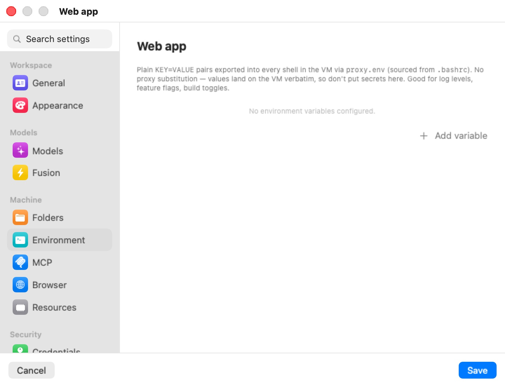

# Environment

The **Environment** pane sets plain environment variables exported into every shell in the machine's VM (a machine is a workspace, in the settings editor). They are for non-secret settings — log levels, feature flags, build toggles — that you want in the agent's environment without any credential handling.

  

The caption says what the pane does and what it is not for: "Plain `KEY=VALUE` pairs exported into every shell in the VM via `proxy.env` (sourced from `.bashrc`). No proxy substitution — values land on the VM verbatim, so don't put secrets here. Good for log levels, feature flags, build toggles." With nothing configured it reads **No environment variables configured.**

## How variables are exported

Each variable is written to `proxy.env`, which the machine's managed `.bashrc` sources for every shell. The value is present in every terminal, every command the agent runs, and every login and non-login shell, exactly as you typed it. There is no fake and no swap on the wire.

For a token or password, use the [Credentials](credentials.mdx) pane instead: there the VM only gets a stand-in, and the real value is put in on the wire. A secret typed into this pane lands inside the VM in clear text.

## Adding and editing variables

**Add variable** appends a row with a name field and a value field; the minus button removes it. The name must be a valid shell identifier — a letter or underscore, then letters, digits and underscores. A name that doesn't match shows an orange warning and is not exported. The value is used as written.

## Changes on a running machine

Saving applies without a restart: `proxy.env` is rewritten, and shells opened after the save see the new values. An agent that is already running keeps the environment it started with; a new tab or a new session picks up the change.

The values are stored in the machine's encrypted `secrets.enc`, like the pane's other data, not in `profile.json`.

## Settings reference

| Setting | Type | Default | Description |
|---|---|---|---|
| **Variable list** | Name / value rows | Empty | Each row exports one variable into every shell via `proxy.env`. Invalid names show a warning and are skipped. Values are used verbatim. |
| **Add variable** | Button | — | Appends an empty row. |

## Related chapters

- [Credentials](credentials.mdx) — where secrets belong.
- [MCP](mcp.mdx) — MCP servers, some of which read environment variables.
- [Settings Reference](index.mdx) — all panes at a glance.
