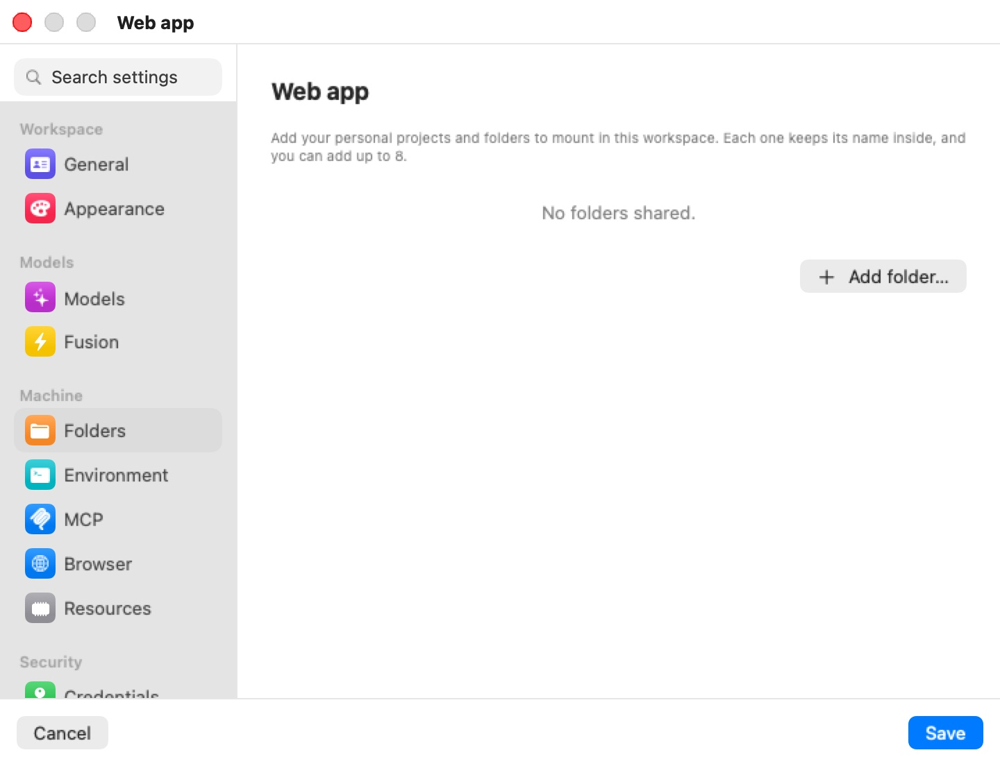

# Folders

The **Folders** pane lists the folders on your Mac that are shared into this machine's VM (a machine is a workspace, in the settings editor). A shared folder is where the agent reads the code it works on and writes its changes. Everything else the VM touches — its home, its system disk — is isolated; a shared folder is not. It is a live, read-write window into your Mac.

  

The pane's caption: "Add your personal projects and folders to mount in this workspace. Each one keeps its name inside, and you can add up to 8." With none configured it reads **No folders shared.**

## How folders are shared

Each folder is mounted at `/home/ubuntu/<name>`, where `<name>` is the folder's own name: `~/Documents` appears as `~/Documents` inside the VM, and `~/code/bromure` as `/home/ubuntu/bromure`. Only the last path component is used, so two folders with the same name from different places would collide — rename one if you need both.

The share is **read-write**. The agent can create, change, and delete files in it, and those changes are immediate and permanent on your Mac. That is what makes the machine useful: the agent edits your working copy in place, and `git`, your editor and your other tools see the edits as they happen.

Shares are attached when the VM boots. Adding or removing a folder on a running machine asks to restart it (**Restart “*name*” to apply these changes?**). On a suspended machine, saving a folder change first asks **Discard suspended VM for “*name*”?** — the saved state can't be resumed with a different set of shares, so the next start is a cold boot. Files in the machine's home and in the shared folders are unaffected.

> **Warning:** A shared folder is not part of the sandbox. It survives everything that resets the VM: deleting a machine leaves it alone, and if a machine is ever flagged as compromised and wiped, its shared folders are not wiped and may still hold files the agent wrote. Share only what the agent needs, and review a shared folder by hand after a compromise alert. See [Credentials & the Wire Boundary](../08-credentials.mdx).

## Adding and removing folders

Click **Add folder…** to open a folder picker; you can select several folders at once, and each becomes a row. The button is disabled once the machine has eight folders.

Each row shows the folder's name and its full path. The minus button stops sharing it; the folder and its contents on the Mac are never touched.

In the iPhone, iPad and Vision Pro client, **Add folder…** asks for the path instead ("Enter the folder's absolute path on the server; it's mounted into the VM under its own name."), because the folder lives on the Mac that runs the machine.

> **Tip:** You don't have to share a folder to start a session on a project. The new-session screen can also start an agent in a fresh folder or one of your recent folders — see [Starting a Session](../06-new-session.mdx).

## Imported Config Files

If the machine was created by the first-run setup and the scan imported configuration files from your Mac, they are listed under **Imported Config Files** in the [Credentials](credentials.mdx) pane, each as `~/<path>` with a count of its settings, how many secrets were left out, and which settings were disabled. The caption explains: "Copied into the VM as-is. Secrets were left out — those come in as credentials above, so the VM only ever sees a fake." The minus button ("Remove this file from the workspace") drops a file from the machine.

## Settings reference

| Setting | Type | Default | Description |
|---|---|---|---|
| **Folder list** | List of Mac paths | Empty | Each row shows the folder name and full path, with a minus button. Mounted read-write at `/home/ubuntu/<name>`. |
| **Add folder…** | Folder picker (multi-select) | — | Adds folders; disabled at eight. Needs a restart of a running machine. |

## Related chapters

- [Concepts & Architecture](../04-concepts.mdx) — the VM, its layers, and how folders are shared into it.
- [Machines](../06f-machines.mdx) — running, suspending and restarting a machine.
- [Credentials & the Wire Boundary](../08-credentials.mdx) — what a compromise wipe does and does not touch.
- [Settings Reference](index.mdx) — all panes at a glance.
