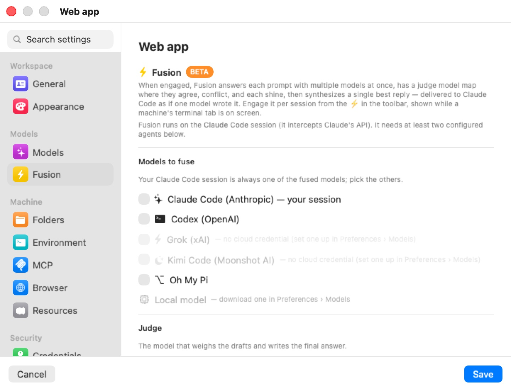

# Fusion

**Fusion** is Bromure Agentic Coding's multi-model answer synthesis, marked **BETA** in the pane. When engaged, it answers each prompt with several models at once, has a judge model map where they agree, conflict, and each shine, then writes a single reply — delivered to Claude Code as if one model wrote it.

Fusion works by intercepting Claude's API, so it runs on the machine's **Claude Code** session, and it needs at least two usable models — your Claude Code session always counts as one. This pane chooses the other models and the judge; you then engage Fusion from the ⚡ in the toolbar, shown while a machine's terminal tab is on screen. How a fused turn runs on the wire is described in [Fusion — the Multi-Model Panel](../12-fusion.mdx).

  

## Models to fuse

A checklist of the models whose drafts are combined, under the line "Your Claude Code session is always one of the fused models; pick the others."

| Leg | Needs |
|---|---|
| **Claude Code (Anthropic) — your session** | Always a leg. |
| **Codex (OpenAI)**, **Grok (xAI)**, **Kimi Code (Moonshot AI)** | A usable cloud credential for that agent — an API key or sign-in in **Preferences › Models**, or in this machine's [Models](models.mdx) override. |
| **Oh My Pi** | omp switched to Anthropic, OpenAI or xAI, with an API key for that provider. omp on z.ai or a custom endpoint can't be a leg. |
| **Local model** | An installed on-device model or a configured custom server. Picking it shows a model picker. |

Legs are judged on the machine's effective model settings — **Preferences › Models** plus this machine's [Models](models.mdx) override — so a key set there makes the matching leg usable, and the pane follows along when you change those settings. A leg that can't be used is greyed out, with a note after its name: "— no cloud credential (set one up in Preferences › Models)", "— needs an Anthropic, OpenAI or xAI API key for Oh My Pi (set it in Preferences › Models)", or, for the local leg, "— download one in Preferences › Models" (on-device models and custom servers are set up under the **On-device** and **Custom server** sources there).

While fewer than two usable models are selected, an orange notice says: "Pick at least two models to fuse — your Claude Code session counts as one, so add one more (a cloud agent or a local model)." A leg that fails at request time is dropped for that turn; if fewer than two answers come back, the turn falls back to Claude's own reply.

## Judge

The **Judge** is "the model that weighs the drafts and writes the final answer." Two pickers:

- **Provider** — one of the usable cloud providers, or **Local** when a local model is installed or a custom server is set up. Defaults to the first usable provider.
- **Model** — **(default)** lets the provider pick its default judge model; otherwise choose one. Cloud lists are fetched live from the provider, and a model saved earlier stays selectable even if the list no longer shows it. With **Local**, the list is your installed models or the custom server's models.

## Engaging Fusion

Setting up this pane makes Fusion available; it does not turn it on. Engage it with the ⚡ button in the window toolbar. The button appears when one of the machine's own terminal tabs is on stage (not while a chat session is selected):

| Button | Tooltip |
|---|---|
| Hollow, greyed | "Enable at least two models to use Fusion" |
| Filled dark grey | "Fusion available — click to engage" |
| Filled yellow | "Fusion engaged — click to disengage" |

From the command line: `bromure-cli vm fusion enable|disable <machine>`. See [Fusion — the Multi-Model Panel](../12-fusion.mdx).

> **Note:** Fusion affects only Claude Code. Sessions running Codex, Grok, Kimi or omp as their own agent are not fused, although those providers can be legs or the judge for Claude Code.

## Settings reference

| Setting | Description |
|---|---|
| **Models to fuse** | Checkboxes: Claude Code (always), Codex, Grok, Kimi Code (each needs a usable cloud credential), Oh My Pi (needs an Anthropic, OpenAI or xAI API key), and **Local model** with a model picker. Default: none selected besides Claude Code. |
| **Judge — Provider** | A usable cloud provider, or **Local**. Default: the first usable provider. |
| **Judge — Model** | Default: **(default)**, the provider's default judge model. |
| **Fusion engaged** | The ⚡ toggle in the toolbar (not stored in this pane). Default: off. |

## Related chapters

- [Fusion — the Multi-Model Panel](../12-fusion.mdx) — how legs, the judge and synthesis run, plus the CLI and trace records.
- [Models & Providers](../13-models.mdx) — providers, sign-ins, custom servers and on-device models.
- [Models](models.mdx) — this machine's model override.
- [Settings Reference](index.mdx) — all panes at a glance.
