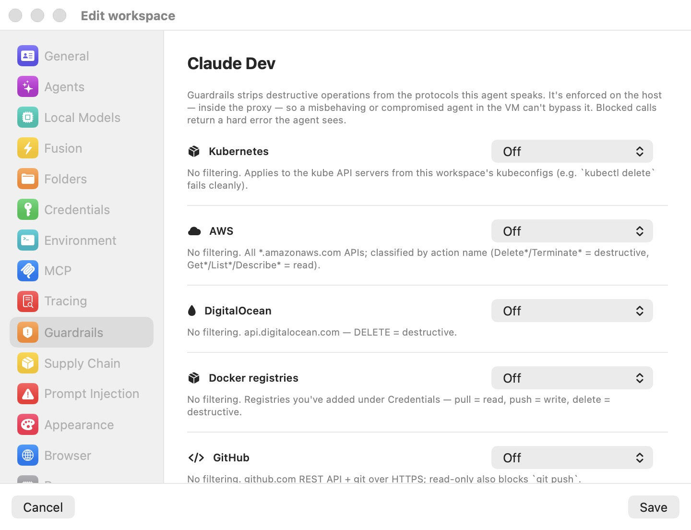

# Guardrails

[Guardrails](../18-glossary.mdx) is Bromure Agentic Coding's host-side control over how a workspace's credentials may be used. As the pane itself puts it: Guardrails govern how this workspace's configured credentials are used. **Ask before use** pops a host-side confirmation the first time a credential is used in a session. A **write policy** strips or blocks destructive operations on the wire — enforced in the proxy, so a compromised agent in the VM can't bypass it. Only credentials you've configured appear here.

  

The pane shows **one row per configured credential**, in the same order the [Credentials](credentials.mdx) pane lists them. Each row shows the credential's title and host(s) and carries two controls:

- An **Ask before use** checkbox (labelled **Require approval to use** on the control itself) — the per-credential consent gate, moved here from the Credentials pane.
- An inline **write policy** picker, shown only where the credential's service supports one.

If the workspace has no credentials, the pane shows an empty state — **No credentials to guard** — pointing you back to the Credentials pane. Enforcement details, error formats, and audit trails are covered in the [prompt-injection and guardrails deep dive](../10-prompt-injection.mdx).

## Ask before use

Every row has an **Ask before use** checkbox, off by default. When it is on, the first time that credential is used in a session the proxy pauses and pops a consent dialog offering time-bounded grants — 5 minutes, 1 hour, or the rest of the session — or **Don't allow**. Grants are in-memory only and are wiped when the session window closes, and every live decision is listed in **Window → Credential Approvals…**. The consent model, the coalescing of concurrent prompts, and the approvals window are covered in [Credentials & the wire boundary](../08-credentials.mdx).

This checkbox applies to any credential, including plain API keys, SSH keys, and manual tokens — the rows that have no write policy show only this control.

## Write policy

Where a credential's service can classify its own traffic, the row also shows a **write policy** picker. It appears for:

- **Git forges** — GitHub, GitLab, Bitbucket tokens.
- **AWS** credentials.
- **DigitalOcean** tokens.
- **Container registries** (Docker Hub, ghcr.io, and others).
- **Kubernetes** contexts.
- **Database** endpoints (MongoDB, ClickHouse, Elasticsearch).

Every write policy offers the same four modes:

| Mode | Behavior |
|---|---|
| **Off** | No filtering. |
| **Prompt before write** | Reads pass through. Every write pauses for a host-side consent dialog showing the exact operation, with time-bounded grants (see below). |
| **Block destructive** | Deletes, drops, and terminates are blocked; creates and updates pass. |
| **Read-only** | Every mutation is blocked; only reads pass. |

New workspaces default to **Prompt before write** on every service that supports a policy (via the preferences template). Workspaces created before Guardrails existed — or profiles whose JSON omits the field — decode as **Off**.

> **Note:** The write policy is **per service**, not per credential. Two credentials for the same service — say two GitHub tokens — share one policy, so changing the picker on either row changes it for both.

> **Note:** Guardrails classifies operations; it does not hide credentials. The credential itself is still injected and swapped by the proxy as configured under [Credentials](credentials.mdx). Combine a **Read-only** write policy with the same row's **Ask before use** checkbox for defense in depth.

## How each service classifies calls

| Service | Scope | Classification |
|---|---|---|
| **Kubernetes** | The Kubernetes API servers from this workspace's kubeconfigs | `GET`/`HEAD`/`OPTIONS` = read; `DELETE` = destructive (includes `deletecollection`); other verbs = write. Blocked calls return a Kubernetes `Status` 403 JSON that `kubectl` renders cleanly. |
| **AWS** | All `*.amazonaws.com` hosts | The action name from the `X-Amz-Target` header (JSON-protocol services such as DynamoDB and Lambda) or the `Action=` form parameter (query-protocol services such as EC2, IAM, SQS) is classified by prefix: `Delete*`/`Terminate*`/`Remove*`/`Purge*`/`Destroy*`/`Deregister*`/`Revoke*` = destructive; `Get*`/`List*`/`Describe*` and similar = read. Falls back to the HTTP method for S3 and REST-style requests. Blocked calls return an `AccessDeniedException` body. |
| **DigitalOcean** | `api.digitalocean.com` and `*.digitalocean.com` | HTTP method: `DELETE` = destructive; `GET`/`HEAD` = read. |
| **Container registries** | The registries configured under Credentials, plus Docker Hub endpoints | Pull (`GET`) = read; push (`PUT`/`POST`) = write; `DELETE` = destructive. Blocked calls return a registry-style `DENIED` error body. |
| **GitHub** | `github.com` REST API and git over HTTPS | Method-based for REST. `git push` (`git-receive-pack`) counts as a write — blocked in **Read-only**, prompted in **Prompt before write**; `git fetch` (`git-upload-pack`) is always a read. |
| **GitLab** | `gitlab.com` REST API and git over HTTPS | Same classification logic as GitHub. |
| **Bitbucket** | `bitbucket.org` REST API and git over HTTPS | Same classification logic as GitHub. |

Database endpoints classify by engine:

| Engine | Read | Write | Destructive |
|---|---|---|---|
| MongoDB (Atlas Data API) | `find`, `findOne`, `aggregate` | `insert`, `update`, `replace` | `deleteOne`, `deleteMany` |
| ClickHouse | SQL whose leading keyword is `SELECT`, `SHOW`, `DESCRIBE`, `EXPLAIN`, `WITH` … | `INSERT`, `CREATE`, `ALTER`, … | `DROP`, `TRUNCATE`, `DELETE`, and `ALTER … DELETE` / `DROP COLUMN` / `DROP PARTITION` / `CLEAR` |
| Elasticsearch | `_search`, `_msearch`, `_count`, `_mget`, `_sql`, and other query endpoints (even over `POST`) | `_bulk`, `_update`, document indexing | `DELETE` and `_delete_by_query` |

An orange inline warning appears when a policy is set but there is nothing for it to scope to — no kubeconfigs for a Kubernetes context, no host set for a database endpoint — since the guard then has no hosts to apply to.

> **Note:** For ClickHouse, if no SQL text is visible in the request, **Read-only** blocks the request (Bromure cannot prove it is a read) while **Block destructive** lets it through (it errs open).

## The consent dialog (Prompt before write)

In **Prompt before write** mode, reads pass silently and every write pauses for a host dialog titled `Allow write on "<scope>" from workspace "<name>"?`. The dialog body shows the exact operation verbatim — the literal SQL statement for a database, or `METHOD /path` for a REST call — so you approve what will actually run, not a summary. The buttons are:

- **Allow for 15 minutes** (the default button)
- **Allow once** — deliberately creates no grant, so the very next write re-prompts. Useful for auditing a chatty agent write-by-write.
- **Allow for the rest of the session**
- **Don't allow** — the agent receives the same hard error the block modes produce. The refusal is remembered for 60 seconds so an agent retrying the same write in a loop does not re-prompt every second.

Grants are scoped per workspace and per protocol scope: one Kubernetes API host, AWS as a whole, one container registry, each git forge as a whole, or one database host. Allowing ClickHouse writes on one host grants nothing anywhere else. Concurrent identical writes coalesce onto a single dialog, and all decisions are in-memory only — session-scoped grants are wiped at session teardown.

When the workspace is driven headless over SSH or the CLI, the same four choices are offered as a text prompt inside the workspace's tmux; no answer means deny.

> **Note:** Guardrails write-grants are not listed in any window. The **Credential Approvals** window (Window menu → **Credential Approvals…**) shows credential-consent decisions — the **Ask before use** grants — only; a write-policy grant expires on its own clock or at session teardown.

## What the agent sees when a call is blocked

Blocked calls return a protocol-appropriate 403-style error body — a Kubernetes `Status` JSON, an AWS `AccessDeniedException`, a registry `DENIED` payload — whose message ends "blocked by Bromure Guardrails". The agent sees a clean, ordinary API failure it can report, rather than a hung connection. (Supply-chain blocks use HTTP 451 instead, precisely so the two are distinguishable at a glance — see [Supply Chain](supply-chain.mdx).)

## Limitations

- **Git force-push** cannot be distinguished from a normal push on the wire, so **Block destructive** does not block it — only **Read-only** and **Prompt before write** gate pushes. Explicit deletions through the forge REST APIs are still caught.
- Kubernetes and container-registry policies only apply to hosts derived from the workspace's kubeconfigs and configured registries; database policies need the endpoint's host set under Credentials. A guard with nothing to scope to filters nothing (the pane warns you inline).
- Guardrails covers the services listed above. Arbitrary HTTPS traffic to other hosts is not classified — for package downloads see [Supply Chain](supply-chain.mdx), and for the agent's AI traffic see [Prompt Injection](prompt-injection.mdx).
