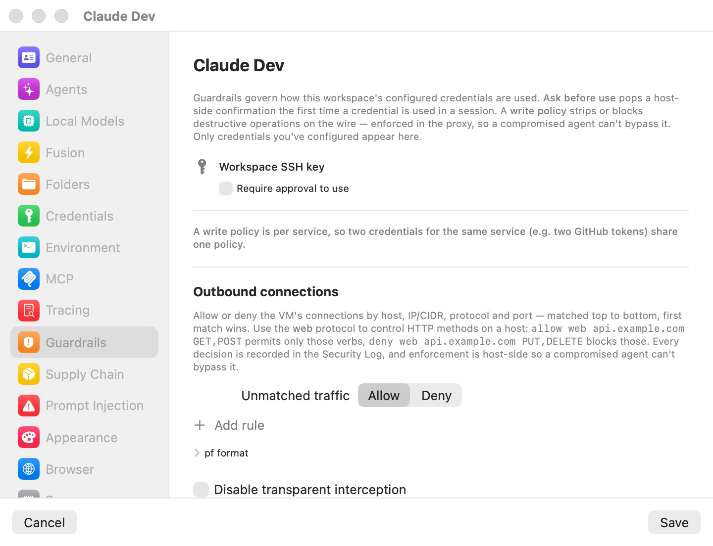

# Guardrails

[Guardrails](../18-glossary.mdx) is Bromure Agentic Coding's host-side control over how a workspace's credentials may be used. As the pane itself puts it: Guardrails govern how this workspace's configured credentials are used. **Ask before use** pops a host-side confirmation the first time a credential is used in a session. A **write policy** strips or blocks destructive operations on the wire — enforced in the proxy, so a compromised agent in the VM can't bypass it. Only credentials you've configured appear here.

<p align="center">
  
</p>

The pane shows **one row per configured credential**, in the same order the [Credentials](credentials.mdx) pane lists them. Each row shows the credential's title and host(s) and carries two controls:

- An **Ask before use** checkbox (labelled **Require approval to use** on the control itself) — the per-credential consent gate, moved here from the Credentials pane.
- An inline **write policy** picker, shown only where the credential's service supports one.

If the workspace has no credentials, the pane shows an empty state — **No credentials to guard** — pointing you back to the Credentials pane. Enforcement details, error formats, and audit trails are covered in the [prompt-injection and guardrails deep dive](../10-prompt-injection.mdx).

## Ask before use

Every row has an **Ask before use** checkbox, off by default. When it is on, the first time that credential is used in a session the proxy pauses and pops a consent dialog offering time-bounded grants — 5 minutes, 1 hour, or the rest of the session — or **Don't allow**. Grants are in-memory only and are wiped when the session window closes, and every live decision is listed in **Window → Credential Approvals…**. The consent model, the coalescing of concurrent prompts, and the approvals window are covered in [Credentials & the wire boundary](../08-credentials.mdx).

This checkbox applies to any credential, including plain API keys, SSH keys, and manual tokens — the rows that have no write policy show only this control.

## Write policy

Where a credential's service can classify its own traffic, the row also shows a **write policy** picker. It appears for:

- **Git forges** — GitHub, GitLab, Bitbucket tokens.
- **AWS** credentials.
- **DigitalOcean** tokens.
- **Container registries** (Docker Hub, ghcr.io, and others).
- **Kubernetes** contexts.
- **Database** endpoints (MongoDB, ClickHouse, Elasticsearch).

Every write policy offers the same four modes:

| Mode | Behavior |
|---|---|
| **Off** | No filtering. |
| **Prompt before write** | Reads pass through. Every write pauses for a host-side consent dialog showing the exact operation, with time-bounded grants (see below). |
| **Block destructive** | Deletes, drops, and terminates are blocked; creates and updates pass. |
| **Read-only** | Every mutation is blocked; only reads pass. |

New workspaces default to **Prompt before write** on every service that supports a policy (via the preferences template). Workspaces created before Guardrails existed — or profiles whose JSON omits the field — decode as **Off**.

> **Note:** The write policy is **per service**, not per credential. Two credentials for the same service — say two GitHub tokens — share one policy, so changing the picker on either row changes it for both.

> **Note:** Guardrails classifies operations; it does not hide credentials. The credential itself is still injected and swapped by the proxy as configured under [Credentials](credentials.mdx). Combine a **Read-only** write policy with the same row's **Ask before use** checkbox for defense in depth.

## How each service classifies calls

| Service | Scope | Classification |
|---|---|---|
| **Kubernetes** | The Kubernetes API servers from this workspace's kubeconfigs | `GET`/`HEAD`/`OPTIONS` = read; `DELETE` = destructive (includes `deletecollection`); other verbs = write. Blocked calls return a Kubernetes `Status` 403 JSON that `kubectl` renders cleanly. |
| **AWS** | All `*.amazonaws.com` hosts | The action name from the `X-Amz-Target` header (JSON-protocol services such as DynamoDB and Lambda) or the `Action=` form parameter (query-protocol services such as EC2, IAM, SQS) is classified by prefix: `Delete*`/`Terminate*`/`Remove*`/`Purge*`/`Destroy*`/`Deregister*`/`Revoke*` = destructive; `Get*`/`List*`/`Describe*` and similar = read. Falls back to the HTTP method for S3 and REST-style requests. Blocked calls return an `AccessDeniedException` body. |
| **DigitalOcean** | `api.digitalocean.com` and `*.digitalocean.com` | HTTP method: `DELETE` = destructive; `GET`/`HEAD` = read. |
| **Container registries** | The registries configured under Credentials, plus Docker Hub endpoints | Pull (`GET`) = read; push (`PUT`/`POST`) = write; `DELETE` = destructive. Blocked calls return a registry-style `DENIED` error body. |
| **GitHub** | `github.com` REST API and git over HTTPS | Method-based for REST. `git push` (`git-receive-pack`) counts as a write — blocked in **Read-only**, prompted in **Prompt before write**; `git fetch` (`git-upload-pack`) is always a read. |
| **GitLab** | `gitlab.com` REST API and git over HTTPS | Same classification logic as GitHub. |
| **Bitbucket** | `bitbucket.org` REST API and git over HTTPS | Same classification logic as GitHub. |

Database endpoints classify by engine:

| Engine | Read | Write | Destructive |
|---|---|---|---|
| MongoDB (Atlas Data API) | `find`, `findOne`, `aggregate` | `insert`, `update`, `replace` | `deleteOne`, `deleteMany` |
| ClickHouse | SQL whose leading keyword is `SELECT`, `SHOW`, `DESCRIBE`, `EXPLAIN`, `WITH` … | `INSERT`, `CREATE`, `ALTER`, … | `DROP`, `TRUNCATE`, `DELETE`, and `ALTER … DELETE` / `DROP COLUMN` / `DROP PARTITION` / `CLEAR` |
| Elasticsearch | `_search`, `_msearch`, `_count`, `_mget`, `_sql`, and other query endpoints (even over `POST`) | `_bulk`, `_update`, document indexing | `DELETE` and `_delete_by_query` |

An orange inline warning appears when a policy is set but there is nothing for it to scope to — no kubeconfigs for a Kubernetes context, no host set for a database endpoint — since the guard then has no hosts to apply to.

> **Note:** For ClickHouse, if no SQL text is visible in the request, **Read-only** blocks the request (Bromure cannot prove it is a read) while **Block destructive** lets it through (it errs open).

## The consent dialog (Prompt before write)

In **Prompt before write** mode, reads pass silently and every write pauses for a host dialog titled `Allow write on "<scope>" from workspace "<name>"?`. The dialog body shows the exact operation verbatim — the literal SQL statement for a database, or `METHOD /path` for a REST call — so you approve what will actually run, not a summary. The buttons are:

- **Allow for 15 minutes** (the default button)
- **Allow once** — deliberately creates no grant, so the very next write re-prompts. Useful for auditing a chatty agent write-by-write.
- **Allow for the rest of the session**
- **Don't allow** — the agent receives the same hard error the block modes produce. The refusal is remembered for 60 seconds so an agent retrying the same write in a loop does not re-prompt every second.

Grants are scoped per workspace and per protocol scope: one Kubernetes API host, AWS as a whole, one container registry, each git forge as a whole, or one database host. Allowing ClickHouse writes on one host grants nothing anywhere else. Concurrent identical writes coalesce onto a single dialog, and all decisions are in-memory only — session-scoped grants are wiped at session teardown.

When the workspace is driven headless over SSH or the CLI, the same four choices are offered as a text prompt inside the workspace's tmux; no answer means deny.

> **Note:** Guardrails write-grants are not listed in any window. The **Credential Approvals** window (Window menu → **Credential Approvals…**) shows credential-consent decisions — the **Ask before use** grants — only; a write-policy grant expires on its own clock or at session teardown.

## The egress firewall

Below the credential rows, the pane hosts the workspace's **Outbound connections** firewall: an ordered rule table that governs which connections the VM may open at all — any protocol, any destination, not just the services Guardrails classifies. Rules are matched top to bottom, first match wins, and a segmented **Unmatched traffic** control picks the default for anything no rule matches: **Allow** (the default for new workspaces) or **Deny** for a locked-down, allow-list posture.

Each rule has five parts:

| Column | Values | Meaning |
|---|---|---|
| **Action** | `allow` / `deny` | What happens to a matching flow. |
| **Proto** | `tcp` / `udp` / `web` / `any` | `web` is HTTP(S)-over-TCP — the one protocol whose rules can also restrict request methods. |
| **Host / CIDR** | `any`, a hostname, or an IPv4 CIDR | Hostnames suffix-match: `example.com` covers the apex and every subdomain; `*.example.com` covers subdomains only. A bare IP is a /32. |
| **Ports** | `any`, a port, a range (`8000-8999`), or a list | Empty means any port. |
| **Methods** | HTTP verbs, `web` rules only | With `allow`, an allowlist (`GET,POST` — only those verbs pass); with `deny`, a blocklist (`PUT,DELETE` — those verbs are refused, everything else passes). `read-only` is shorthand for GET/HEAD/OPTIONS. |

A disclosure at the bottom shows the same ruleset in its canonical **pf format** — one rule per line, ending in `default allow` or `default deny` — which is how the rules are stored and what the CLI and managed profiles carry:

```
allow tcp api.github.com:443
allow web api.example.com GET,POST     # only these verbs reach the site
deny  web api.internal PUT,DELETE      # block these verbs, allow the rest
deny  udp any:53
deny  any 10.0.0.0/8
default deny
```

Enforcement is host-side and layered, so a compromised agent cannot route around it: the virtual network switch applies the rules to every flow by destination IP and DNS-snooped hostname (all protocols, including plain TCP and UDP), and the MiTM proxy applies them again by TLS server name and — for `web` rules — by individual HTTP method. The method dimension is what lets a workspace *read* an API it is not allowed to *write*: `allow web api.example.com GET,POST` gives the agent queries without mutations, at the wire, regardless of what tool inside the VM makes the request.

Rule edits **apply to running sessions immediately** — saving the workspace refreshes the live policy without a reboot, including for headless sessions. Every verdict is recorded as a Firewall row in the [Security Timeline](../11-tracing.mdx) window, and on enrolled installs as an `egress.firewall` event in the organization's stream.

> **Note:** Local inference is exempt by construction: an `allow` rule for the on-host inference endpoint (`bromure.llm`) is prepended ahead of your rules, so even `default deny` cannot cut agents off from [Local Models](local-models.mdx). That traffic never leaves your Mac.

## Transparent interception

The firewall would be advisory if the VM could simply ignore the proxy, so it no longer can: the virtual switch **transparently diverts the VM's port-80 and port-443 flows into the host proxy** — no environment variables required, nothing the guest can unset. Plain HTTP on port 80 is intercepted and inspected the same way HTTPS is. This is on by default for every workspace.

The escape hatch is the **Disable transparent interception** toggle beneath the rule table. Turning it on stops the switch from diverting :80/:443, so Guardrails and the firewall's `web` rules only see traffic that cooperatively uses the proxy environment variables — use it only for a workspace that genuinely breaks under interception (for example, heavy certificate pinning not covered by the built-in passthrough list), and treat the firewall as advisory while it is on.

## What the agent sees when a call is blocked

Blocked calls return a protocol-appropriate 403-style error body — a Kubernetes `Status` JSON, an AWS `AccessDeniedException`, a registry `DENIED` payload — whose message ends "blocked by Bromure Guardrails". The agent sees a clean, ordinary API failure it can report, rather than a hung connection. (Supply-chain blocks use HTTP 451 instead, precisely so the two are distinguishable at a glance — see [Supply Chain](supply-chain.mdx).)

## Limitations

- **Git force-push** cannot be distinguished from a normal push on the wire, so **Block destructive** does not block it — only **Read-only** and **Prompt before write** gate pushes. Explicit deletions through the forge REST APIs are still caught.
- Kubernetes and container-registry policies only apply to hosts derived from the workspace's kubeconfigs and configured registries; database policies need the endpoint's host set under Credentials. A guard with nothing to scope to filters nothing (the pane warns you inline).
- The write policies cover the services listed above; traffic to other hosts is governed by the egress firewall's host/port/method rules rather than semantic classification. For package downloads see [Supply Chain](supply-chain.mdx), and for the agent's AI traffic see [Prompt Injection](prompt-injection.mdx).
