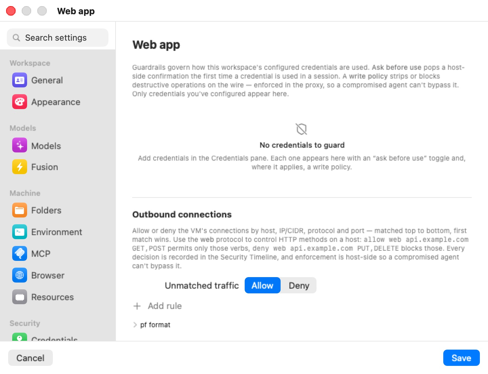

# Guardrails

[Guardrails](../18-glossary.mdx) control how a machine's credentials may be used (a machine is a workspace, in the settings editor), which connections its VM may open, and how strictly its traffic is intercepted. In the pane's own words: "Guardrails govern how this workspace's configured credentials are used. **Ask before use** pops a host-side confirmation the first time a credential is used in a session. A **write policy** strips or blocks destructive operations on the wire — enforced in the proxy, so a compromised agent can't bypass it. Only credentials you've configured appear here."

<p align="center">
  
</p>

The pane has three parts: one row per credential, the **Outbound connections** firewall, and three switches at the bottom. Everything in it applies to a running machine as soon as you click **Save** — no restart. The deeper mechanics are in [Prompt-Injection Detection & Guardrails](../10-prompt-injection.mdx).

## Credential rows

The pane lists every credential configured in [Credentials](credentials.mdx), in the same order. Each row shows the credential's name and hosts, a **Require approval to use** checkbox, and — where the service supports one — a write-policy picker. With no credentials, the pane shows **No credentials to guard** and points you to the Credentials pane.

### Require approval to use (ask before use)

Off by default. When on, the first time the credential is used in a session the proxy pauses the request and asks, offering **Allow for 5 minutes**, **Allow for 1 hour**, **Allow for the rest of the session**, or **Don't allow**. Grants live in memory and end with the session; **Window › Credential Approvals…** lists the current ones. See [Credentials & the Wire Boundary](../08-credentials.mdx).

> **Note:** An automation that uses a credential with approval on can't run fully unattended: it pauses at the dialog until you answer on the Mac. The automation editor warns about this.

### Write policy

A write-policy picker appears for:

- git forge tokens (GitHub, GitLab, Bitbucket)
- AWS credentials
- DigitalOcean tokens
- container registries
- Kubernetes contexts
- database endpoints (MongoDB, ClickHouse, Elasticsearch)

| Mode | Behavior |
|---|---|
| **Off** | No filtering. |
| **Prompt before write** | Reads pass. Each write pauses for a dialog showing the exact operation. |
| **Block destructive** | Deletes, drops and terminations are blocked; creates and updates pass. |
| **Read-only** | Every change is blocked; only reads pass. |

New machines use **Prompt before write** for every service (from the Defaults template). Machines created before Guardrails existed load as **Off**.

> **Note:** A write policy is per service, not per credential, as the pane notes: "two credentials for the same service (e.g. two GitHub tokens) share one policy." Changing either row changes both.

## How each service is classified

| Service | Scope | Classification |
|---|---|---|
| **Kubernetes** | The API servers in this machine's kubeconfigs | `GET`/`HEAD`/`OPTIONS` read; `DELETE` (including `deletecollection`) destructive; other verbs write. Blocked calls return a Kubernetes `Status` 403 that `kubectl` shows cleanly. |
| **AWS** | `*.amazonaws.com` | The action name (`X-Amz-Target` header or `Action=` parameter) by prefix: `Delete*`, `Terminate*`, `Remove*`, `Purge*`, `Destroy*`, `Deregister*`, `Revoke*` destructive; `Get*`, `List*`, `Describe*` and similar read. S3 and REST-style calls fall back to the HTTP method. Blocked calls return `AccessDeniedException`. |
| **DigitalOcean** | `*.digitalocean.com` | `DELETE` destructive; `GET`/`HEAD` read. |
| **Container registries** | Configured registries and Docker Hub | Pull read; push write; `DELETE` destructive. Blocked calls return a registry `DENIED` error. |
| **GitHub / GitLab / Bitbucket** | The forge's REST API and git over HTTPS | REST by method. `git push` is a write (blocked in **Read-only**, prompted in **Prompt before write**); `git fetch` is always a read. |

Database endpoints are classified by engine:

| Engine | Read | Write | Destructive |
|---|---|---|---|
| MongoDB (Atlas Data API) | `find`, `findOne`, `aggregate` | `insert`, `update`, `replace` | `deleteOne`, `deleteMany` |
| ClickHouse | `SELECT`, `SHOW`, `DESCRIBE`, `EXPLAIN`, `WITH` … | `INSERT`, `CREATE`, `ALTER` … | `DROP`, `TRUNCATE`, `DELETE`, and `ALTER … DELETE` / `DROP COLUMN` / `DROP PARTITION` / `CLEAR` |
| Elasticsearch | `_search`, `_msearch`, `_count`, `_mget`, `_sql` and other queries (even over `POST`) | `_bulk`, `_update`, indexing | `DELETE`, `_delete_by_query` |

An orange warning appears when a policy has nothing to apply to — a Kubernetes context without a kubeconfig, a database endpoint without a host.

> **Note:** For ClickHouse, if no SQL text is visible in the request, **Read-only** blocks it (it can't be proven a read) while **Block destructive** lets it through.

### The write dialog

In **Prompt before write**, a write pauses for **Allow write on "*scope*" from workspace "*name*"?**, showing the operation verbatim — the SQL statement, or `METHOD /path`. The choices:

- **Allow for 15 minutes** (default)
- **Allow once** — creates no grant, so the next write asks again.
- **Allow for the rest of the session**
- **Don't allow** — the agent gets the same error the blocking modes return. The refusal is remembered for 60 seconds so a retry loop doesn't re-prompt every second.

Grants are per machine and per scope: one Kubernetes API server, AWS as a whole, one registry, each forge, or one database host. Identical concurrent writes share one dialog. When the machine is used headless over SSH or the CLI, the same choices are asked inside the machine's tmux; no answer means deny.

## Outbound connections (egress firewall)

"Allow or deny the VM's connections by host, IP/CIDR, protocol and port — matched top to bottom, first match wins." Rules cover any protocol and any destination, not just the services above. **Unmatched traffic** sets what happens to a connection no rule matches: **Allow** (default) or **Deny** for an allow-list setup. **Add rule** appends a row.

| Column | Values | Meaning |
|---|---|---|
| **Action** | `allow` / `deny` | What happens to a match. |
| **Proto** | `tcp` / `udp` / `web` / `any` | `web` is HTTP(S), the only protocol whose rules can also restrict methods. |
| **Host / CIDR** | `any`, a hostname, or an IPv4 CIDR | `example.com` covers the domain and all subdomains; `*.example.com` subdomains only. A bare IP is a /32. |
| **Ports** | `any`, a port, a range (`8000-8999`) or a list | Empty means any. |
| **Methods** | HTTP verbs, `web` rules only | With `allow`, only these verbs pass (`GET,POST`); with `deny`, these verbs are refused (`PUT,DELETE`). `read-only` means GET/HEAD/OPTIONS. |

The **pf format** disclosure shows the same rules as text — one per line, ending in `default allow` or `default deny` — which is how they are stored and what the CLI and managed profiles use:

```
allow tcp api.github.com:443
allow web api.example.com GET,POST     # only these verbs reach the site
deny  web api.internal PUT,DELETE      # block these verbs, allow the rest
deny  udp any:53
deny  any 10.0.0.0/8
default deny
```

Enforcement happens on the Mac, in two layers: the virtual network switch checks every connection by destination IP and by the hostname seen in DNS (all protocols), and the proxy checks again by TLS server name and, for `web` rules, by HTTP method. That is what lets a machine read an API it may not write to: `allow web api.example.com GET,POST` gives the agent queries without changes, whatever tool it uses.

Every decision is recorded in the [Security Timeline](../11a-security-timeline.mdx), and on enrolled Macs sent to your organization.

> **Note:** Local models are always reachable: an allow rule for the on-Mac inference endpoint is placed ahead of your rules, so even `default deny` can't cut agents off from an on-device model.

## Disable transparent interception

By default, the virtual switch diverts the VM's HTTP and HTTPS connections (ports 80 and 443) into Bromure's proxy at the network layer, so the proxy sees them even when a program ignores the proxy settings.

Turning on **Disable transparent interception** stops only that forced diversion. Programs that open raw connections, and apps that pin certificates, then reach the network — and the real server certificate — directly. The proxy itself stays on: `HTTP_PROXY` / `HTTPS_PROXY` remain set, so proxy-aware tools (apt, git, pip, curl, node…) and the agents' own API calls still go through Bromure and keep credential swapping, tracing and guardrails. Applies live, no restart.

Use it for a machine with a client that breaks under interception. While it is on, traffic from programs that bypass the proxy settings is not seen by the firewall's `web` rules or the write policies.

## Allow per-request insecure bypass (X-bromure-insecure)

A narrower escape hatch for self-signed or private-CA servers. When a request to such a host fails certificate validation, the agent can retry it with the header `X-bromure-insecure: yes`, and Bromure skips validating that server's certificate for that request. Interception, tracing and the leak guard stay on, and Bromure puts no real credential into such a request — only the VM's stand-ins go out. Every use is recorded in the Security Timeline.

On by default: it only acts when the VM explicitly sends the header. Turn it off to refuse the header outright.

## Don't alert on credential exfiltration

When a credential is seen heading to a host it doesn't belong to, Bromure blocks the request, pauses the VM, and shows a compromise alert with **Shut down**, **Block**, **Allow**, and **Save for Investigation**. **Allow** trusts that destination for the rest of the session. See [Credentials & the Wire Boundary](../08-credentials.mdx).

**Don't alert on credential exfiltration** turns off that alert for this machine. The leak is still blocked and still recorded in the Security Timeline, as "blocked — exfiltration attempt (alerts off, VM not paused)" — only the interruption goes away. Applies live, no restart. Default: off.

## What the agent sees when a call is blocked

A blocked call returns an ordinary error in the service's own format — a Kubernetes `Status`, an AWS `AccessDeniedException`, a registry `DENIED` — whose message ends "blocked by Bromure Guardrails". The agent sees a clean failure it can report, not a hung connection. (Supply-chain blocks use HTTP 451 instead, so the two are easy to tell apart — see [Supply Chain](supply-chain.mdx).)

## Limitations

- A force-push looks like a normal push on the wire, so **Block destructive** doesn't stop it; **Read-only** and **Prompt before write** do gate pushes. Deletions through the forge's REST API are caught.
- Kubernetes and registry policies only cover hosts from this machine's kubeconfigs and registries; a database policy needs the endpoint's host.
- Other hosts are governed by the firewall's host, port and method rules, not by service-level classification.
- The rule table is not shown in the iPhone, iPad or Vision Pro client; rules set on the Mac still apply.

## Settings reference

| Setting | Type | Default |
|---|---|---|
| **Require approval to use** | Checkbox per credential | Off |
| Write policy | **Off** / **Prompt before write** / **Block destructive** / **Read-only**, per service | **Prompt before write** for new machines |
| **Unmatched traffic** | **Allow** / **Deny** | Allow |
| Rules | Ordered table (**Add rule**), also shown as **pf format** | None |
| **Disable transparent interception** | Toggle | Off |
| **Allow per-request insecure bypass (X-bromure-insecure)** | Toggle | On |
| **Don't alert on credential exfiltration** | Toggle | Off |

## Related chapters

- [Credentials](credentials.mdx) — the credentials these rows govern.
- [Prompt-Injection Detection & Guardrails](../10-prompt-injection.mdx) — enforcement in depth.
- [Security Overview & Timeline](../11a-security-timeline.mdx) — every block and allow, per machine.
- [Settings Reference](index.mdx) — all panes at a glance.
