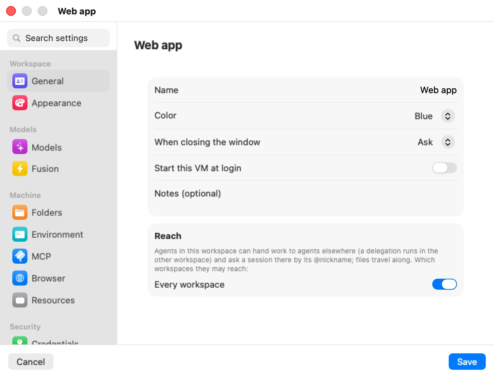
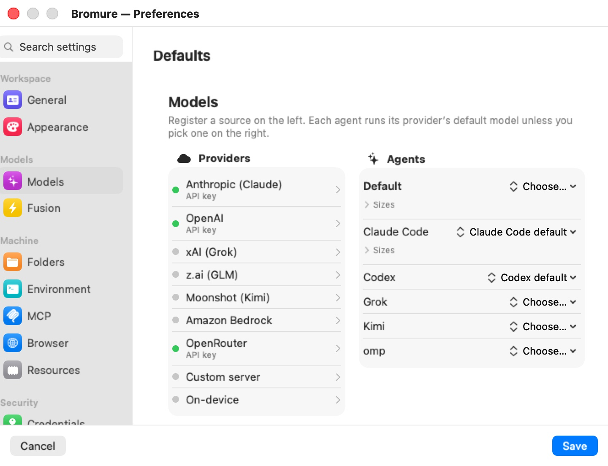

# Settings Reference

Almost every setting in Bromure Agentic Coding belongs to one machine. The session UI calls it a **machine**; the settings editor still calls it a **workspace** — they are the same thing. Each machine carries its own credentials, security policies, terminal appearance, shared folders, and VM resources, all edited in one window: the settings editor.

A few things are not per-machine:

- **Models** has a global board in **Preferences › Models** that every machine inherits. The per-machine **Models** pane is an optional override of it.
- **Automation** (the loopback HTTP API and the `bromure-ac mcp` server) is app-wide and only appears in Preferences.
- The browser image, the prompt-injection and PII detector models, and on-device model downloads are shared by every machine on the Mac.

This chapter is the reference for the editor and for each of its panes. Each pane has its own page with a screenshot, a settings table with defaults, and pointers to the chapter that explains the feature behind it.

## Opening the editor

The editor opens from wherever you happen to be:

| From | How |
|---|---|
| **Sidebar** | In the **Virtual Machines** section, open a machine's **⋯** menu and choose **Edit…**. |
| **Machine menu** | The capsule in the window toolbar showing the machine's color and name (tooltip "The machine: its settings, trace, reboot…") → **Settings…**. |
| **A session** | Right-click the session's name in the header, or open the session's menu in the sidebar, and choose **“*machine*” Settings…** (for example **“Payments API” Settings…**). |
| **The chat** | When an agent has no model provider on its machine, the chat shows a card with **Machine settings…**. |
| **An automation** | An automation that uses a credential set to ask before use shows "Won't run fully unattended" with **Open Workspace Settings…**. |
| **⌘K** | The command palette lists **“*machine*” Settings…** for every machine, and **Preferences** under Actions. |
| **Preferences** | **Preferences…** in the app menu (⌘,) opens the editor on the Defaults template (see below). |

To create a machine, use the **+** on the **Virtual Machines** section header (tooltip **New workspace**), **New machine…** in the new-session screen's machine picker, or **New Machine…** in ⌘K. They open the same editor, titled **New workspace** until you type a name, with **Create** in place of **Save**. See [Machines](../06f-machines.mdx) for the machine lifecycle.

Only one editor window exists at a time. Opening the settings of another machine replaces it; opening the same machine's settings brings the existing window forward.

## The editor window

The window title and the heading of every pane show the machine's name. The left column is a sidebar of panes in five groups, with a **Search settings** field on top; the right column is the selected pane. **Cancel** (Esc) discards your edits; **Save** (Return) — **Create** for a new machine — applies them.

  

The groups and panes, in sidebar order:

| Group | Panes |
|---|---|
| **Workspace** | General, Appearance |
| **Models** | Models, Fusion |
| **Machine** | Folders, Environment, MCP, Browser, Resources |
| **Security** | Credentials, Tracing, Guardrails, Supply Chain, Prompt Injection, PII Protection |
| **App** | Automation (Preferences only) |

**Search settings** filters the sidebar as you type. It matches pane names, group names, and a few keywords per pane — for example `firewall` finds **Guardrails**, `ram` finds **Resources**, `api key` finds **Models**, `gdpr` finds **PII Protection**. Every word you type must match. If the selected pane is filtered out, the editor jumps to the first match.

## What saves live, and what waits for Save

Edits in the editor are a draft until you click **Save**. What happens next depends on whether the machine is running.

**Applied to a running machine at Save, without a restart:** environment variables, credentials (git tokens, API keys, DigitalOcean, Linear, Twilio, container registries, databases), git identity, guardrail write policies and ask-before-use gates, the egress firewall, transparent interception, the insecure-bypass and exfiltration-alert switches, supply-chain policy, prompt-injection policy, PII protection, the trace level, the workspace's model override, terminal font, colors, cursor and opacity, and the machine's name and color.

**Needs a restart:** VM memory, network mode, shared folders, SSH keys (the workspace key and imported keys), Kubernetes contexts, and AWS credentials. When you save one of these while the machine runs, the app asks **Restart “*name*” to apply these changes?**, lists them, and offers **Restart Now…** or **Later**.

Two edits ask before saving:

- Changing shared folders on a suspended machine: **Discard suspended VM for “*name*”?** — the saved RAM state can't be resumed with a different set of shares, so saving discards it and the next start is a cold boot. **Discard & save** or **Cancel**.
- Changing the browser's permissions or **Stay signed in to websites** while the browser is open: **Restart the browser for “*name*”?** — **Restart & Save** or **Cancel**.

**Immediate, whatever you do next** (not undone by **Cancel**):

- Everything in **Preferences › Models** on this Mac: providers, sign-ins, API keys and model picks save as you make them.
- Model downloads: prompt-injection detectors and the PII model start downloading when you tick their box; on-device models download from the **On-device** source.
- Signing in to or logging out of a provider, and MCP **Authorize with OAuth…** / **Revoke**.
- The **Automation** pane, and in Preferences › Resources the **Workspace subnet** and **Remote transport** settings.
- **Download Now** / **Re-download** for the browser image.
- The storage actions in **Resources** (**Erase home…**, **Restore home…**, **Reset to base…**), each after its own confirmation.

Secrets you type in the editor never go into the plain-text `profile.json`. On save they are split into `secrets.enc`, encrypted with a key held in the macOS Keychain. See [Credentials & the Wire Boundary](../08-credentials.mdx).

## The Defaults template (Preferences)

**Preferences…** (⌘,) opens a window titled **Bromure — Preferences**. It holds the same editor, but bound to a template machine named **Defaults** rather than to a real machine. Every new machine starts as a copy of this template, so what you set there — credentials, guardrails, supply-chain rules, appearance, memory — becomes the starting point for machines you create afterwards. Existing machines are not changed.

The Preferences flavor differs from a machine's editor in a few ways:

- **General** hides **Name**, **Start this VM at login**, **Notes**, and **Reach** — they belong to one machine, not to a default.
- **Resources** has no storage stack (there are no disks to act on) and adds two app-wide sections: **Workspace subnet** and **Remote transport** (this Mac's Preferences only).
- **Models** is the global board, not an override, and saves as you edit.
- The **App** group appears, with the **Automation** pane (this Mac's Preferences only).

The factory template runs Claude Code, sets every write policy to **Prompt before write**, and records sessions at **AI request details**. The defaults quoted in this chapter are these factory values; once you edit Preferences, new machines inherit yours.

## Global Models and the per-machine override

Which providers you have, which sign-ins, and which model each agent runs are set once, globally, in **Preferences › Models**. Every machine inherits that board. A machine's own **Models** pane can override it — **Inherit, with changes** (for example, its own API key for one provider, or a provider switched off) or **Standalone** (its own complete setup). With the override off, the pane just summarizes what the machine inherits.

  

See [Models](models.mdx) for the override and [Models & Providers](../13-models.mdx) for the global board.

## Settings for: editing a remote Mac's defaults

When at least one mirror window onto a remote Mac is open, Preferences shows a **Settings for:** picker above the editor, offering **This Mac** and each connected remote. Pressing ⌘, from a mirror window preselects that remote. Choosing a remote loads its template over the connection ("Loading preferences from *host*…"); the title becomes **Preferences — *host***. If the fetch fails, the window shows **Couldn't load the remote preferences** with **Retry**.

A remote's template and its global Models board are edited as a draft and sent back when you click **Save**. API keys stored on the remote are not sent to your Mac: they show as configured, and they are kept unless you type a new one. Switching targets throws away an unsaved draft rather than carrying it across.

> **Note:** The **Automation** pane and the **Workspace subnet** and **Remote transport** sections of Resources belong to this Mac, so they appear only in this Mac's own Preferences — not in a remote's Preferences, nor when you edit a remote machine from its mirror window. A remote machine's editor also shows no storage stack in Resources.

See [Remote Access & Clients](../14-remote-access.mdx) for mirror windows.

## On iPhone, iPad and Apple Vision Pro

The iPhone, iPad and Vision Pro client uses the same editor to change a machine on the server it connects to:

- **iPhone** — a Settings-style list: the grouped panes are the first screen and each pushes its own page. **Cancel** and **Save** sit in the navigation bar. There is no search field.
- **iPad and Apple Vision Pro** — the sidebar-and-detail layout of the Mac, with **Search settings**, and **Cancel** / **Save** along the bottom.

Everything in the editor applies on the server. The mobile editor leaves out what only makes sense on the Mac running the machines: the **Models** and **Automation** panes, the browser-image section, the egress-firewall rule table, and the bridged-interface picker. A few fields change shape: **Add folder…** asks for the folder's absolute path on the server, and AWS SSO takes the profile name as typed.

## The panes

| Pane | What it configures |
|---|---|
| [General](general.mdx) | Name, color, what closing the window does, how much Kimi Code asks, start at login, notes, and which machines its agents may reach. |
| [Appearance](appearance.mdx) | Terminal font, cursor, colors, and opacity. |
| [Models](models.mdx) | This machine's override of the global model settings. |
| [Fusion](fusion.mdx) | Multi-model answer synthesis (BETA): which models to fuse and which one judges. |
| [Folders](folders.mdx) | Mac folders shared into the VM (up to 8), and config files imported at setup. |
| [Environment](environment.mdx) | Plain `KEY=VALUE` variables exported into every shell. |
| [MCP](mcp.mdx) | Your own MCP servers, next to the built-in `bromure-*` ones. |
| [Browser](browser.mdx) | The embedded Chromium: stay signed in, permissions, the browser image. |
| [Resources](resources.mdx) | Storage layers, memory, and NAT or bridged networking. |
| [Credentials](credentials.mdx) | Git identity and every secret the agent may use — held on the Mac, swapped on the wire. |
| [Tracing](tracing.mdx) | How much traffic is recorded, private mode, subscription token swap. |
| [Guardrails](guardrails.mdx) | Ask-before-use, write policies, the egress firewall, and the interception escape hatches. |
| [Supply Chain](supply-chain.mdx) | Package age gate, OSV, socket.dev or Depi, install scripts, lockfile prompts. |
| [Prompt Injection](prompt-injection.mdx) | On-device detectors for injected instructions, and what happens on a hit. |
| [PII Protection](pii-protection.mdx) | Personal data swapped for stand-ins before it reaches the model. |
| [Automation](automation.mdx) | App-wide (Preferences only): the loopback HTTP API and the `bromure-ac mcp` server. |

## Where settings are stored

A machine's settings live in `~/Library/Application Support/BromureAC/profiles/<uuid>/profile.json`, with its secrets in the adjacent encrypted `secrets.enc`. The Defaults template is `profile-template.json` plus `profile-template.enc` next to the `profiles` directory, so it never appears as a machine. The global Models board is stored encrypted in `models.enc`. The Automation pane and the subnet and remote-transport settings are app preferences (the `io.bromure.agentic-coding` defaults domain), not part of any profile.
