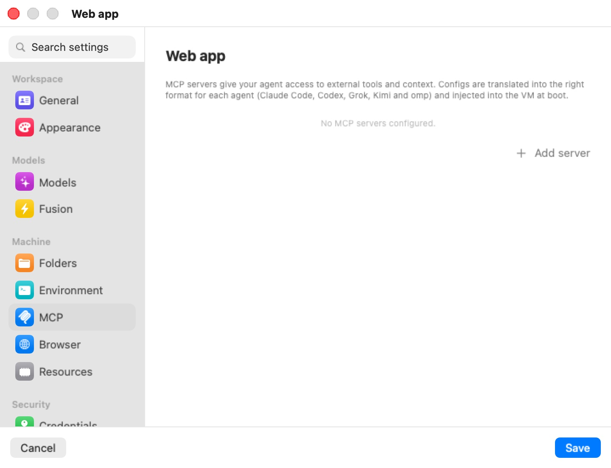

# MCP

The **MCP** pane configures the [Model Context Protocol](../18-glossary.mdx) servers this machine's agents can use (a machine is a workspace, in the settings editor). MCP servers give an agent tools and context from outside — a documentation index, an issue tracker, a design tool, a database explorer. You describe each server once here; Bromure writes it into each agent's own configuration and hands it to the VM at boot.

  

The caption: "MCP servers give your agent access to external tools and context. Configs are translated into the right format for each agent (Claude Code, Codex, Grok, Kimi and omp) and injected into the VM at boot." With none configured, the pane reads **No MCP servers configured.**

## Built-in servers

Every machine also gets Bromure's own MCP servers. You don't configure them here and they are not listed in the pane. Each is a small program in the VM that talks to the Mac over a private virtual socket.

| Server | Given to | What the agent can do with it |
|---|---|---|
| `bromure-browser` | Every agent | Drive the machine's embedded Chromium: navigate, click, type, screenshot, read the console and network log. See [The Embedded Browser](../06g-browser.mdx). |
| `bromure-automations` | Every agent | List, create, edit, delete and run this machine's automations. See [Automations](../06h-automations.mdx). |
| `bromure-infrastructure` | Every agent | See which Kubernetes clusters and registries this machine may use, and create new ones. See [Kubernetes Clusters & Registries](../13a-kubernetes.mdx). |
| `bromure-delegation` | Every agent session | Hand work to another session, or send a request to another machine, and hear back. See [Agents Working Together](../06d-delegation.mdx). |
| `bromure-board` | Agents working a coding task | Set the plan, create subtasks, hand the task to review. See [Coding Tasks](../06i-coding-tasks.mdx). |
| `bromure-switchboard` | The Switchboard only | See and steer every session. See [Switchboard & Messaging](../06e-switchboard.mdx). |

In Claude Code's configuration the first four appear as `browser`, `automations`, `infrastructure` and `delegation`.

> **Tip:** Don't give one of your own servers the same name as a built-in one (`browser`, `automations`, `infrastructure`, `delegation`): yours replaces the built-in entry in the agent's configuration.

## Adding a server

Click **Add server** to add a row. New servers use **HTTP** and are enabled. Each row has:

- **Name** — the server's identifier (placeholder `my-server`).
- **Transport** — **HTTP** or **STDIO**. Hidden in JSON mode.
- **Enable switch** — turns this server on or off without deleting it.
- **Edit as JSON** — the braces button swaps the form for a raw JSON editor, validated as you type and passed through as-is; it then reads **Switch to form**.
- **Remove** — the minus button.

### STDIO servers

A program launched inside the VM that speaks MCP over standard input and output:

- **Command** — the executable (placeholder `npx`).
- **Arguments** — space-separated (placeholder `-y @upstash/context7-mcp`).

### HTTP servers

A remote MCP endpoint. **URL** takes the address (placeholder `https://mcp.example.com/mcp`); the **Authentication** disclosure holds the credential. Either way, the real token stays on the Mac:

- **Authorize with OAuth…** — the Mac runs the OAuth sign-in. Once authorized, the row shows **Authorized** with its expiry and **Re-authorize** / **Revoke**. The agent's configuration carries no credential at all; the proxy adds the authorization to requests bound for the server.
- **Static token** — under "Or enter a static token:", set an **Env var name** (for example `FIGMA_OAUTH_TOKEN`) and paste the **Token**, captioned **Never sent to VM — swapped by proxy**. The VM gets a stand-in in that variable, and the proxy swaps it for the real token on requests to the server's host.

For HTTP servers with a token, the proxy also answers the server's OAuth discovery requests, so the agent treats the server as already signed in instead of trying its own sign-in, which can't work inside the VM. See [Credentials & the Wire Boundary](../08-credentials.mdx).

> **Note:** If a server in JSON mode also has a static token, its JSON is ignored and the form's fields are used instead, so the token can be swapped.

## When changes apply

Server definitions are written into the agents' configuration when the machine boots. After adding, changing or removing a server, restart the machine for agents to see it. OAuth authorization and revocation take effect on the Mac immediately.

## This pane vs. the app's own MCP server

- **This pane** configures servers the agent *inside the VM* uses as tools.
- The **Automation** pane in Preferences enables the `bromure-ac mcp` server, which lets an agent *outside* — on your Mac — drive Bromure itself. See [Automation](automation.mdx) and [CLI, API & MCP](../16-automation-cli.mdx).

## Settings reference

| Setting | Type | Default | Description |
|---|---|---|---|
| **Server list** | Rows | Empty | Name, transport, enable switch, JSON toggle. |
| **Transport** | **HTTP** / **STDIO** | HTTP | Hidden in JSON mode. |
| **Enabled** | Switch | On | Per server. |
| **Edit as JSON** | Toggle | Form | Raw JSON, passed through. |
| **Command / Arguments** | Text (STDIO) | Empty | Executable and arguments. |
| **URL** | Text (HTTP) | Empty | The endpoint. |
| **Authentication** | OAuth or static token (HTTP) | None | Real token stays on the Mac; swapped on the wire. |
| **Add server** | Button | — | Adds an enabled HTTP server. |

## Related chapters

- [CLI, API & MCP](../16-automation-cli.mdx) — the app's own MCP server and the in-guest servers' ports.
- [Credentials & the Wire Boundary](../08-credentials.mdx) — how MCP tokens are held and swapped.
- [Settings Reference](index.mdx) — all panes at a glance.
