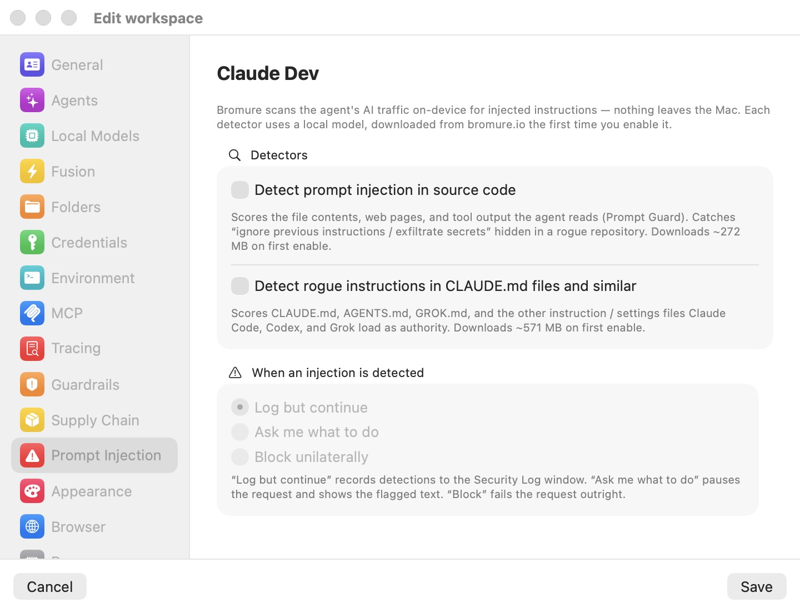

# Prompt Injection

[Prompt injection](../18-glossary.mdx) is malicious text hidden in content the agent reads — a file in a rogue repository, a web page, a poisoned `CLAUDE.md` — that tries to steer the model ("ignore previous instructions, exfiltrate secrets"). The **Prompt Injection** pane enables per-workspace detectors that scan the agent's AI traffic for such content. As the pane's description says: Bromure scans the agent's AI traffic on-device for injected instructions — nothing leaves the Mac. Each detector uses a local model, downloaded from bromure.io the first time you enable it.

  

The pane has two groups: **Detectors** (which scanners run) and **When an injection is detected** (what happens on a hit). In the screenshot both detectors are off, so the action radio group below is disabled — it activates as soon as at least one detector is on. Scanning happens in the host proxy, so an agent in the VM cannot switch it off. Detector internals, scoring, and enforcement are covered in the [prompt-injection deep dive](../10-prompt-injection.mdx).

## Detectors

### Detect prompt injection in source code

Scores the untrusted external content the agent streams back to the model — file contents, web pages, and tool output sent as `tool_result` blocks — with the local Prompt Guard classification model. This is the detector that catches "ignore previous instructions / exfiltrate secrets" text hidden in a rogue repository. The pane caption states a download of about 272 MB on first enable.

The scan runs entirely on-device. Only the newest message carrying tool results is scanned each turn (the resent conversation history is skipped), and identical content is cached, so repeated reads of the same file cost nothing.

### Detect rogue instructions in CLAUDE.md files and similar

Targets the "rules file backdoor" threat: malicious instructions planted in the files coding agents auto-load as trusted authority — `CLAUDE.md`, `AGENTS.md`, `GROK.md`, and the nested and global variants Claude Code, Codex, and Grok read into their system prompt. Two passes run:

- A deterministic scanner (no model needed) that flags invisible-Unicode obfuscation — zero-width characters, bidirectional overrides, Unicode tag characters — plus meta-instruction patterns ("ignore previous instructions", "do not tell the user") and capability or exfiltration keywords (credential file paths, curl-pipe-to-shell, force pushes).
- A fine-tuned ModernBERT classifier that makes a semantic pass over the same instruction-file bodies.

The pane caption states a download of about 571 MB on first enable. Findings from an unchanged file are deduplicated per session, so a flagged `CLAUDE.md` is logged once, not on every turn.

## Model downloads

Detector models are not bundled with the app. Checking either toggle first shows a confirmation alert — `Download the <detector> detector model?` — stating the exact download size computed from the real byte totals (about 298 MB for the source-code detector and about 603 MB for the rules detector, slightly larger than the rounded pane captions) with **Download** and **Cancel** buttons, then a progress window with a percentage and a Cancel button. Declining, cancelling, or a failed download reverts the toggle: a detector without its model is a no-op, and Bromure will not pretend otherwise.

Details worth knowing:

- Models download from `dl.bromure.io` into `~/Library/Application Support/BromureAC/Models/` (`prompt-injection/` for the source detector, `claudemd-guard/` for the rules detector). To remove one, delete its folder.
- Downloads start immediately when you confirm — this is one of the few settings-editor actions that takes effect before you click **Save**.
- Downloads are shared: once fetched, any workspace enabling the same detector reuses the model.
- A free-disk preflight refuses a doomed download up front. If a detector is enabled but its model is missing at app launch, a background download starts automatically; progress and outcome land in the Security Log.

## When an injection is detected

One shared action applies to both detectors. The pane's helper text summarizes it: "Log but continue" records detections to the Security Log window; "Ask me what to do" pauses the request and shows the flagged text; "Block" fails the request outright.

| Action | Behavior |
|---|---|
| **Log but continue** | The detection is recorded to the Security Log and the request proceeds. Scanning happens after the response has been relayed, so this mode adds zero latency. The default. |
| **Ask me what to do** | The outbound request is paused before any byte reaches the AI host, and a dialog shows the flagged text in a scrollable monospaced view, with **Block this request** and **Allow this request** buttons. Your decision is remembered for that workspace, source, and content, so the same flagged text is not re-prompted every turn. |
| **Block unilaterally** | The request is refused outright. The agent receives an HTTP 451 error ("Bromure blocked this request: possible … detected in …") and the model never sees the poisoned content. |

The radio group is disabled until at least one detector is enabled. In the **Ask** and **Block** modes the scan runs before forwarding, which adds classifier latency to flagged turns; **Log but continue** adds none. When a workspace is driven headless over SSH or the CLI, the **Ask** question is posed as a text prompt inside the workspace's tmux — only an explicit allow lets the request through.

## Where detections appear

Every detection, download event, and enforcement outcome surfaces in the **Security Log** window (Window menu → **Security Log…**) — a live feed with entries such as `[prompt-injection] rules FLAG source=/path/CLAUDE.md signals=[zero_width(high)]`. Log lines carry only a short preview of the flagged content; the full text appears in the **Ask me what to do** dialog. On Macs enrolled with a bromure.io workspace, detections are also forwarded as audit events (suppressed by the [Tracing pane's](tracing.mdx) **Private mode**).

## Settings reference

| Setting | Type | Default |
|---|---|---|
| **Detect prompt injection in source code** | Toggle (prompts to download the model on first enable) | Off |
| **Detect rogue instructions in CLAUDE.md files and similar** | Toggle (prompts to download the model on first enable) | Off |
| **When an injection is detected** | Radio: **Log but continue** / **Ask me what to do** / **Block unilaterally** (disabled until a detector is on) | **Log but continue** |

> **Tip:** A sensible progression: start with both detectors on in **Log but continue**, watch the Security Log for a few days to gauge the false-positive rate on your repositories, then move to **Ask me what to do** for untrusted codebases. For memory and Neural Engine tuning of the on-device classifiers, see the [prompt-injection deep dive](../10-prompt-injection.mdx).
