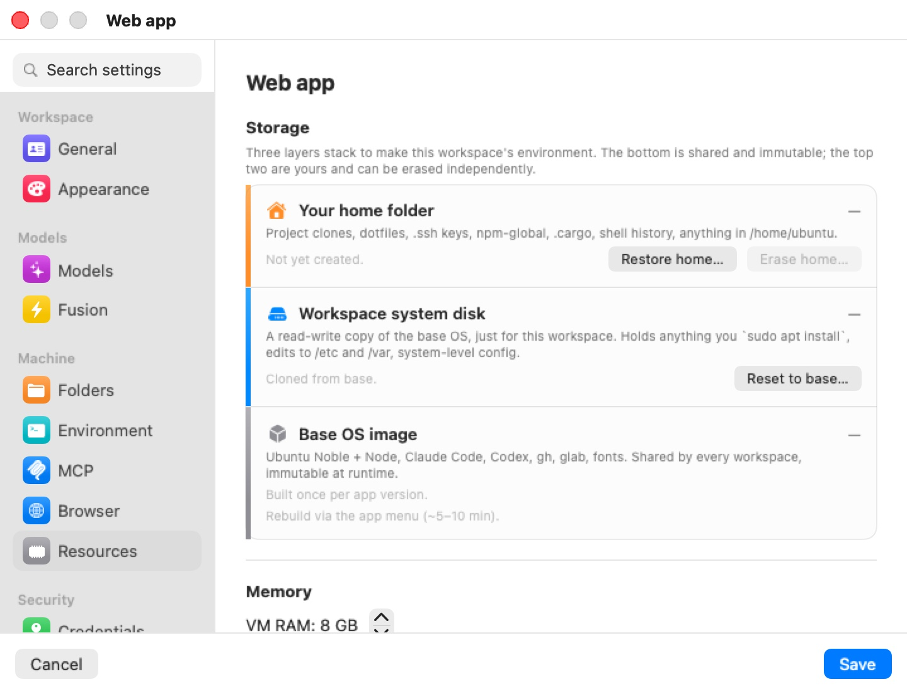
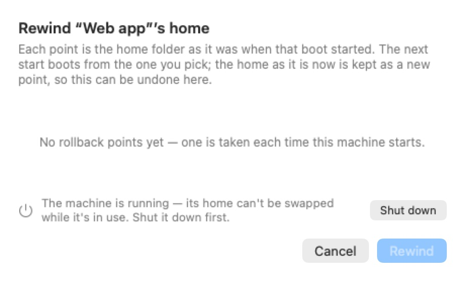

# Resources

The **Resources** pane configures the virtual machine behind a machine (a workspace, in the settings editor): its disk layers, its memory, and how it reaches the network. It has three groups — **Storage**, **Memory**, and **Network**.

  

The storage controls act on a real machine's disks. In Preferences (the **Defaults** template) the Storage group only says "Storage controls only apply to real workspaces. They appear in each workspace's editor when you create or edit one.", and two app-wide sections appear at the bottom (see [Preferences only](#preferences-only-subnet-and-remote-transport)). When you edit a remote machine from a mirror window, the storage stack isn't shown either.

## Storage

"Three layers stack to make this workspace's environment. The bottom is shared and immutable; the top two are yours and can be erased independently." Each layer is a row with its size, its status, and its actions.

### Your home folder

The top layer is `/home/ubuntu` — project clones, dotfiles, `.ssh` keys, `npm-global`, `.cargo`, shell history, anything the agent writes to its home. It lives on a private disk image that shrinks on your Mac as files are deleted inside the VM. The status line reads **Active** with how long ago it was last used, or **Not yet created.** before the first start.

- **Erase home…** (destructive) wipes the home: projects, history, `npm-global`, `.cargo`, the machine's SSH keypair, and the home's rollback points. The app's managed dotfiles are rebuilt on the next start. The system disk, settings, and credentials are untouched.
- **Restore home…** rolls the home back to one of its rollback points. A rollback point is taken each time the machine starts (the last few starts, then one per day for a week, then one per week for a month); each one is the home as it was when that start began. Pick one in the alert and confirm; the current home is saved as a new point first, so a restore can be undone. The next start boots from the restored home.
- **Upgrade storage…** replaces **Restore home…** on an older machine whose home is still a folder on the Mac. It arms a one-time move of the home onto its own disk image, offered at the next start; the old home is kept on the Mac as a backup.

### Rewind home… from the sidebar

The same rollback is also on the machine's **⋯** menu in the sidebar's **Virtual Machines** section: **Rewind home…** opens a sheet that lists the rollback points with their dates and sizes.

  

"Each point is the home folder as it was when that boot started. The next start boots from the one you pick; the home as it is now is kept as a new point, so this can be undone here." With no points yet, it reads "No rollback points yet — one is taken each time this machine starts." The home can't be swapped while the machine runs: the sheet says so and offers **Shut down**, and **Rewind** stays disabled until the machine is off. After a rewind, the sheet confirms which home the next start boots from.

### Workspace system disk

The middle layer is a read-write copy of the base OS, made for this machine. It holds whatever you `sudo apt install`, edits to `/etc` and `/var`, and other system-level changes. The status line shows the base version it was copied from ("Cloned from base v…").

**Reset to base…** (destructive) throws away every system-level change and copies the disk again from the current base image. The home is left alone. Resetting also discards any suspended state, so the next start is a clean boot. It is the same action as **Reset disk** in the machine's **⋯** menu — see [Machines](../06f-machines.mdx).

### Base OS image

The bottom layer is the shared base image — "Ubuntu Noble + Node, Claude Code, Codex, gh, glab, fonts. Shared by every workspace, immutable at runtime." — with its version, build date and size. It has no action here; rebuilding it affects every machine, so it lives in the app menu (**Rebuild Base Image…**), as the row notes: "Rebuild via the app menu (∼5–10 min)."

> **Note:** **Erase home…**, **Restore home…**, **Upgrade storage…** and **Reset to base…** are disabled while the machine runs (tooltip "Close the session window first."). On a machine that has never started, the disks don't exist yet ("Created on first launch.").

## Memory

The **VM RAM** stepper sets the machine's memory, from 2 to 32 GB in steps of 2 — "Bump this if Claude / Codex feels sluggish or rust builds OOM." The default depends on your Mac: 4 GB on Macs with less than 18 GB, 6 GB up to 36 GB, 8 GB above. The VM has 4 virtual CPUs; that is not configurable.

Changing memory on a running machine asks to restart it.

## Network

- **NAT** (default) — "VM sits behind NAT. Egress works; nothing on your LAN can reach it." All NAT machines share one private network on the Mac, so a machine and its browser, or two machines, can reach each other's dev servers by IP address.
- **Bridged** — the VM joins your physical network. An **Interface** picker lists the Mac's network interfaces (default: the first one): "The VM gets a LAN-routable IP via DHCP on the chosen interface." If none can be bridged, an orange warning says "No bridged interfaces available. Bromure AC will fall back to NAT at launch."

Changing the network mode or interface on a running machine asks to restart it. In the iPhone, iPad and Vision Pro client there is no interface picker; the server picks one, or falls back to NAT.

## Preferences only: subnet and remote transport

Two app-wide sections appear at the bottom of Resources in this Mac's Preferences. They apply to this Mac, save immediately, and are not part of the template. A remote's Preferences, and a remote machine's editor in a mirror window, don't show them.

**Workspace subnet** — **Use a private subnet (avoids clashes across remotes)**. When on, the Mac's machines use a private `172.16.x.x/24` network, shown with a **Randomize** button to pick another. When off, they use `192.168.64.0/24`, which collides when a Mac mirrors more than one remote. New installs start with this on. Changes apply the next time your machines start.

**Remote transport** — **UDP relay transport (experimental)**, off by default. When a remote connection falls back to the relay, it prefers a UDP path that copes better with packet loss than the TCP relay, and drops back to TCP when UDP is blocked. It applies to new connections, and the relay server must also have UDP enabled. See [Remote Access & Clients](../14-remote-access.mdx).

## Settings reference

| Setting | Type | Default |
|---|---|---|
| **Your home folder** — **Erase home…** | Destructive button | — |
| **Your home folder** — **Restore home…** / **Upgrade storage…** | Button | — |
| **Workspace system disk** — **Reset to base…** | Destructive button | — |
| **Base OS image** | Read-only row | — |
| **VM RAM** | Stepper, 2–32 GB, steps of 2 | 4, 6 or 8 GB depending on the Mac's memory |
| **Network** | **NAT** / **Bridged** | NAT |
| **Interface** (bridged) | Picker | First available |
| **Use a private subnet** (Preferences) | Toggle, with **Randomize** | On for new installs |
| **UDP relay transport (experimental)** (Preferences) | Toggle | Off |

A machine's disks, home image and rollback points live under `~/Library/Application Support/BromureAC/profiles/<uuid>/`.

## Related chapters

- [Machines](../06f-machines.mdx) — starting, suspending, resetting and deleting machines.
- [Concepts & Architecture](../04-concepts.mdx) — the layered disk model.
- [Advanced](../16a-advanced.mdx) — disk checks and other maintenance.
- [Settings Reference](index.mdx) — all panes at a glance.
