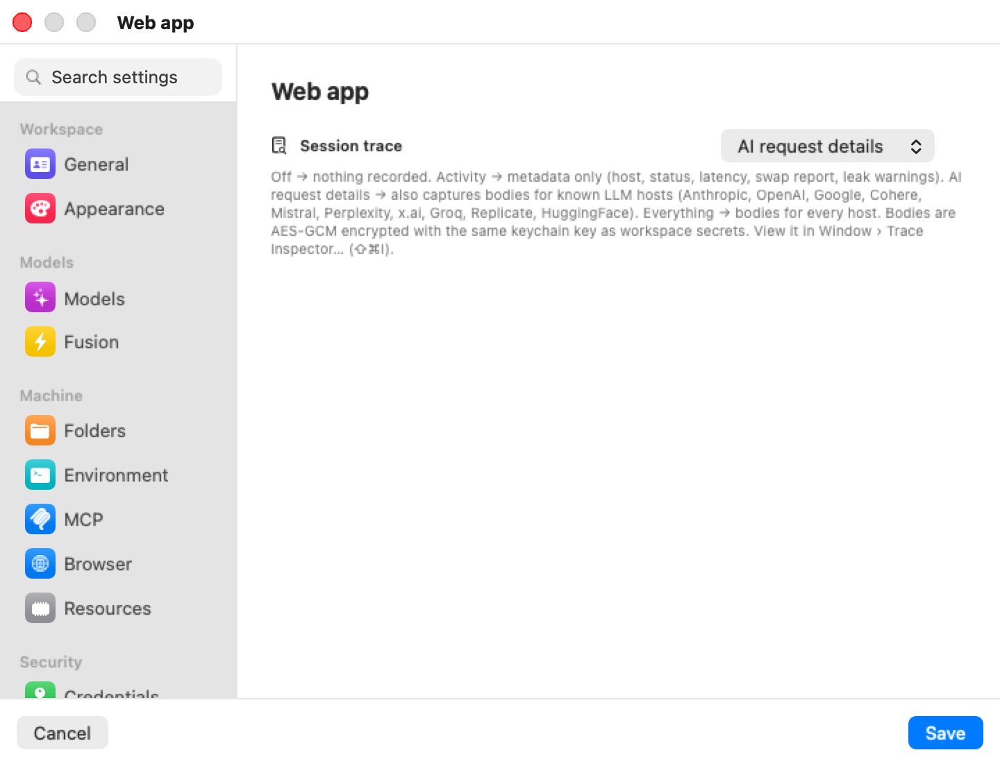

# Tracing

Every request a machine makes (a machine is a workspace, in the settings editor) — agent traffic to model providers, package downloads, calls to your infrastructure — passes through Bromure's proxy on the Mac. The **Tracing** pane sets how much of that traffic is recorded for this machine, from nothing to full request and response bodies. Everything recorded stays on your Mac, encrypted, and is browsable in the Trace Inspector or with `bromure-cli trace`.

  

The trace level is only about recorded traffic. The **Security Timeline** — what the security engines blocked, allowed, swapped or flagged — is always recorded, whatever you set here. See [Security Overview & Timeline](../11a-security-timeline.mdx).

## Session trace

| Level | What is recorded |
|---|---|
| **Off** | Nothing. |
| **Activity only** | One metadata record per request: time, host, method, path, status, sizes, latency, the token-swap report, and credential-leak warnings. No bodies. |
| **AI request details** | Everything in **Activity only**, plus full request and response bodies for known model-provider hosts (Anthropic, OpenAI, Google, Cohere, Mistral, Perplexity, x.ai, Groq, Replicate, HuggingFace). |
| **Everything** | Bodies for every host. Fills disk fastest. |

New machines record at **AI request details** (from the Defaults template), so agent conversations can be audited from the start. The level changes on a running machine as soon as you save.

> **Tip:** **Activity only** gives you the audit trail — which hosts were contacted, whether credentials were swapped or leaked — without keeping prompts and replies on disk.

## How traces are stored

Metadata goes to `~/Library/Application Support/BromureAC/traces/YYYY-MM-DD/<sessionID>.jsonl`, one JSON line per request. Bodies go next to it, in a per-session folder, encrypted with the same Keychain-held key that protects machine secrets.

Before anything is written, sensitive headers (`Authorization`, `Proxy-Authorization`, `Cookie`, `Set-Cookie`, `x-amz-security-token`, `api-key`, and any header ending in `-api-key`) are replaced with `<redacted>`, and swaps and suspected leaks are recorded as first/last-character previews only — real secrets never enter a trace.

Bodies are capped at 100 MB per session (oldest bodies go first; metadata is kept) and the traces folder at 5 GB (oldest days go first).

> **Warning:** At **AI request details** and **Everything**, the full text of AI exchanges is on disk — encrypted, but present.

## Private mode

The **Private mode** switch appears only on Macs enrolled with a bromure.io organization. When on, this machine's sessions stop sending session metadata (tools, files, commands, token usage) to your organization — "neither the title-bar indicator nor the admin's session list will see anything from this workspace." Local tracing is unaffected. On a Mac that isn't enrolled the switch is hidden, since nothing is sent. Default: off. See [Enterprise — Enrollment & Fleet](../15-enterprise.mdx).

## Subscription token swap

When an agent signed in with a subscription runs, the proxy can keep the real Claude or Codex sign-in tokens on the Mac and give the VM stand-ins — the same swap used for API keys. After it has asked you once for this machine, the pane shows a row per provider:

- **Claude subscription token swap**
- **Codex subscription token swap**

Each reads **Active** ("The proxy is keeping the real OAuth tokens on this Mac and serving fakes inside the VM.") or **Declined**, with **Forget swap (re-prompt next session)** or **Re-enable prompt** to reset it; the proxy then asks again. The rows are hidden until the proxy has asked.

## Viewing what was recorded

- **Trace Inspector** — **Window › Trace Inspector…** (⇧⌘I), or **Inspect Trace** in a machine's machine menu. A live, filterable list of recorded exchanges with swap and leak badges; captured AI exchanges render as a conversation.
- **Command line** — with the app running, `bromure-cli trace ls`, `trace summary`, `trace hostnames`, `trace leaks`, and `trace clear`.

Both are covered in [Tracing & Audit](../11-tracing.mdx).

## Settings reference

| Setting | Type | Default |
|---|---|---|
| **Session trace** | **Off** / **Activity only** / **AI request details** / **Everything** | **AI request details** for new machines |
| **Private mode** | Switch (enrolled Macs only) | Off |
| **Claude subscription token swap** | Status and reset (after the first prompt) | Hidden |
| **Codex subscription token swap** | Status and reset (after the first prompt) | Hidden |

## Related chapters

- [Tracing & Audit](../11-tracing.mdx) — the Trace Inspector, levels, and the trace CLI.
- [Security Overview & Timeline](../11a-security-timeline.mdx) — the always-on record of security decisions.
- [Settings Reference](index.mdx) — all panes at a glance.
