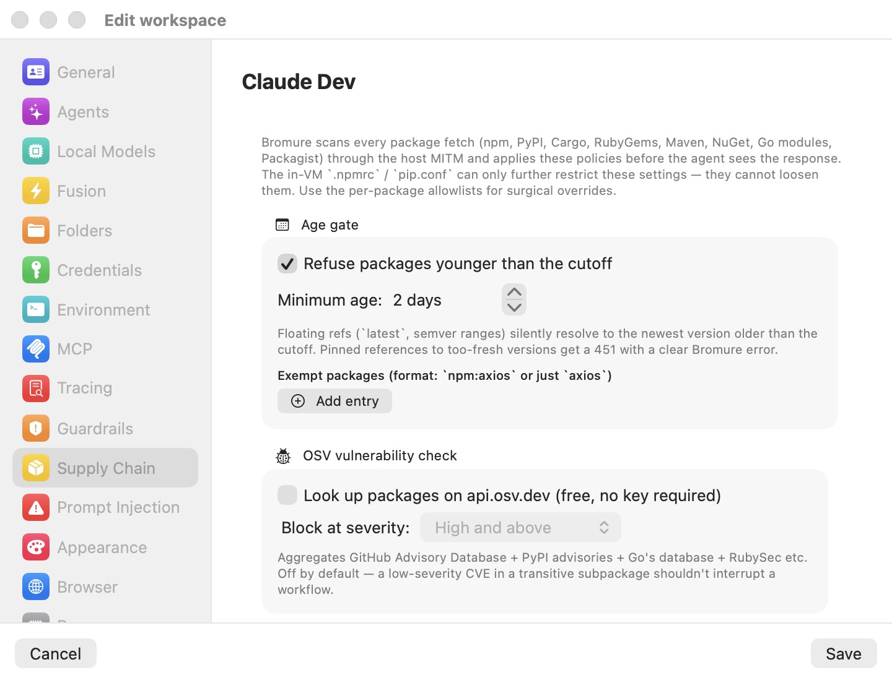

# Supply-Chain Protection

An autonomous coding agent installs packages constantly — scaffolding a project pulls in hundreds of dependencies without a human ever reading a name, let alone a changelog. That makes the package registry the single widest channel for hostile code to enter the sandbox: a typosquatted name, a freshly hijacked release, or a malicious `postinstall` script runs with the agent's full permissions the moment `npm install` finishes. Bromure Agentic Coding treats every package fetch as untrusted input and applies a per-workspace policy to it on the host, before a single byte reaches the VM.

This chapter explains what is intercepted, each check in the pipeline, what happens when a check fires, and how to read the results in the Security Log. The field-by-field settings reference for the pane lives in [Supply Chain settings](07-settings/supply-chain.mdx).

## Why package installs are the attack surface

The sandbox already contains the agent: it cannot touch your Mac, and its credentials are decoys (see [Credentials](08-credentials.mdx)). What the sandbox cannot do by itself is judge the *provenance* of code the agent pulls in. Supply-chain attacks exploit exactly that gap:

- **Fresh-release hijacks.** A maintainer's account is compromised and a malicious version is published. These versions are typically detected and yanked within hours to days — which is why the [age gate](18-glossary.mdx) refuses versions younger than a cutoff.
- **Known-vulnerable versions.** The agent resolves a dependency to a version with a published advisory. The [OSV](18-glossary.mdx) check catches these.
- **Malware, typosquats, and rogue install scripts.** Packages built to be malicious from the start. The [socket.dev](18-glossary.mdx) and [Delpi](18-glossary.mdx) providers flag or filter these, and install-script stripping removes the most common execution vector outright.

Enforcement is host-side by design. The proxy applies policy to the response before the agent sees it, so nothing running inside the VM — including a fully compromised agent — can loosen the rules. The in-VM `.npmrc` and `pip.conf` can only further restrict what the proxy already served, never widen it. Reputation-service API keys (socket.dev, Delpi) are held on the host only and are never exported into the VM.

## How interception works

Every network request the VM makes passes through the host-side MITM proxy (see [Concepts](04-concepts.mdx)). The proxy recognizes requests to the major package registries and classifies each one:

- **Metadata** — a package's version listing (an npm packument, PyPI's JSON API or `/simple/` index, a Cargo sparse-index entry, and so on). The age gate operates here, by rewriting the listing.
- **Artifact** — the downloadable file for one specific version: an npm `.tgz`, a Python wheel or sdist, a `.crate`, `.gem`, `.nupkg`, or Go module `.zip`. OSV lookups, socket.dev checks, script stripping, and hard blocks all happen at artifact-fetch time.
- **Passthrough** — everything else on those hosts (search, authentication). Untouched.

Interception is automatic as soon as at least one supply-chain layer is enabled for the workspace (or the workspace is enrolled with bromure.io, in which case fetches are observed for telemetry even with every enforcement layer off). There is nothing to install or configure inside the VM.

> **Note:** Packages already present in npm's or pip's local cache never hit the network, so nothing is checked — or logged — for them. A quiet Security Log during an install can simply mean everything came from cache.

## Verdicts: allow, rewrite, block, hold

Supply-chain layers are individual on/off toggles, each with a fixed action — there is no global block/warn/allow mode for this pane. (The three-way log/ask/block radio you may know from [Prompt Injection](10-prompt-injection.mdx), and the enforcement modes in [Guardrails](07-settings/guardrails.mdx), are separate systems.) Every fetch ends in one of four outcomes:

| Outcome | What happens | Visible marker |
|---|---|---|
| **Allowed** | The response passes through untouched. | Green check in the Security Log; an "inspecting" line confirms the proxy saw it. |
| **Rewritten** | The proxy modified the response: too-fresh versions removed from metadata, or install scripts stripped from a tarball. The package manager proceeds normally. | `X-Bromure-Rewritten: supply-chain` response header; orange "stripped" lines in the log. |
| **Blocked** | The download is refused with an HTTP [451](18-glossary.mdx) ("Unavailable For Legal Reasons") response. | `X-Bromure-Block: supply-chain` header; red line in the log. |
| **Held for consent** | The download pauses while Bromure asks you — for lockfile-pinned pass-throughs and for packages no enabled reputation source could vet. Denying converts the hold into a 451 block. | A system consent alert; the decision is logged. |

A 451 block carries a plaintext body that begins with `Bromure Supply-Chain Security blocked this request:` followed by the exact reason, for example:

```
Bromure Supply-Chain Security blocked this request: npm package foo@1.2.3
published 4 hours ago — policy requires 2 days minimum
```

npm, pip, cargo, and the other package managers print that body verbatim in their error output, so both the agent and you see precisely why an install failed — and the agent can often route around it on its own (for example, by pinning an older version). The 451 status was chosen deliberately so supply-chain blocks are distinguishable at a glance from the 403s that [Guardrails](07-settings/guardrails.mdx) uses.

## Coverage by ecosystem

The proxy intercepts eight package ecosystems. Not every check supports every ecosystem:

| Ecosystem | Intercepted hosts | Age gate | OSV | socket.dev | Delpi | Script strip |
|---|---|---|---|---|---|---|
| npm | `registry.npmjs.org`, `*.npmjs.org` | Yes | Yes | Yes | Yes | Yes |
| PyPI | `pypi.org`, `files.pythonhosted.org` | Yes | Yes | Yes | — | — |
| Cargo | `crates.io`, `static.crates.io`, `index.crates.io` | Yes | Yes | No | — | — |
| RubyGems | `rubygems.org` | Yes | Yes | Yes | — | — |
| Maven Central | `repo1.maven.org`, `repo.maven.apache.org`, `search.maven.org` | No | Yes | Yes | — | — |
| NuGet | `api.nuget.org`, `*.nuget.org` | No | Yes | Yes | — | — |
| Go modules | `proxy.golang.org` | No | Yes | Yes | — | — |
| Packagist | `repo.packagist.org`, `packagist.org` | Yes | Yes | Yes | — | — |

Two gaps worth knowing about:

- **Age gate — Maven, NuGet, Go.** These three ecosystems do not carry per-version publish timestamps in their standard metadata responses, so their metadata passes through unfiltered and the artifact backstop has no data to act on. The age gate effectively does not block them today; npm, PyPI, Cargo, RubyGems, and Packagist are fully covered.
- **socket.dev — Cargo.** socket.dev has no Cargo support. With socket.dev filtering enabled, every `crates.io` artifact yields no verdict and therefore triggers the unverified-package consent prompt (see [Offline and degraded behavior](#offline-and-degraded-behavior)). If your workspace does heavy Rust work, either answer the prompts or pick a different provider.

## The age gate

The age gate refuses package versions younger than a configurable number of days, on the theory that a freshly published release is the one most likely to be a just-hijacked package — malicious versions are usually reported and yanked quickly, and waiting out that window costs almost nothing for regular development. It is the only layer enabled by default, with a 2-day minimum.

<p align="center">
  
</p>

It works through two cooperating mechanisms:

- **Metadata rewriting.** The proxy strips too-fresh versions out of the registry's version listing and re-aims `latest` and other dist-tags at the newest surviving version. Floating references — `pkg@latest`, semver ranges — are therefore never hard-blocked: the package manager silently resolves to the newest version old enough to pass. From the agent's point of view, versions younger than the cutoff simply do not exist yet.
- **Artifact-fetch backstop.** Every per-version publish time the proxy sees in metadata is cached in memory (up to 50,000 entries). If the agent then requests a pinned, too-fresh version directly, the fetch is blocked with a 451 that states the package's actual age and the required minimum. For pip — whose default PEP 503 HTML index carries no timestamps — Bromure performs an on-demand lookup of `https://pypi.org/pypi/<pkg>/<version>/json` to obtain the publish time.

To configure it, open the workspace's **Supply Chain** pane and use the **Age gate** group:

1. Toggle **Refuse packages younger than the cutoff**.
2. Set **Minimum age:** with the stepper (0–90 days).
3. If a specific package must be installable immediately — for example, your own team publishes it — add it under **Exempt packages** with the **Add entry** button. Entries use the [allowlist format](18-glossary.mdx): `npm:axios` scopes the exemption to one ecosystem, a bare `axios` matches the package name in every ecosystem. Matching is case-insensitive.

> **Tip:** npm metadata requests are silently upgraded to the full packument so the gate can see publish times — you do not need to do anything for npm's abbreviated metadata format.

## OSV vulnerability check

The OSV check looks up each downloaded artifact's ecosystem, package, and version on `api.osv.dev` — the free Open Source Vulnerabilities database, which aggregates the GitHub Advisory Database, PyPI advisories, Go's vulnerability database, RubySec, and others. If any advisory for that exact version is at or above your chosen severity, the download is blocked with a 451. It covers all eight ecosystems and requires no API key.

Severity is taken from the GHSA label when the advisory has one; otherwise Bromure computes the CVSS v3 base score from the advisory's vector string.

In the **OSV vulnerability check** group:

1. Toggle **Look up packages on api.osv.dev (free, no key required)**.
2. Pick **Block at severity:** — **Low and above**, **Medium and above**, **High and above**, or **Critical only**.

The check is off by default, and the severity threshold defaults to **High and above** — as the pane itself notes, a low-severity CVE in a transitive subpackage should not interrupt a workflow. Lookups run only on artifact downloads (not metadata fetches), results are cached in memory for the app run, at most 16 lookups run in parallel, and transient network errors are retried up to 5 times with backoff. If OSV cannot be reached at all, the package is held for your consent rather than silently allowed — see [Offline and degraded behavior](#offline-and-degraded-behavior).

## Package filtering: socket.dev and Delpi

The **Package filtering** group selects a reputation provider through a mutually exclusive radio: **None**, **socket.dev**, or **Delpi**. The two providers work in fundamentally different ways — socket.dev is a pre-flight lookup the proxy consults before letting a fetch through; Delpi replaces the npm registry outright. Only one can be active at a time by design (running both would double-filter every install), and selecting **None** disables both while keeping any stored keys. Whichever provider you choose, the other layers in this chapter — age gate, OSV, script stripping — still apply on top.

The default is **None**. Workspaces created before the radio existed that already have a socket.dev key are automatically inferred as **socket.dev**.

### socket.dev

[socket.dev](18-glossary.mdx) is a commercial package-reputation service. With **socket.dev** selected and an API key entered, the proxy checks each artifact download against socket.dev's issue API before serving it. It supports npm, PyPI, Go, Maven, RubyGems, NuGet, and Packagist — but not Cargo (see [Coverage by ecosystem](#coverage-by-ecosystem)).

You bring your own key: click **Get an API key** next to the **API key:** field (it opens `socket.dev/dashboard/settings/api-tokens`), create a token, and paste it into the secure field. Both block toggles stay disabled until a key is entered, and an empty key disables socket.dev entirely regardless of the toggles. The key is stored host-side in the workspace's `profile.json` and never enters the VM; all lookups originate from your Mac.

Two independent blocks are available:

- **Block compromised packages (rogue install scripts, malware-flagged, typosquats, suspicious telemetry)** — fires on socket.dev's attack-shaped supply-chain-risk issues. Definitive malware signals (malware, known malware, GPT-detected malware, troll packages, compromised SSH keys) block at any severity. Noisier attack-shaped signals — obfuscated code, suspicious strings, install scripts, typosquatting, shell access, unusual HTTPS use — block only when socket.dev rates them high or critical, so a package with a benign `postinstall` does not get caught. Pure quality and attribute signals (new author, environment-variable reads, network access, telemetry) deliberately never block.
- **Block packages with known CVEs** — fires on socket.dev's vulnerability bucket at or above the **CVE block threshold:** picker (same four levels as OSV; default **High and above**).

Both blocks are off by default. Results are cached for the app run, at most 16 calls run in parallel, and transient failures are retried 5 times with backoff. Authentication errors are surfaced in the Security Log with the HTTP status and a preview of the response body.

> **Note:** If you enable OSV and socket.dev's CVE block together, both will check every artifact — that is allowed (they are different layers), just redundant for CVE coverage. Many users pair socket.dev's compromised-package block with the free OSV check instead.

### Delpi

[Delpi](18-glossary.mdx) is a drop-in secure npm registry by Lupin & Holmes (landh.tech) that serves pre-vetted packages. Instead of looking packages up, Bromure re-routes *every* npm registry request — metadata, tarballs, audit, anything addressed to `registry.npmjs.org` or `*.npmjs.org` — to Delpi's npm-compatible filtering registry at `depi-npm-proxy.landh.tech:443`, attaching your key as an `Authorization: Bearer` header and stripping any Authorization header the guest sent. Delpi rewrites tarball URLs in its packuments to point at itself, so those follow-up fetches get the key injected host-side too.

To enable it, select **Delpi** in the radio and paste your key into the **API key:** secure field (**Get an API key** opens landh.tech). While the field is empty, an orange warning reads **Enter an API key — Delpi stays off without one.** Each re-routed request is logged in the Security Log:

```
[delpi] GET registry.npmjs.org/… → https://depi-npm-proxy.landh.tech
```

Error handling is explicit rather than silent:

- **401 (key rejected).** Bromure substitutes a clear plaintext error that npm prints ("Bromure: the Delpi registry rejected the configured API key…", with the header `X-Bromure-Block: delpi-auth`), logs it, and raises a one-shot GUI alert per workspace-and-key combination: "Delpi rejected your API key". Headless SSH/TUI sessions do not get the GUI alert; they rely on the log line and the rewritten npm error.
- **403 (package blocked by Delpi, or key not authorized for it).** Logged and passed through unchanged, so npm reports Delpi's own refusal text.

Delpi affects npm only — the other seven ecosystems are untouched by it. Delpi replaces socket.dev in the radio, not your local policy: the age gate, OSV check, and script stripping still run on what Delpi serves.

## Install-script stripping

npm's `preinstall`, `install`, `postinstall`, and `prepare` hooks run arbitrary code at install time and are the workhorse of real-world npm malware. With **Strip preinstall / install / postinstall / prepare from npm tarballs on the fly** enabled (in the **Install scripts** group), the proxy rewrites each npm tarball in flight: it gunzips the `.tgz`, locates the top-level `package/package.json`, removes those four script keys, recomputes the tar header checksum, and re-gzips.

Because the tarball bytes change, the proxy also scrubs `dist.integrity` and `dist.shasum` from the package's registry metadata, so npm computes the hash itself from the stripped tarball and its verification still passes for unpinned installs. Each strip is logged ("stripped install scripts from" the package and version, shown in orange); tarballs that were inspected and found clean are tagged with the `X-Bromure-Rewritten: supply-chain` header only. On any parse failure the original tarball passes through untouched — this layer fails open, because it must never brick a well-formed install.

Some packages genuinely need install scripts — native binding compilers such as `better-sqlite3` or `node-canvas`. Add those to **Allow install scripts for** (format `npm:better-sqlite3`) and they keep their hooks.

The toggle is off by default, and two limits apply:

- **npm only.** PyPI sdists are not rewritten — `setup.py` *is* arbitrary code, so stripping is not feasible there.
- **Unpinned installs only.** A tarball whose integrity hash is pinned in `package-lock.json` cannot be rewritten without failing verification. That case is governed by the next layer.

## Lockfile-pinned installs

A [lockfile-pinned install](18-glossary.mdx) — `npm ci` — pins every tarball's integrity hash in the lockfile. Bromure cannot rewrite those tarballs without breaking hash verification, so its only options are to pass them through unmodified or to block them. By default they pass through silently.

If you want a say, enable **Prompt before passing lockfile-pinned tarballs through unmodified (`npm ci`, `pip --require-hashes`)** in the **Lockfile-pinned installs** group. The first lockfile-pinned fetch in a batch (detected for npm via the `npm-command: ci` request header) then pops a host consent dialog titled **Pass through npm ci (lockfile-pinned install) from workspace "…"?** with the buttons **Allow for 15 minutes**, **Allow once**, **Allow for the rest of the session**, and **Don't allow**. The whole burst of concurrent fetches coalesces onto that one prompt and follows your decision; denying blocks the fetch with a 451 and the denial is remembered for 60 seconds so retries do not re-prompt.

> **Note:** Despite the UI label mentioning `pip --require-hashes`, detection is currently implemented only for npm's `npm-command: ci` header — pip hash-pinned installs do not trigger the prompt. (They are also never rewritten, since PyPI artifacts are never modified.)

## Consent prompts and grants

All supply-chain ask-the-user paths — the lockfile pass-through and the unverified-package hold described below — go through a shared consent broker with burst coalescing: concurrent requests for the same scope wait on a single dialog instead of stacking alerts. Every prompt offers the same four decisions:

| Decision | Effect |
|---|---|
| **Don't allow** | Blocks with a 451; remembered for 60 seconds, auto-denying immediate retries. |
| **Allow once** | Lets this one request (or coalesced burst) through. |
| **Allow for 15 minutes** | Grants the scope for 15 minutes. |
| **Allow for the rest of the session** | Grants the scope until the app quits. |

Active grants and denies are listed as **Supply chain decisions** — separate from guardrail decisions — in the approvals UI (the **Window** → **Credential Approvals…** area), where you can revoke a grant early. Grants are in-memory only and do not survive an app restart.

In remote SSH/CLI sessions there is no GUI dialog: the same question is rendered as a chooser inside the workspace's tmux. No answer means deny. See [Remote Access](14-remote-access.mdx).

## Configuring the policy

Supply-chain policy is configured per workspace, in the **Supply Chain** pane of the **Edit workspace** window (the yellow shipping-box icon in the sidebar). The full field-by-field reference is in [Supply Chain settings](07-settings/supply-chain.mdx); the defaults at a glance:

| Setting | Default |
|---|---|
| **Refuse packages younger than the cutoff** (age gate) | On, **Minimum age:** 2 days, no exemptions |
| **Look up packages on api.osv.dev (free, no key required)** | Off; **Block at severity:** High and above |
| **Package filtering** | **None** (no socket.dev or Delpi key) |
| **Block compromised packages** / **Block packages with known CVEs** (socket.dev) | Off; **CVE block threshold:** High and above |
| **Strip preinstall / install / postinstall / prepare from npm tarballs on the fly** | Off, empty allowlist |
| **Prompt before passing lockfile-pinned tarballs through unmodified** | Off (silent pass-through) |

Three operational details:

- **Edits apply live.** Saving the workspace pushes the new policy to running sessions immediately — the proxy reads it per request, so no VM restart is ever needed. Each new or changed policy is confirmed with a one-line summary in the Security Log, for example:

  ```
  [supply-chain] policy engaged for 1a2b3c4d: age-gate=2d osv=high socket.dev=compromised+cve=high strip-scripts
  ```

  Misconfigurations are called out right in that summary: `socket.dev=key-set-but-no-toggle` means a key is entered but neither block is enabled, and `delpi=selected-but-no-key` means Delpi is chosen but off for lack of a key.
- **Where it is stored.** The policy lives in the workspace's `profile.json` under `~/Library/Application Support/BromureAC/profiles/<id>/` (only non-default fields are written). The socket.dev and Delpi API keys are stored there too — host-side only, shown as secure fields in the UI, and never copied into the VM. There are no supply-chain-specific environment variables or launch arguments.
- **Remote configuration.** The SSH/TUI remote menu exposes the same **Supply Chain** pane with the same fields, so a headless instance can be configured without the GUI. See [Remote Access](14-remote-access.mdx).

## The Security Log window

Everything the supply-chain pipeline does is visible in the Security Log — open **Window** → **Security Log…**. It is a live tail of every security event the proxy emits: supply-chain lookups and verdicts, 451 blocks, script strips, policy-engaged confirmations, and Delpi re-routes, alongside prompt-injection detections, Fusion engage/disengage, LLM routing changes, remote-access events, and worktree lines. One window serves the whole app; choosing the menu item again brings it forward.

Rows are color-coded so you can read an install at a glance:

| Color | Meaning | Marker |
|---|---|---|
| Blue | Outbound lookup (OSV, socket.dev, publish-time backstop) | → |
| Green | Clean verdict — the package passed | ✓ |
| Red | Block or failure (451, error) | ✗ |
| Orange | Install scripts stripped from a tarball | "stripped" |
| Accent | Policy engaged / changed | `[supply-chain]` |

The window has a **Filter…** field to narrow the view (type a package name, an ecosystem, or any text from the lines you care about), an **Auto-scroll** checkbox (on by default; uncheck it to stop following the tail while you read), a **Clear** button that wipes the buffer, and a footer showing the entry count ("42 entries", or "7 of 42 entries" while a filter is active). An empty-state message explains when entries will appear.

To see it in action: open the window, run any install inside a session (`npm install`, `pip install`, `cargo add`, `gem install`, …), and watch the entries stream in. A fully clean install still produces "inspecting" lines for each artifact — that is deliberate, so a quiet pipeline is distinguishable from a bypassed one.

> **Note:** The buffer is an in-memory ring capped at roughly 5,000 lines and does not persist across app restarts. Every line is also mirrored to the app's stderr, so launching `bromure-cli` from a terminal (or capturing its log output) gives you a durable copy. The window opens at 820×460 and can be resized down to 720×360.

## Offline and degraded behavior

The pipeline's reputation checks depend on outbound calls from your Mac (never from the VM): `api.osv.dev` for OSV, `api.socket.dev` for socket.dev, `pypi.org` for the PyPI publish-time backstop, and `depi-npm-proxy.landh.tech` for Delpi. When an enabled source cannot produce a verdict — network down after retries, HTTP error, rate-limiting, an auth failure, or an unsupported ecosystem — Bromure **fails closed** rather than silently allowing.

The download pauses and an [unverified-package hold](18-glossary.mdx) asks you, per package and version, with a system alert titled **Pass through an unverified package from workspace "…"?**: Bromure could not reach the source to vet the package, and installing it means accepting a package that was not checked against your configured reputation sources. The four standard consent decisions apply; denying (including when no GUI is available and the remote prompt times out) blocks with a 451. Holds are keyed per package@version, so one approval can never blanket the whole dependency graph.

This is deliberate protection: without it, an attacker who can induce rate-limiting on the reputation service could sneak packages through unchecked. The practical consequences:

- **Working fully offline** with OSV or socket.dev enabled means a prompt for every uncached package. Disable those layers for offline stints — the age gate keeps working from already-cached metadata without connectivity.
- **socket.dev plus Cargo** means a prompt for every crate, since socket.dev cannot vet Cargo at all (grants are per package@version, so a session grant only covers that one crate version).
- **The PyPI publish-time backstop is the one exception:** on a pure network error it fails open for that fetch (the failure is not cached, so the lookup is retried next time). The age gate's metadata rewriting is unaffected.

## Compromise detection

Supply-chain checks reduce the odds of hostile code entering the sandbox; compromise detection catches the moment hostile code that *did* get in tries to act. It is part of the credential system rather than the package pipeline — the full picture of decoy credentials and the token swap is in [Credentials](08-credentials.mdx) — but its alarm is documented here because a poisoned package is its most likely trigger.

Every outgoing request from the VM is scanned in a single pass for the decoy ("fake") tokens the credential-swap layer minted. A fake scoped to one host (say, `github.com`) appearing in a request bound for *any other host* is the signature of credential exfiltration. When that happens:

1. The proxy blocks the request with a 451 — the destination never receives a byte.
2. The VM is paused instantly. If the session was detached, it is force-reattached and revealed. The frozen session frame tints red.
3. A critical alert appears, titled **This environment may have been compromised**, explaining that Bromure detected an outbound attempt to leak a session credential from the named workspace to a host it was not minted for and that the VM has been paused — with a detail line per leak: a token preview (like `sk-a…f9q3`), the credential's name, the host it was minted for, and the host it was observed heading to.

The alert offers three responses:

- **Shut down** (the default) — stops the VM and marks the workspace [compromised](18-glossary.mdx).
- **Save for Investigation** — you pick a folder; Bromure exports `disk.img` (a copy of the VM system disk), `home.tar.gz` (the workspace home directory), and `shares/<name>.tar.gz` for each shared folder, then shuts down and marks the workspace compromised. RAM state is discarded.
- **Continue** — accept the risk and resume; the detector re-fires if it happens again. Esc and Cmd-. deliberately do *not* map to **Continue** — resuming a possibly hostile VM must be an explicit click.

A workspace marked compromised refuses to boot again until you explicitly wipe it, and the wipe flow warns that shared folders are *not* wiped — they may still hold contaminated files, so review them by hand.

There is nothing to configure: detection is always on for credentials that declare a host scope. Manual credentials without a pinned host ("any host") can never trigger it, and Claude/Codex tokens use a relaxed same-registered-domain match (a token minted for `api.anthropic.com` seen on another `anthropic.com` host does not alarm). Only one alert shows at a time; repeat events while it is open are dropped.

## Enterprise visibility

For workspaces enrolled with bromure.io, every metadata and artifact fetch also emits a `supply_chain.fetch` event to the enterprise event stream, carrying the ecosystem, package, version, request kind, outcome (`allowed`, `rewritten`, `blocked`, or `stripped`), and the reason kind (`age_gate`, `osv`, `socket_compromised`, `socket_cve`, `verify_unavailable`, `lockfile_denied`, `scripts_stripped`). Enrollment alone gives administrators organization-wide package-download visibility — an inventory of everything every agent installed — even on workspaces with every enforcement layer switched off.

How enrollment works, and what administrators see on the other end, is covered in [Enterprise](15-enterprise.mdx).
