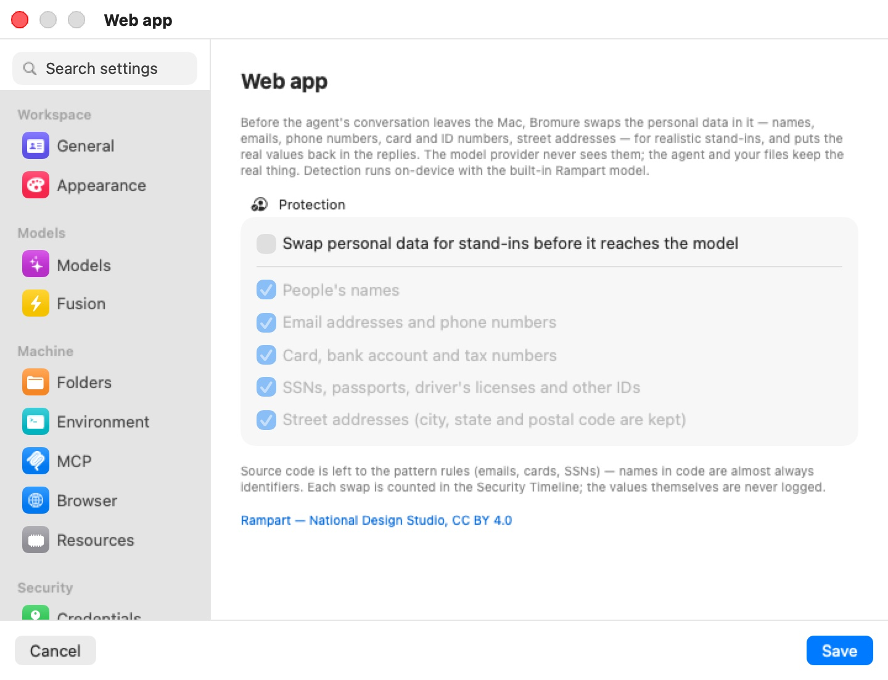

# PII Protection

A coding agent sends a great deal of your data to its model provider: every file it reads, every command output, every row of a database dump or CSV it looks at goes into the conversation. When that data holds personal information — customer names, email addresses, phone numbers, card numbers, street addresses — the provider receives it too.

**PII Protection** keeps that personal data on your Mac. Before a request leaves for the model provider, the host-side proxy finds the personal data in it and replaces each value with a realistic **stand-in**: a made-up name for a real name, an `@example.com` address for a real email, and so on. When the reply comes back, the proxy puts the real values back. The provider only ever sees stand-ins; the agent, your files and your terminal keep working with the real values, and the agent never sees a stand-in.

Detection runs on-device with the built-in **Rampart** model. Nothing is sent anywhere to be scanned.

This chapter explains what the feature swaps, how the stand-ins behave, where to see it working, and its limits. PII Protection is set per machine (a workspace, in the settings editor); the field reference is in [Settings → PII Protection](07-settings/pii-protection.mdx).

## Turning it on

Open the machine's settings and select **PII Protection** under **Security** in the sidebar.

  

The pane has one group, **Protection**:

| Setting | Default | What it covers |
|---|---|---|
| **Swap personal data for stand-ins before it reaches the model** | Off | The master switch. The categories below are greyed out while it is off. |
| **People's names** | On | First names and surnames. |
| **Email addresses and phone numbers** | On | Email addresses; phone numbers with at least seven digits. |
| **Card, bank account and tax numbers** | On | Payment card numbers, bank account and routing numbers, tax numbers. |
| **SSNs, passports, driver's licenses and other IDs** | On | US Social Security numbers and other government ID numbers. |
| **Street addresses (city, state and postal code are kept)** | On | The street line (building number, street, unit), swapped as a whole. |

Click **Save**. The setting takes effect on the machine's next AI request.

Below the group, the pane notes that source code is left to the pattern rules and that each swap is counted in the Security Timeline without the values ever being logged. The **Rampart — National Design Studio, CC BY 4.0** link credits the detector model.

> **Note:** The detector model ships inside the app. In a build that doesn't include it, turning the switch on offers to download it (about 14 MB); if the download is declined or fails, the switch turns itself back off.

## What gets swapped

Detection combines two passes:

- **Pattern rules** with validators recognize structured data exactly: email addresses, card numbers (checked with the Luhn algorithm), SSNs and similar.
- **The Rampart model**, a small token classifier running on the Mac's CPU, finds the unstructured kinds — names and street addresses — in prose and data.

Bromure then filters what the model proposes so ordinary code and product names aren't mistaken for people:

- **Source code gets the pattern rules only.** Names in code are almost always identifiers, so code is kept out of the model pass; emails, cards and SSNs in code are still swapped.
- Names of well-known products, companies and tools (Claude, GitHub, Docker, Postgres, …) are never treated as people.
- City, state and postal code are kept, so is anything that looks like a URL or an IP address. Only the street line of an address is swapped.
- A value never spans lines, and fragments too short or too code-shaped to be someone's data are left alone.

Only the text of the conversation is changed. The proxy rewrites the request string by string and leaves every other byte as the agent sent it. Model thinking, signatures and encrypted content are never touched in either direction, so the provider's integrity checks still pass.

## How stand-ins behave

Each stand-in looks like the real thing, so the model can still reason about the data:

| Kind | Stand-in |
|---|---|
| Name | A realistic, pronounceable name |
| Email | An address at `@example.com` |
| Phone number | A number in the same format as the original |
| Card number | A test card number that passes the Luhn check |
| SSN | A number in the never-issued 9xx range |

Stand-ins are **consistent per machine**. The same real value always gets the same stand-in — across turns and across app restarts — because each is derived from the value with a per-machine key. This matters for two reasons:

- The conversation the agent resends every turn stays byte-identical, so the provider's **prompt caching keeps working**.
- The model sees one consistent person or customer throughout a conversation, not a new random name every turn.

Each stand-in is checked against the dictionary and against every other entry before it is used, so restoring it in a reply can't alter ordinary words. A name that is also an everyday word ("Will", "Grace") is swapped only where it was detected as a name.

The per-machine key lives in `~/Library/Application Support/BromureAC/pii/<workspace-id>.key` (mode 0600). The table of values and stand-ins is never written to disk; it is rebuilt in memory as values are seen again.

## Putting the real values back

As the reply streams back, the proxy replaces each stand-in with its real value before the agent sees it — in the text, and in the arguments of tool calls, so a file the agent writes or a command it runs gets the real data. Replies are restored for the Anthropic Messages API, the OpenAI Chat Completions and Responses APIs, and Gemini, whether streamed or sent whole. When streaming, the proxy holds back a few characters at a time so that a stand-in split across two chunks is still recognized.

## Where it applies

PII Protection works on the agent's requests to cloud AI providers — the known AI hosts whose bodies [tracing](11-tracing.mdx) can capture, HuggingFace excepted — when the request carries a conversation. It does not apply to:

- **On-device models.** A turn served by the Mac's own inference engine never leaves the Mac, so it isn't rewritten.
- **Compressed request bodies.** A request whose body the client compressed is passed through unscanned.

Because the swap happens before [Fusion](12-fusion.mdx) fans a question out, the other models on a Fusion panel receive the stand-ins too.

## Seeing it work

Each request in which new values were swapped adds a **PII protection** row to the [Security Timeline](11a-security-timeline.mdx): the counts by kind and the destination host (for example `3 names · 1 phone number → api.anthropic.com`), with the decision **swapped for stand-ins**. Rows carry counts only — the values themselves are never logged. Values already swapped on an earlier turn and resent with the history aren't counted again. A request too large for the model's budget gets a row with the decision **partial — model budget reached; pattern rules only**, even when nothing was swapped.

The **Overview** tab's **PII swapped** tile adds up the values swapped in the last 24 hours, and the **Protections** table has a **PII protection** column showing which machines have the feature on.

## Limits

- **It is detection, not a guarantee.** The model trades a little recall for far fewer false positives on code; unusual formats, names in unusual contexts, or personal data inside source code can get through. Treat it as a strong reduction of exposure, not as proof that no personal data reached the provider.
- **Very large requests are partly pattern-only.** The model reads at most 300,000 characters of new text per request, newest first; beyond that budget only the pattern rules run, and the Security Timeline records the request as "partial — model budget reached; pattern rules only". Older history was already handled on earlier turns.
- **Only conversation text is changed.** Images, file attachments sent as binary data, and fields such as ids and model names are not scanned.
- **Traces keep the real values.** When [tracing](11-tracing.mdx) captures AI bodies, the stored request is the one the agent sent and the stored reply is the restored one, so both hold the real values — encrypted on your Mac, like every trace body. The stand-in version the provider received is not stored.
