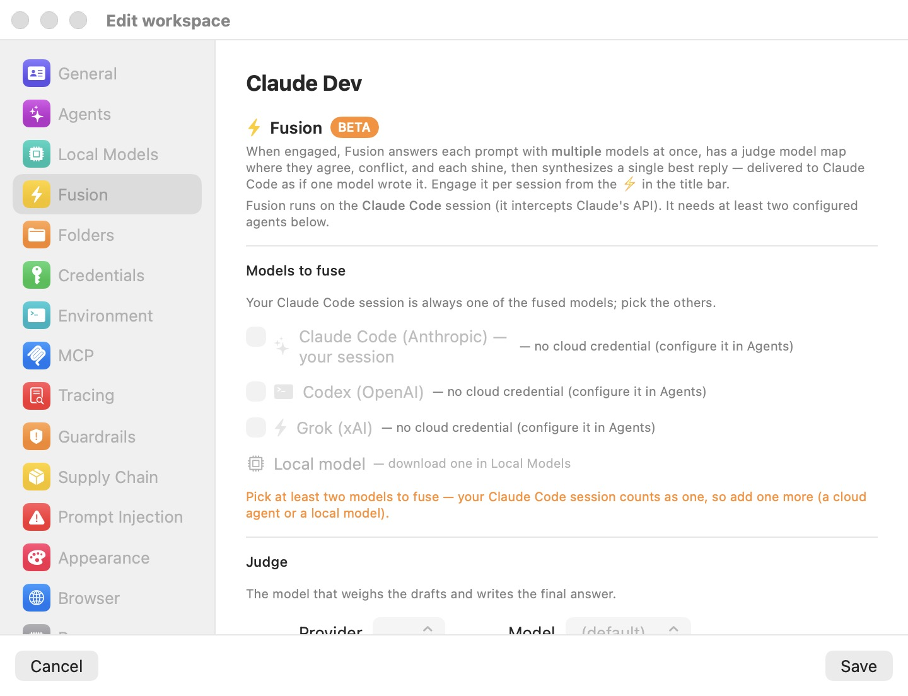

# Fusion — the Multi-Model Panel

Different frontier models fail differently. One misses an edge case another catches; one hallucinates an API the other three refuse to invent. [Fusion](18-glossary.mdx) turns that diversity into a feature: when engaged, every question your Claude Code session asks is answered by several models at once, a [judge](18-glossary.mdx) model maps where the drafts agree, conflict, and individually shine, and a single synthesized answer — grounded in that analysis — is delivered back to Claude Code as if one model wrote it. The agent never knows a panel was convened.

Fusion runs entirely in the host-side proxy (see [Concepts](04-concepts.mdx)), so nothing changes inside the VM: no agent flags, no wrapper scripts, no visible latency source the agent could react to. It is configured per workspace in the **Fusion** settings pane and engaged per session with the bolt button (⚡) in the session title bar.

> **Note:** Fusion is labeled **BETA** in the UI. It is a working prototype: the mechanism is stable, but the judge prompts, provider backends, and failure handling are still evolving. See [Beta limitations](#beta-limitations) before relying on it.

## How Fusion works

Fusion intercepts the Claude Code session's traffic to Anthropic's `/v1/messages` endpoint. Each request is handled in stages:

1. **Leg A — Claude answers first.** The guest's original request is sent to Anthropic unchanged (forced non-streaming so the full reply can be inspected). Your Claude Code session is always one [leg](18-glossary.mdx) of the fuse.
2. **Tool turns pass through.** If Claude's reply is a tool call — the common case in agentic coding, where most turns are "read this file", "run this command" — it is forwarded to the agent verbatim and fusion is skipped for that turn. The agentic loop is never broken by a synthesized tool call.
3. **Text turns fan out.** Only when Claude returns a plain-text answer does Fusion engage. Every other selected provider — Codex (OpenAI), Grok (xAI), and optionally a local on-device model — is asked the same question over the same flattened transcript.
4. **The judge maps the terrain.** The judge model compares all drafts and emits a structured JSON analysis — consensus, conflicts, unique insights, blind spots, and a verdict — rather than prose commentary.
5. **The judge synthesizes.** The same judge model then writes the definitive answer, grounded in the analysis it just produced.
6. **Delivery.** The fused answer is streamed back to the in-VM agent in exactly the wire shape it asked for (Anthropic SSE or JSON). From Claude Code's perspective, one model answered.

Failure at any stage degrades gracefully rather than breaking the session: a leg whose credential can't be resolved, or that errors or times out, is silently dropped from the fuse. If fewer than two answers survive, Claude's own answer is returned unchanged.

### Tool turns vs. text turns

The tool-turn/text-turn distinction is what makes Fusion safe for agentic work. Actions (tool calls) are executed exactly as Claude issued them; only *answers* — explanations, designs, reviews, plans — are fused. In a typical coding session most turns are actions, so Fusion's influence concentrates where model diversity matters most: the reasoning and conclusions, not the mechanical file edits.

### Where each leg's identity comes from

Fusion has no credential UI of its own. Each leg resolves the credential the workspace's [Agents](07-settings/agents.mdx) tab already holds for that provider:

- **Subscription mode** — the leg uses a live OAuth token from the host's subscription store; the host refreshes it as needed. Claude subscription tokens automatically receive the Claude Code identity system block and OAuth beta header Anthropic requires.
- **API token mode** — the leg uses the real API key from the host-side token swap map (the guest only ever saw a decoy; see [Credentials](08-credentials.mdx)).
- **Local model** — the leg targets the on-host inference engine with its internal key (see [Local & Hybrid Inference](13-local-models.mdx)).
- **Bedrock (AWS)** — a Claude agent in Bedrock mode contributes only through the guest's own request; there is no separate Bedrock fusion leg.

A leg whose credential cannot be resolved is dropped with a log line, never with an error surfaced to the agent.

## Requirements

Fusion needs **at least two usable models**:

- Your Claude Code session always counts as one leg, provided the Claude Code agent has a usable credential.
- Each additional cloud leg — **Codex (OpenAI)**, **Grok (xAI)** — needs its credential configured in the workspace's **Agents** tab. Until then, its row in the Fusion pane is greyed out with the hint *— no cloud credential (configure it in Agents)*.
- The **Local model** leg needs at least one model downloaded in the **Local Models** pane. Until then, its row shows *— download one in Local Models*.

With fewer than two usable models selected, the pane shows the helper text *"Pick at least two models to fuse — your Claude Code session counts as one, so add one more (a cloud agent or a local model)."* and the session bolt button stays disabled.

## Configuring Fusion for a workspace

Fusion is configured in the **Fusion** pane of the **Edit workspace** window (the yellow bolt icon in the sidebar, marked **BETA**). The field-by-field reference lives in [Fusion settings](07-settings/fusion.mdx); this section walks the workflow.

<p align="center">
  
</p>

In the screenshot above, no agent credentials are configured yet, so every row under **Models to fuse** is greyed out and the orange helper text explains what is missing. Once the Agents tab holds credentials, the rows become selectable.

1. Open the workspace in the workspace browser and click **Edit workspace**, then select the **Fusion** pane.
2. Under **Models to fuse**, tick the providers whose answers you want in the panel. **Claude Code (Anthropic) — your session** is always one leg; add **Codex (OpenAI)**, **Grok (xAI)**, and/or **Local model**. The Local model row includes a picker of installed local models.
3. Under **Judge**, pick the **Provider** and **Model** that will weigh the drafts and write the final answer. The Provider list offers every cloud provider with a usable credential, plus **Local** when at least one local model is installed. Cloud model lists are fetched live from the provider's `/v1/models` endpoint and include a **(default)** entry; if the fetch fails, a small built-in list is offered instead. A local judge picks from the installed catalog models.
4. Click **Save**.

| Setting | Default | Notes |
|---|---|---|
| **Models to fuse** | None selected | Claude Code is always a leg; others need a credential (cloud) or an installed model (local). |
| **Judge → Provider** | First usable provider | **Local** appears once a local model is installed. |
| **Judge → Model** | **(default)** → `claude-opus-4-8` | Cloud lists fetched live from `/v1/models`. |

When a leg's model is not pinned explicitly, the defaults are: Claude → `claude-opus-4-8`; Codex → `gpt-5.5` on a subscription or `gpt-5.5-2026-04-23` with an API key; Grok → `grok-build`.

> **Tip:** A local model makes a capable, zero-marginal-cost extra leg — and the judge itself can run locally, keeping the entire analysis and synthesis stage on your Mac. See [Local & Hybrid Inference](13-local-models.mdx).

## Engaging Fusion in a session

Configuring the pane only makes Fusion *available*. Each [session](06-sessions.mdx) decides whether to use it, via the bolt button (⚡) in the session window's title bar:

| Bolt appearance | State | Tooltip |
|---|---|---|
| Hollow, disabled | Not available — fewer than two usable models | "To enable Fusion you need to have at least two models enabled." |
| Filled, dark grey | Available, disengaged | "Fusion available — disengaged. Click to engage multi-model synthesis." |
| Filled, yellow | Engaged | "Fusion engaged — answers are synthesized across your selected models. Click to disengage." |

Click the bolt to toggle. New sessions always start disengaged — Fusion is an explicit, per-session choice, never a silent default.

### From the command line

With the app running, you can toggle Fusion on a running VM without touching the window:

```
bromure-cli vm fusion enable <vm>
bromure-cli vm fusion disable <vm>
```

`<vm>` is a VM id or a workspace name, and `on`/`off`/`engage`/`disengage` are accepted as aliases. The `bromure-cli vm` status output includes a fusion row reading `engaged` or `available (off)`. These commands talk to the app's control API, so they require the app (or its agent) to be running; see [Automation & CLI](16-automation-cli.mdx).

## What Fusion costs

Fusion multiplies model usage, and you should engage it knowing the arithmetic. For every turn where Claude returns a **plain-text answer**:

- Each additional selected leg makes **one full model call**, receiving the same flattened transcript as context — so long conversations cost proportionally on every leg, every fused turn.
- The judge makes **two more calls**: one to produce the JSON analysis, one to write the synthesis. Both are capped at 4,096 output tokens.

With all four legs selected, a single fused answer therefore costs up to five model calls beyond the Claude call you were already making. Tool-call turns fan out to **zero** extra calls, which in practice keeps agentic sessions far cheaper than the worst case — most turns in a coding loop are tool calls.

How each leg is billed follows its credential: API-key legs bill per token, subscription legs draw on the subscription's quota, and a local leg costs only on-device compute (and battery, on a laptop). Each leg has a 600-second upstream timeout by default.

## Fusion in the trace

Fusion is deliberately invisible to the agent but fully visible to you. Every upstream side call — each leg, the judge analysis, and the synthesis — is captured by the trace pipeline like any other AI exchange, subject to the workspace's trace level (see [Tracing](11-tracing.mdx)).

Practical consequences:

- The **Trace Inspector** (Window menu → **Trace Inspector…**) lists the extra exchanges alongside the session's normal traffic, and renders captured requests and responses as parsed conversations — you can read exactly what each leg answered and what the judge concluded.
- `bromure-cli trace hostnames` shows that hosts such as `api.openai.com` were contacted from a session you may have thought was Anthropic-only. If your organization audits egress, expect fused sessions to show every selected provider's endpoints.
- Fusion also logs verbosely to the app's stderr with a `[fusion]` prefix — useful when diagnosing why a leg was dropped.

> **Note:** If your workspace's data-handling rules restrict which providers may see your code, remember that every selected leg receives the full flattened transcript of the conversation. Select legs accordingly.

## Environment overrides

A few defaults can be overridden with environment variables when launching the app — useful for experimentation, not intended as day-to-day configuration:

| Variable | Default | Effect |
|---|---|---|
| `BROMURE_FUSION_TIMEOUT` | `600` | Per-leg upstream timeout, in seconds. |
| `BROMURE_FUSION_OPENAI_MAX_TOKENS` | `128000` (GPT-5/o-series), `16384` (gpt-4o and earlier) | OpenAI leg completion-token cap. |

## Beta limitations

Fusion is a beta feature with sharp edges worth knowing:

- **Claude Code sessions only.** Fusion intercepts Anthropic `/v1/messages` POST requests. Sessions running Codex or Grok as the primary agent are not fused — those agents' traffic passes through normally.
- **Non-Claude legs answer without tools.** Tool definitions are dropped for the Codex, Grok, and local legs; they answer as prose over a flattened transcript. Their drafts inform the synthesis but cannot themselves take actions.
- **Best-effort subscription backends.** The Codex-subscription leg rides the ChatGPT backend over WebSocket, and the Grok-subscription leg uses `cli-chat-proxy.grok.com` — both undocumented interfaces. On any error the leg is dropped rather than failing the fuse.
- **Silent degradation.** Dropped legs and judge failures fall back to Claude's own answer (or a raw draft) without alerting the agent. The trace and the `[fusion]` stderr log are the only places you'll see it happened.
- **Latency.** A fused text turn waits for the slowest surviving leg, then two judge calls. Expect noticeably slower answer turns than a plain session; tool turns are unaffected.
