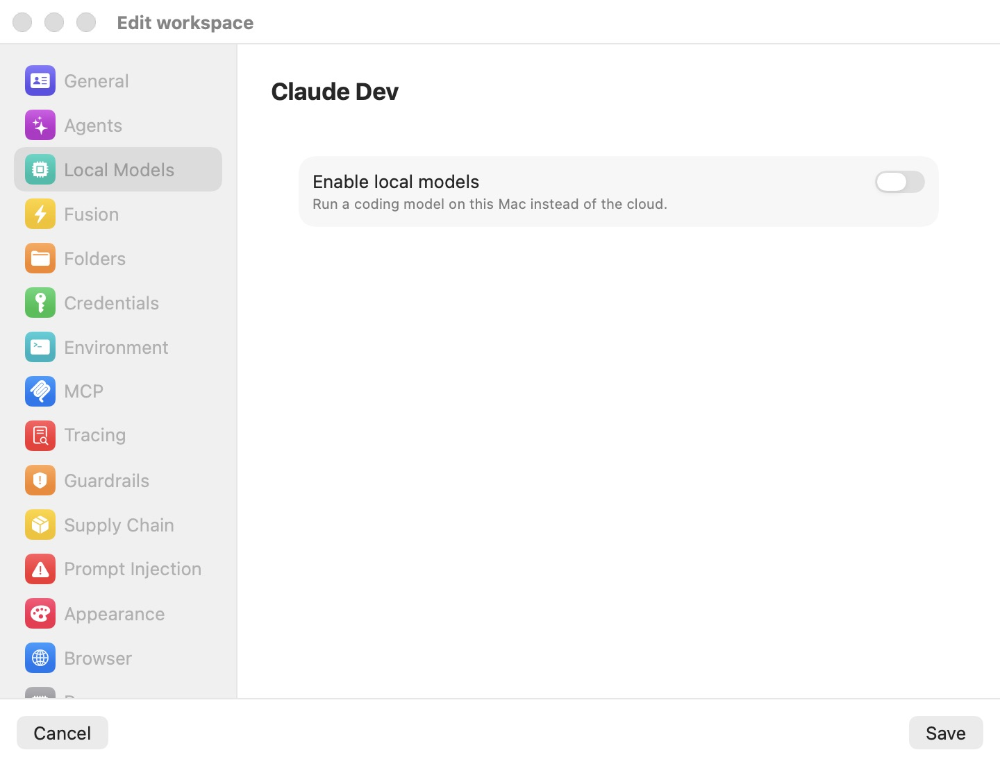

# Local & Hybrid Inference

Not every prompt needs a frontier model in someone else's data center. Bromure Agentic Coding can run open-weight coding models directly on your Mac's GPU with Apple's [MLX](18-glossary.mdx) framework — no cloud round-trip, no per-token bill, and no code leaving the machine. A workspace can run entirely on-device, keep using the cloud with an on-device safety net, or mix the two agent by agent.

Local inference is a per-workspace choice, orthogonal to [Fusion](12-fusion.mdx): Fusion decides *how many* models answer a prompt, while routing decides *which backend* answers it. This chapter explains where inference runs, how the model catalog and downloads work, the three routing modes and the hybrid policy engine, how to point an individual agent at a local model, and how to watch the engine's behavior. The field-by-field settings reference for the pane lives in [Local Models settings](07-settings/local-models.mdx).

> **Note:** Everything here runs on the Mac host, not inside the VM. Virtualization.framework gives the Linux guest no GPU, Metal, or MLX access, so on-device inference has to happen on macOS and be reached from the guest across the [wire boundary](18-glossary.mdx). Apple Silicon (M1 or newer) is required — the same requirement as the app itself.

## Where inference runs

The engine is built into the app; there is nothing to install, no Python environment, and no external server such as Ollama, LM Studio, or a self-hosted vLLM instance to point at. When a session needs on-device inference, the app starts a private MLX engine and wires the guest agent to it.

### The engine child

The MLX engine runs as a **supervised child process** of the app's own binary (`bromure-cli model _mlx-engine`), not inside the app itself. This is deliberate isolation: loading a model that is too large for the Mac's memory kills only the engine child, never the app or its running VMs. The parent restarts a crashed engine automatically, up to three times; after that it gives up with the log line `engine child crashed repeatedly — giving up (a model likely OOMs this Mac)`. The child is killed when the app quits, and any orphan left by a hard crash is reaped at the next launch.

One engine serves every open workspace. It binds a **kernel-assigned loopback port** on `127.0.0.1` — never `0.0.0.0`, and never the conventional `11434` (that port is left free so a separate Ollama or LM Studio install keeps working). It loads several models in parallel under a memory budget of the host's unified memory minus 16 GB (with a floor of 8 GB), lazily loading each model on first use and evicting the least-recently-used one when the budget is tight. Opening or closing a workspace reconfigures the running engine live through an admin endpoint — no restart.

While the engine is warming, session windows show a status pill reading **Starting local engine…** that clears once the engine answers a readiness probe.

### How the guest reaches the engine

In-VM agents never talk to the engine directly. They target the synthetic host `https://bromure.llm` — a name with no real DNS — and the host-side MITM proxy intercepts it, applies the same [prompt-injection scanning](10-prompt-injection.mdx) and [trace capture](11-tracing.mdx) it applies to cloud traffic, and forwards the request to the on-host engine. Local inference is therefore never a blind spot: it crosses the same wire boundary and lands in the same audit trail as a call to Anthropic.

Agents are pinned to a sentinel model name, `bromure-local`, which the host remaps to the workspace's currently-active model. Switching the active model is a host-side remap with no agent restart — the agent keeps asking for `bromure-local` and simply gets a different model behind it.

> **Note:** A model whose architecture the MLX engine does not yet support fails with a clear, permanent error — *"its architecture … isn't supported by the on-device engine yet — pick a different model"* — returned as a client error so the agent does not retry it in a loop.

## The model catalog

The catalog is a curated list of pre-converted MLX models, each vetted for the one thing that matters most in agentic coding: quantized models frequently break tool calling, so every catalog entry carries a **tool-calling verification** badge. Entries also record a download size and a minimum unified-memory requirement, which the pane turns into a [RAM-fit gate](18-glossary.mdx).

A baseline catalog ships inside the app so the pane works offline on day one. At launch the app fetches a refreshed catalog from `https://dl.bromure.io/mlx/catalog.json`; a newer manifest **fully replaces** the baseline (it is not merged). A model dropped from the published catalog disappears from the list — unless you already have it installed, in which case it survives as an installed extra.

### Models that ship in the baseline

The bundled catalog is a set of Qwen3 coding models across memory tiers. All four are tool-calling verified:

| Model | On disk | Minimum unified memory | Recommended |
|---|---|---|---|
| **Qwen3 8B (4-bit DWQ MLX)** | 4.3 GB | 16 GB | Yes |
| **Qwen3-Coder 30B-A3B (4-bit DWQ MLX)** | 17 GB | 32 GB | Yes |
| **Qwen3-Coder-Next 80B-A3B (mxfp4 MLX)** | 42 GB | 96 GB | Yes |
| **Qwen3-Coder 480B-A35B (4-bit MLX)** | 270 GB | 512 GB | No |

The 8-billion-parameter model runs on any supported Mac; the 480-billion-parameter mixture-of-experts model needs a 512 GB machine (an M3 Ultra) and is not marked recommended for that reason. A refreshed catalog may add newer or larger builds without an app update.

### Badges and the RAM-fit gate

Each row in the pane (and each line of `bromure-cli model catalog`) carries two badges:

- A **size tier** — **S** for models needing 16 GB or less, **M** up to 32 GB, **L** up to 64 GB, **XL** above that.
- A **fit verdict** against *your* Mac's unified memory: **Fits**, **Tight**, or **Won't fit**. "Fits" requires the model's minimum plus 16 GB of headroom for the OS and everything else; "Tight" means it loads with little room to spare; "Won't fit" means the model's minimum exceeds your memory. Won't-fit rows are greyed out and cannot be selected or downloaded.

For example, the Qwen3 8B model (16 GB minimum) reads **Tight** on a 16 GB Mac and **Fits** on 32 GB or more; Qwen3-Coder 30B-A3B (32 GB minimum) reads **Fits** from 48 GB up.

### Using a model outside the catalog

The catalog is a curated menu, not a fence. Any Hugging Face repository already in MLX format can be pulled by its `org/repo` name from the command line (see [Command-line reference](#command-line-reference)); such a model is treated as untested — it carries no tool-calling guarantee and no RAM-fit assurance. Repositories in the GGUF format are rejected outright, because GGUF is the Ollama and llama.cpp path, not MLX:

```
That's a GGUF (Ollama/llama.cpp) model — Bromure serves MLX weights only.
```

## Downloading and storing models

Weights are pulled straight from `huggingface.co` by a built-in, pure-Swift downloader — no Python, no `mlx_lm.convert`, no conversion of any kind. The downloader reads the repository's file list from the Hugging Face API, streams each weight file to a `.partial` temporary file, and atomically renames it into place; documentation, images, and any GGUF files in the repo are skipped. Before it starts, a disk-space preflight fails fast rather than filling your disk:

```
Not enough disk space: 40 GB free, but about 270 GB is needed.
```

### Where models live

Downloaded weights land in a flat, per-repository layout under your Application Support directory:

```
~/Library/Application Support/BromureAC/models/<org>--<name>/
```

Each directory holds the model's `config.json`, its `.safetensors` shards, and its tokenizer. Downloads are a **global side effect**, shared across every workspace — pulling a model once makes it available to all of them. Models previously cached by other tools in `~/.cache/huggingface/hub` are migrated into this directory once, via hardlinks, so nothing is downloaded twice.

### Download states in the pane

The action control on each model row reflects its state:

| State | Control | Meaning |
|---|---|---|
| Not installed | **Download** button | Ready to pull (disabled if the model won't fit). |
| Downloading | Progress bar + byte label + stop (✕) | A determinate bar driven by real bytes on disk; the ✕ cancels and deletes the partial. |
| Interrupted | **Interrupted** + **Resume** / discard (trash) | A pull the app did not finish because it crashed or was killed. Resume continues where it stopped; discard deletes the partial. |
| Failed | **Retry** button | The download errored; hover for the reason. |
| Installed | **Installed** with a **Remove** menu item | Fully downloaded and ready to serve. |

Because the downloader is resumable at file granularity, an interrupted pull never has to start over, and a partial download is never mistaken for a working install — an in-flight sentinel file marks it until the last byte lands.

> **Tip:** The first model you download is automatically set as the workspace's active model, so a fresh workspace goes from "no local model" to "ready to serve" in one click.

## Enabling local models for a workspace

Open the workspace in the workspace browser, click **Edit workspace**, and select the **Local Models** pane (the mint CPU icon). The pane starts as a single switch; the mode picker and model list appear only once local inference is on.

<p align="center">
  
</p>

1. Turn on **Enable local models** (*"Run a coding model on this Mac instead of the cloud."*). This sets the workspace's routing away from Cloud; turning it back off restores Cloud.
2. Pick a **Mode**:
   - **Local — always on-device** keeps every request on this Mac. As the pane notes, replies are private but slower, and bounded by the model you can fit in memory.
   - **Hybrid — cloud, fall back to local** sends requests to the cloud as usual and falls back to the on-device model only when the cloud is unreachable — cloud speed and quality, with a local safety net.
3. In the model list — headed **Models · N GB unified memory**, where N is your Mac's memory — **Download** a model, then select it as active with the radio dot to its left. Greyed-out rows need more memory than your Mac has.
4. Click **Save**.

The routing mode and active-model selection persist when you save; downloads, being global, happen immediately whether or not you save. If the models you select would together need close to or more than your Mac's memory — the engine serves them in parallel, so their memory adds up — the pane shows a warning and asks you to drop one or pick smaller models.

The full field list and defaults are in [Local Models settings](07-settings/local-models.mdx).

## Routing: Cloud, Local, and Hybrid

Routing is the top-level, per-workspace choice of which backend serves an agent's LLM traffic. It has three values:

| Mode | Behavior |
|---|---|
| **Cloud** | The default. Requests pass through to the real provider (optionally with a host-side credential swap; see [Credentials](08-credentials.mdx)). |
| **Local** | Every LLM request is served on-device. |
| **Hybrid** | The cloud is used by default, with policy-driven fallback to the local model. |

Selecting **Local** or **Hybrid** automatically engages the MITM interception path — you never flip a separate switch for it. Each answered turn is tagged in the [trace](11-tracing.mdx) with a [served-by marker](18-glossary.mdx) recording which backend answered: `cloud` or `local-<model>`. You can read it in the Trace Inspector to confirm, turn by turn, where a hybrid session actually went.

Routing is a per-workspace default set in the pane, but it can also be changed on a **running** VM from the command line with `bromure-cli vm routing` (see [Command-line reference](#command-line-reference)).

> **Note:** Local routing reroutes an agent's traffic to Anthropic and OpenAI hosts (and the `bromure.llm` sentinel) to the engine. It does not hijack an agent that is itself already pinned to a real cloud credential — for instance, a subscription Claude agent sharing a workspace keeps its real cloud traffic. To force one specific agent local regardless of workspace routing, use its own **Local model** auth mode, below.

## The hybrid fallback policy

Hybrid is not a single switch but a small policy engine, tuned to never break a coding trajectory by swapping models mid-flight. Every decision is made at a session boundary and is then **sticky** — once a conversation is routed to a backend, it stays there for the rest of that session (the coherence guard).

### What triggers a fall back to local

For a new session, the first rule that matches wins, in this order: an already-pinned sticky session, an exhausted cloud-token budget, an unhealthy cloud (the health gate), a split-ratio assignment, and otherwise the cloud. During a request already in flight to the cloud, two things force an immediate replay on the local model, pinning the session local for its lifetime:

- **Hard errors** — a refused or timed-out connection, or an HTTP `429`, `529`, or `5xx` from the provider.
- **A missed soft deadline** — no first token within the [TTFT](18-glossary.mdx) budget (5 seconds by default).

Underneath sits a conservative **health gate**: the cloud is marked unhealthy after at least three failures in the last roughly ten requests, or when the exponentially weighted moving average of TTFT climbs past 8 seconds, and it recovers only after three clean, fast probes. While the cloud is unhealthy, new sessions go straight to local without each paying the soft-timeout penalty first. The backends are never raced against each other — there is no speculative hedging and no double spend; fallback fires only after a real trigger.

### The tunable knobs

Three knobs are exposed, and only through the command line against a running VM (see [Command-line reference](#command-line-reference)). They persist per workspace but are ignored unless routing is **Hybrid**:

| Knob | Command | Default | Effect |
|---|---|---|---|
| Cloud token budget | `bromure-cli vm hybrid budget <tokens> <vm>` | 0 (unlimited) | Cap on cloud-served tokens per rolling 24-hour window; once exceeded, new sessions route local until the window slides back under cap. |
| Soft TTFT timeout | `bromure-cli vm hybrid ttft <seconds> <vm>` | 5 | Seconds without a first token before the request is cancelled and replayed locally. |
| Local split | `bromure-cli vm hybrid split <0-100> <vm>` | 0 | Percentage of new sessions proactively pinned to local even when the cloud is healthy, to blend cost, latency, and privacy. |

The health-gate internals (the 8-second EWMA threshold, the failure window, and the recovery-probe count) are fixed and not user-tunable.

## Local models as an agent backend

Routing is a workspace-wide axis, but you can also point a single agent at the local engine, leaving the rest of the workspace on the cloud. In the workspace's [Agents](07-settings/agents.mdx) tab, each agent — Claude Code, Codex, or Grok — has an auth-mode picker whose options include **Local model**. Choose it, pick an installed model, and that agent runs entirely against the on-device engine with dummy cloud keys the engine ignores; the MITM applies the same protections as it does to cloud traffic.

This makes mixed workspaces possible — for example, Claude Code on a subscription alongside Codex on a local model. Profile-wide Local routing never hijacks a cloud agent's real traffic, and per-agent Local mode never leaks to the others. When you toggle local inference on or off in the **Local Models** pane, the app keeps each agent's auth mode in step automatically.

## Local models in Fusion

A local model is also a valid participant in [Fusion](12-fusion.mdx), the multi-model synthesis feature, and it can play either of two roles there:

- **As a leg.** Tick **Local model** under *Models to fuse* and pick an installed model; its draft answer joins the panel alongside Claude, Codex, and Grok. Because it runs on your Mac, it is a capable extra leg at zero marginal cost.
- **As the judge.** Choose **Local** as the Fusion judge provider to run the analysis-and-synthesis stage entirely on-device, keeping the whole judging step off the cloud.

Both roles need at least one downloaded local model; until then, the corresponding rows in the Fusion pane are greyed out with a hint to download one here first. See [Fusion](12-fusion.mdx) for the full panel workflow.

## Tool-call repair

The dominant failure mode of quantized models in agentic use is emitting a tool call as plain text instead of a structured call the agent can execute. A **repair proxy** sits in front of the engine — the guest and the MITM local route both point at it, not at the bare engine — and rescues these cases transparently.

For each response it buffers the output and re-parses the many ad-hoc shapes a model might leak a call in, including:

```
<function name="write_file" arguments='{…}'>
<tool_call>{…}</tool_call>
[{"name": "…", "parameters": {…}}]
```

as well as Qwen3-Coder's native `<function=Name><parameter=k>v</parameter></function>` format and Gemma's channel format. It synthesizes proper tool-use blocks from whatever it finds and re-emits the message as protocol-correct SSE in the agent's native wire shape. It also detects a **stuck preamble** — where the model narrates an action ("Now I'll create the file:") and then ends its turn without ever calling the tool — and re-prompts up to twice to recover the missing call. A tool-format reminder is appended to the system prompt whenever tools are declared.

Repair is always on for local inference and needs no configuration. Engine problems are converted into wire-native error bodies, so the agent shows the real reason rather than a generic failure, for example:

```
Local inference engine unreachable (starting up, reloading a model, or stopped) — retry in a moment.
```

## Monitoring the engine

Two windows under the **Window** menu let you watch on-device inference without opening Console.app.

### Inference Metrics

**Window** → **Inference Metrics…** opens a live telemetry panel (window title **Inference Metrics**), headed with the label **Local inference** and the engine's loopback address. It parses the engine's Prometheus metrics into cards — **Decode tok/s**, **Prefill tok/s**, **Running**, **Waiting**, **In flight**, **Avg latency**, **Cache hit**, **Metal mem**, **Gen tokens**, and **Prompt tokens** — plus a **Loaded models** list and an **All metrics** disclosure with the raw table.

The window polls every 5 seconds, and only while it is open. Decode and prefill rates are lifetime cumulative ratios by design, so they read as stable averages rather than jumpy per-second deltas. When the engine is down the panel shows *engine not reachable*, and during a long generation it may briefly show *engine busy (timed out)*.

### Inference Engine Log

**Window** → **Inference Engine Log…** opens a live tail (window title **Inference Engine Log**) of the engine child's output plus the parent's lifecycle events — model loads, "serving", per-request stats, and any OOM, crash, restart, or load error. Lines are color-coded (red for failures, green for healthy events, orange for warnings, blue for work in progress). The toolbar offers a **Filter…** field, an **Auto-scroll** checkbox, **Copy**, and **Clear**; when nothing has happened yet it reads *No inference-engine activity yet*. The buffer is an in-memory ring capped at 5,000 lines, and every line is also mirrored to the app's stderr, so launching `bromure-cli` from a terminal gives you a durable copy.

## Command-line reference

The model and routing commands talk to the running app's control API, so the app (or its agent) must be running. The commands that act on a specific VM take a trailing `<vm>` argument, which is a VM id or a workspace name. Persistent per-workspace defaults are edited in the GUI panes described above; these commands act on a live session. See [Automation & CLI](16-automation-cli.mdx) for the surrounding command set.

Model management:

```
bromure-cli model catalog [--all] [--offline]
bromure-cli model pull <catalog-id | org/repo>
bromure-cli model ls
bromure-cli model use <catalog-id | org/repo> <vm>
bromure-cli model rm <catalog-id | org/repo>
```

| Command | What it does |
|---|---|
| `model catalog` | Lists curated models with fit and tool-calling badges and an installed checkmark, and prints your Mac's unified memory. It refreshes the live catalog first (non-fatal if that fails). `--all` includes models that won't fit this Mac; `--offline` skips the refresh and uses the bundled and cached catalog only. |
| `model pull` | Downloads a model by catalog id or any Hugging Face MLX repo. It validates that the repo is MLX (rejecting GGUF), preflights disk space, then shows a progress bar driven by real bytes on disk. |
| `model ls` | Lists installed models with their disk usage and repo. |
| `model use` | Sets the active local model for a running VM's workspace — a host-side remap of the `bromure-local` sentinel, with no agent restart. |
| `model rm` | Removes an installed model's weights from disk. |

Routing and hybrid policy for a running VM:

```
bromure-cli vm routing cloud|local|hybrid <vm>
bromure-cli vm hybrid budget <tokens> <vm>
bromure-cli vm hybrid ttft <seconds> <vm>
bromure-cli vm hybrid split <0-100> <vm>
bromure-cli vm fusion enable|disable <vm>
```

`vm routing` sets the backend mode; the three `vm hybrid` knobs tune the fallback policy (and only bite when routing is Hybrid). `vm fusion` engages the orthogonal multi-model panel and is documented in [Fusion](12-fusion.mdx).

<details>
<summary>Internal diagnostic commands</summary>

These hidden subcommands exist for development and troubleshooting and are not part of the everyday workflow. The engine child itself is spawned by the app as `bromure-cli model _mlx-engine --config <path>`.

| Command | Purpose |
|---|---|
| `bromure-cli model _mlx-serve <repo>` | Start the in-process MLX server for one model and block, printing its port and key for `curl` testing. |
| `bromure-cli model _mlx-selftest <repo>` | Load a model, generate once, and print TTFT and decode tok/s. |
| `bromure-cli model _repair-serve --engine-port <port>` | Run the tool-call repair proxy standalone against a running engine. |
| `bromure-cli model _tc-test <path>` | Run tool-call rescue on a saved text file to check leaked-call extraction. |
| `bromure-cli model _spec-bench <main-repo> --draft <draft-repo>` | Benchmark speculative decoding off versus on for a model pair. |

</details>

## Performance expectations

On-device inference trades speed for privacy and cost, and the trade is real — set expectations accordingly:

- **Throughput scales with the model and the chip.** A small model such as Qwen3 8B is brisk on any supported Mac; the large mixture-of-experts builds are slower and need far more memory. The **Inference Metrics** window shows the actual decode and prefill rates on *your* hardware — the honest number to plan around.
- **The first request pays for a model load.** A cold engine shows **Starting local engine…** while it warms; large weights take real time to load into memory before the first token appears. Subsequent requests skip this.
- **Multi-turn agent loops get cheaper after the first turn.** The engine keeps a per-conversation prefix KV cache (up to four session slots per model), so each agent turn prefills only the new tokens rather than the whole transcript — and a sidechain does not evict the main conversation's cache.
- **Generation is serialized.** The engine runs one generation at a time, so several busy sessions share the GPU rather than truly running in parallel.
- **Reasoning models think silently.** For models that emit a `<think>` block, the block is always stripped before the answer reaches the agent — you get the quality without the transcript bloat.

> **Tip:** If a local model feels slow or stalls, open the **Inference Engine Log** window first: model loads, evictions, OOM restarts, and unsupported-architecture errors all surface there in plain text, which is faster than guessing from the agent's side.
