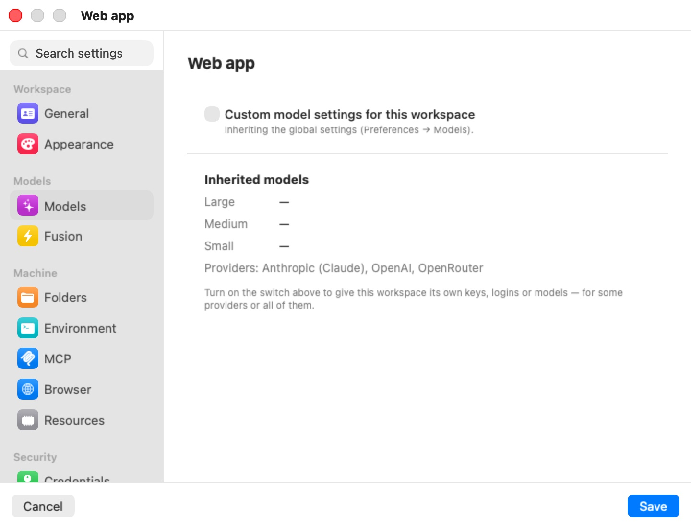

# Models & Providers

Every coding agent in Bromure Agentic Coding — Claude Code, Codex, Grok, Kimi and omp — gets its model and its credentials from one place: the **Models** board. You register each source once (a cloud provider's sign-in or API key, Amazon Bedrock, OpenRouter, an inference server of your own, or models that run on this Mac), and every machine can use it. A machine (a workspace, in the settings editor) inherits these global settings by default and can override any part of them.

This chapter covers the board itself, sign-in and log-out, choosing models per agent, per-machine overrides, how agents reach providers that are not their own, what happens to running agents when you change something, and the built-in on-device engine: its catalog, downloads, monitoring windows and `model` commands. For a field-by-field listing of the workspace pane, see [Models settings](07-settings/models.mdx). [Fusion](12-fusion.mdx) — several models answering one prompt — is a separate feature with its own pane.

> **Note:** Earlier releases had a per-workspace **Agents** pane, a **Local Models** pane and a "hybrid" routing mode that fell back from the cloud to a local model. All three are gone. Model and credential choices live on the Models board, and a machine's traffic goes either to the cloud or to a local backend, per agent, as described below.

## Where the Models board appears

The same two-column board shows up in four places:

| Where | What it edits | When changes apply |
|---|---|---|
| **Preferences › Models** (⌘,) | The global settings every machine inherits. | Immediately — the board saves as you edit, independent of the Preferences window's **Save** button. |
| A machine's settings editor › **Models** | That machine's override of the global settings (see [Per-machine overrides](#per-machine-overrides)). | When you click **Save** in the editor. |
| The onboarding wizard's **Models** step | The global settings, on first run only. | Immediately. |
| Preferences for a mirrored remote Mac (**Settings for:** a remote host) | That Mac's global settings, fetched over the tunnel with API keys redacted. | When you click **Save**. See [Remote Access](14-remote-access.mdx#remote-preferences). |

<p align="center">
  
</p>

The pane is headed **Models**, with the caption "Register a source on the left. Each agent runs its provider’s default model unless you pick one on the right." On the left is the **Providers** column; on the right the **Agents** column.

## Providers

Each row in **Providers** has a status dot and a one-line subtitle. Green means usable; grey means not configured; orange means a subscription sign-in has expired. Click a row to open its configuration popover.

| Provider | How you configure it | Notes |
|---|---|---|
| **Anthropic (Claude)** | Subscription sign-in or API key | Native provider of Claude Code. |
| **OpenAI** | Subscription sign-in or API key | Native provider of Codex. |
| **xAI (Grok)** | Subscription sign-in or API key | Native provider of Grok. |
| **z.ai (GLM)** | API key only | z.ai's coding plan is delivered as an API key; there is nothing to sign in to. |
| **Moonshot (Kimi)** | Subscription sign-in or API key | Native provider of Kimi. |
| **Amazon Bedrock** | **Use Amazon Bedrock**, optional region and optional API key | See [Amazon Bedrock](#amazon-bedrock). |
| **OpenRouter** | API key only | Its model list is fetched live from OpenRouter. |
| **Custom server** | Server URL and optional API key | Any OpenAI-compatible server. See [Custom server](#custom-server). |
| **On-device** | Download models | MLX models run on this Mac's GPU. See [On-device models](#on-device-models). |

The row subtitle tells you how a provider is configured: **API key**, **subscription**, **sign-in expired**, **AWS credentials** (Bedrock), a host name (custom server), or **N installed** (on-device). In a machine's override it can also read **inherited API key**, **inherited subscription**, **overridden here** or **off here**.

### Signing in and API keys

For Anthropic, OpenAI, xAI and Moonshot the popover leads with **Sign in with *provider*** ("Interactive login in a temporary VM — no API key needed."), then "or paste an API key" above an **API key** field. With neither, it reads **Not configured yet.**

Signing in runs the provider's own CLI login inside a throwaway VM; the provider's page opens in your browser, and the captured sign-in is stored on the host, never in a machine. Once signed in, the popover shows **Signed in** with how long ago, plus **Sign in again…** and **Log out…**. **Log out…** asks for confirmation — "Log out of *provider*?", "Workspaces using this sign-in stop working until you sign in again." — with **Log Out** / **Cancel**.

If the provider rejects a saved sign-in (for example, it was revoked elsewhere), the popover switches to an orange **Sign-in expired** panel explaining that sessions can't use it until you sign in again, with a prominent **Sign in again** button.

A pasted API key wins over a subscription for the same provider: typing a key switches that provider to pay-per-use. Keys are stored encrypted (see [Where settings are stored](#where-settings-are-stored)).

> **Note:** A subscription can only power its own agent — a Claude subscription drives Claude Code, a ChatGPT subscription drives Codex, and so on. A provider signed in by subscription therefore never appears in another agent's model menu, and cannot be used on the **Default** row. API keys have no such restriction.

### Subscription scope: every machine or just one

A sign-in started from **Preferences › Models** is always shared by every machine. A sign-in started from a machine's settings editor (its **Models** pane) ends with a question: **Share with every workspace?** — "Use this *provider* sign-in for every Bromure workspace (replacing any workspace's own *provider* sign-in), or only for this one?" — with **Every workspace** and **Just this workspace**.

- **Every workspace** stores the sign-in as the shared one and removes any machine-specific sign-in for that provider, so the new sign-in really is what every machine uses.
- **Just this workspace** stores it for that machine only. A machine with its own sign-in always uses it in preference to the shared one.

When the sign-in was started from a mirrored remote Mac and nobody answers the question, the choice defaults to **Just this workspace**.

### Amazon Bedrock

The Bedrock popover explains: "Any agent can run on Amazon Bedrock: Claude Code natively, the others through Bedrock's OpenAI-compatible API. Sign requests with each workspace's own AWS credentials (Credentials → AWS), or paste a Bedrock API key."

1. Turn on **Use Amazon Bedrock**.
2. Optionally set **AWS region**. Left empty, each machine uses the region of its own AWS credentials, else `us-east-1`.
3. Optionally paste a **Bedrock API key (optional — else AWS credentials sign)**. Without a key, the host signs each request with the machine's AWS credentials from its [Credentials](08-credentials.mdx) pane; the credentials never enter the VM.

Enabling Bedrock pre-fills Claude Code's main model with a Bedrock Claude model id. Model ids are the ones Bedrock uses (for example `us.anthropic.claude-sonnet-4-6`); pick them per agent from the menu or type your own with **Custom id…**. Bedrock has no model-listing endpoint, so the menu offers a short curated list.

An agent on Bedrock without an API key is only ready to start in machines that have AWS credentials. Turning **Use Amazon Bedrock** off clears every model choice that pointed at Bedrock, so those agents fall back to their defaults.

### Custom server

**Custom server** is any OpenAI-compatible inference server — vLLM, Ollama, LM Studio, `llama-server` — on this Mac or elsewhere on your network. The popover calls it "Recommended for local models."

1. Turn on **Enabled**.
2. Enter the **Server URL** (for example `http://127.0.0.1:11434/v1`) and, if the server needs one, an **API key (optional)**.
3. Click **Test Connection**. On success it shows **N model(s)** and the server's models appear in every agent's menu under **Custom server**; on failure it shows the server's error.

With a custom server, the model id is the server's own id verbatim (for example `qwen3:32b`). The host's repair proxy translates each agent's wire format (Anthropic messages, OpenAI chat, OpenAI responses) to the server's `/v1/chat/completions` and back, and the model's context window, vision and reasoning support are probed from the server and passed to the agents. No engine process is started on the Mac for a custom server.

### On-device models

**On-device** opens a list of catalog models — "MLX models run in-process on this Mac (N GB) — the lazy backup, nothing to install." Each row shows the model name, a fit badge (**Fits**, **Tight** or **Won't fit**) and its download size, and one action:

| Control | Meaning |
|---|---|
| **Get** | Download the model. Disabled when it won't fit this Mac. |
| Progress bar + ✕ | Downloading; ✕ cancels and deletes the partial download. |
| **Resume** | A download that was interrupted (the app quit or crashed); continues where it stopped. |
| **Retry** | The download failed; hover for the reason. |
| **Remove** | Installed; removes the weights and clears any model choice that used them. |

Installed models appear in every agent's menu under **On-device**. Downloads are shared by every machine. The catalog, the fit rules and the engine are described in [The on-device engine](#the-on-device-engine).

## Agents: choosing models

The **Agents** column has a **Default** row, then one row per agent: **Claude Code**, **Codex**, **Grok**, **Kimi** and **omp**. Each row has a model chip; click it to choose.

What a chip shows:

- ***Agent* default** — nothing is chosen and the agent's own provider is configured, so the agent runs that provider's default model, exactly as its own `/model` "Default" would. You don't need to pick anything.
- **Choose…** — nothing is chosen and nothing resolves for this agent.
- A model id, with a colored dot for its source (blue: a cloud provider; mint: the custom server; purple: on-device; orange, struck through and marked **· unavailable**: a provider this agent can't reach — see [Which agent can reach which provider](#which-agent-can-reach-which-provider)). **· inherited** after the id means the value comes from the **Default** row (or, in a machine override, from the global settings). An ✕ next to an explicit choice clears it.

The chip's menu lists every usable provider the agent can reach as a submenu of model ids (a curated list merged with the provider's live model list where there is one), then **Custom server** and **On-device** when configured. Each provider submenu ends with **Custom id…**, which asks for "The id exactly as the backend names it (e.g. claude-opus-5, glm-4.6, qwen3-coder)." For an agent with an explicit choice, the menu also offers **Use Default** (or **Use *agent*’s default** when nothing is set on the Default row) to clear it.

If the menu has nothing to offer it says so: **Configure a provider first**; **No configured provider can power *agent*** when the configured providers are all ones that agent can't reach; or **A subscription can only power its own agent** when the only configured providers are subscriptions for other agents. Under **Custom server**, **Test the connection to list models** means the server hasn't been probed yet.

### The Default row

A model on the **Default** row applies to every agent that has no choice of its own — including agents whose own provider is configured and would otherwise run their provider's default. Leave **Default** on **Choose…** if you want each agent on its own provider's default model.

### Sizes

Claude Code uses three model slots; every other agent runs one model. The **Default** and **Claude Code** rows have a **Sizes** disclosure with two extra chips:

| Size | Claude Code slot |
|---|---|
| **Large** | ≈ opus |
| (main chip) | ≈ sonnet |
| **Small** | ≈ haiku (background and fast tasks) |

Unset, the large and small slots follow Claude Code's own defaults. **Sizes** opens by itself when one of them is set. On the **Claude Code** row, **Reset to Default** drops all of Claude Code's own choices so it inherits the **Default** row again. Codex, Grok, Kimi and omp use only the main chip.

## Which agent can reach which provider

Each agent reaches its own provider natively. It can also be pointed at some other providers, which the host bridges for it:

| Agent | Native provider | Also reaches |
|---|---|---|
| **Claude Code** | Anthropic (subscription or key) | Amazon Bedrock (Claude Code's own Bedrock mode); OpenRouter and z.ai (directly, through their Anthropic-compatible endpoints, API key); custom server; on-device |
| **Codex** | OpenAI | Amazon Bedrock, OpenRouter, xAI, Moonshot (through the host's repair proxy, API key); custom server; on-device |
| **Grok** | xAI | Amazon Bedrock, OpenRouter, Moonshot (repair proxy); custom server; on-device |
| **Kimi** | Moonshot | Amazon Bedrock, OpenRouter, xAI (repair proxy); custom server; on-device |
| **omp** | Anthropic, API key only | Amazon Bedrock, OpenRouter, xAI, Moonshot (repair proxy); z.ai when omp itself is switched to it; custom server; on-device |

For the repair-proxy route, the agent inside the VM talks to the host, which translates the agent's wire format, holds the real key (or signs for Bedrock) and forwards the request. The key never enters the VM. Claude Code's OpenRouter and z.ai routes instead point the agent straight at the provider's Anthropic-compatible endpoint (`https://openrouter.ai/api`, `https://api.z.ai/api/anthropic`) with a stand-in key that the host swaps for the real one on the wire, as it does for every cloud credential (see [Credentials & the Wire Boundary](08-credentials.mdx)).

An agent's model menu offers only the providers it can reach. Claude Code speaks only the Anthropic dialect, so its menu has no OpenAI, xAI or Moonshot models; z.ai's OpenAI-compatible API is not one the other agents can be bridged to, so Claude Code's is the only agent menu that offers z.ai models (omp switched to z.ai reaches it on its own).

A choice stored before it stopped being reachable — or inherited from the **Default** row by an agent that can't use it — shows in orange, struck through, with **· unavailable** after it. Its tooltip explains: "*Agent* can’t use *provider* models, so it runs on its own provider instead. Pick another model."

omp has no provider of its own on the board and cannot use a subscription; give it an API key-based provider.

## Per-machine overrides

A machine's settings editor has a **Models** pane (under the **Models** group). By default it shows a switch, **Custom model settings for this workspace**, turned off — "Inheriting the global settings (Preferences → Models)." — and an **Inherited models** summary: the global Large / Medium / Small models and the configured providers.

<p align="center">
  
</p>

Turn the switch on and pick one of two modes:

- **Inherit, with changes** (the default) — "Starts from the global settings; only what you set below is different here." The full board appears, showing the global settings with this machine's changes on top. Anything you don't touch keeps following the global settings live — a provider you register globally later shows up here too.
- **Standalone** — "This workspace has its own providers, logins and model choices below — the global settings are ignored." Switching to Standalone starts from a copy of what is currently in effect, so nothing changes until you edit it.

In **Inherit, with changes** mode, each provider popover says where the provider comes from and lets you change that for this machine only:

| Label | Meaning |
|---|---|
| **Inherited from Preferences → Models (API key / subscription / AWS credentials).** | The global credential is used. **Don't use in this workspace** opts out, "— or override it below" with this machine's own key or sign-in. |
| **Not used in this workspace — the global settings have it.** | You opted out. **Use the global provider** opts back in. |
| **This workspace's own credential.** | This machine has its own key or sign-in. **Use the global provider** drops it. |
| **This workspace's own server.** / **Use the global server** | The same for the custom server. |

Model chips work as on the global board; an unchanged chip shows **· inherited**, and clearing an explicit choice returns it to the global value (**Use the global setting**).

The override is saved with the machine when you click **Save**. Keys typed into an override are stored encrypted with the machine's other secrets.

## Changing models on running machines

You never need to restart a machine for a model or credential change. When you register a provider, paste or change a key, sign in or out, move an agent to another model, or save a machine override:

1. The host updates what the machine's agents read — the credential swap map, the agents' environment and configuration files — for every running machine.
2. Each agent whose credentials or model actually changed is stopped in its own tab and immediately relaunched with its resume flags, so the conversation carries on. In the chat view the session keeps its transcript; in a terminal you see the agent quit and come straight back.
3. Agents whose configuration didn't change are left alone, and the VM itself never restarts.
4. The machine's [Fusion](12-fusion.mdx) setup follows the same settings: its legs and judge are re-evaluated, and the ⚡ toggle is disengaged if fewer than two usable models remain.

Changes on the global board are applied about a second and a half after you stop typing.

> **Warning:** Restarting an agent interrupts whatever it was doing at that moment. If an agent is in the middle of a long turn, wait for it to finish before switching its model or credentials.

## Where settings are stored

The global settings are kept in `~/Library/Application Support/BromureAC/models.enc`, encrypted with the same key as the workspace secrets vault. A machine's override is stored with the machine, its keys in the encrypted secrets store. Subscription sign-ins are held host-side by the credential proxy, shared or per machine as chosen above. None of these secrets are ever copied into a VM: agents get stand-in values that the host swaps on the wire.

## Limits

- Subscriptions are available for Anthropic, OpenAI, xAI and Moonshot only, and each powers only its own agent.
- omp uses API keys only.
- A custom server must be OpenAI-compatible.
- Within one machine, all agents that run locally (custom server or on-device) share a single local model: the main agent's choice wins.
- The on-device engine uses the Mac's one GPU and runs one generation at a time.
- The Models board is not available in Bromure Remote on iPhone, iPad or Apple Vision Pro; edit models from a Mac.

## The on-device engine

The on-device engine runs open-weight coding models on your Mac's GPU with Apple's [MLX](18-glossary.mdx) framework — no cloud round-trip, no per-token bill, and no code leaving the Mac. There is nothing to install, no Python environment and no server to configure.

> **Note:** Inference runs on the Mac, not inside the VM. The browser's optional [Metal graphics device](06j-metal-renderer.mdx) does not provide GPU compute or MLX access to Linux, so the guest reaches the engine across the [wire boundary](18-glossary.mdx). Apple Silicon is required — the same requirement as the app itself.

### The engine process

The MLX engine runs as a **supervised child process** of the app's own binary (`bromure-cli model _mlx-engine`), not inside the app. Loading a model too large for the Mac's memory kills only the engine child, never the app or its running VMs. The app restarts a crashed engine automatically, up to three times; after that it gives up with the log line `engine child crashed repeatedly — giving up (a model likely OOMs this Mac)`. The child is killed when the app quits, and an orphan left by a hard crash is reaped at the next launch.

One engine serves every machine. It binds a kernel-assigned loopback port on `127.0.0.1` — never `0.0.0.0`, and never Ollama's conventional `11434`, so a separate Ollama or LM Studio install keeps working. It can hold several models under a memory budget (the Mac's unified memory minus some headroom), loading each on first use and evicting the least-recently-used one when memory is tight.

While the engine warms up, a machine's toolbar shows a small CPU badge with a spinner ("Starting local engine…"); it turns green once the model is ready, or orange if the engine failed to start (hover for the reason).

### How the guest reaches it

Agents in the VM never talk to the engine directly. They target the synthetic host `https://bromure.llm`, which has no real DNS: the host-side proxy intercepts it, applies the same [prompt-injection scanning](10-prompt-injection.mdx) and [trace capture](11-tracing.mdx) as for cloud traffic, and forwards the request to the engine. Local inference is never a blind spot.

Agents are configured with the real model id the engine serves (for example `mlx-community/Qwen3-8B-4bit-DWQ`), so their context sizing and capability lookups see the truth.

> **Note:** A model whose architecture the MLX engine doesn't support yet fails with a clear, permanent error — "its architecture … isn't supported by the on-device engine yet — pick a different model" — returned as a client error so the agent doesn't retry it in a loop. Use a [custom server](#custom-server) for such models.

### The catalog

The catalog is a curated list of pre-converted MLX models, each checked for the thing that matters most in agentic coding — reliable tool calling — and each recording a download size and a minimum amount of unified memory.

A baseline catalog ships inside the app so the list works offline on day one. The app fetches a refreshed catalog from `https://dl.bromure.io/mlx/catalog.json`; a newer published catalog replaces the baseline rather than merging with it. A model dropped from the published catalog disappears from the list unless you already have it installed.

The bundled catalog holds four Qwen3 models, all tool-calling verified:

| Model | Download | Minimum unified memory | Recommended |
|---|---|---|---|
| **Qwen3 8B (4-bit DWQ MLX)** | 4.3 GB | 16 GB | Yes |
| **Qwen3-Coder 30B-A3B (4-bit DWQ MLX)** | 17 GB | 32 GB | Yes |
| **Qwen3-Coder-Next 80B-A3B (mxfp4 MLX)** | 42 GB | 96 GB | Yes |
| **Qwen3-Coder 480B-A35B (4-bit MLX)** | 270 GB | 512 GB | No |

A refreshed catalog may add newer or larger builds without an app update.

### The fit badge

Each model is judged against *your* Mac's unified memory:

- **Won't fit** — the model's minimum exceeds your memory. The row is dimmed and can't be downloaded.
- **Tight** — it loads, with less than 16 GB to spare for everything else.
- **Fits** — the minimum plus 16 GB of headroom fits.

For example, Qwen3 8B (16 GB minimum) reads **Tight** on a 16 GB Mac and **Fits** from 32 GB up.

### Downloads and storage

Weights come straight from `huggingface.co` through a built-in downloader — no Python and no conversion. Each weight file streams to a temporary `.partial` file and is renamed into place when complete, so an interrupted download resumes file by file and a partial download is never mistaken for an installed model. Documentation, images and GGUF files in the repository are skipped. A disk-space check runs first and fails fast rather than filling your disk:

```
Not enough disk space: 40 GB free, but about 270 GB is needed.
```

Models are stored per repository under:

```
~/Library/Application Support/BromureAC/models/<org>--<name>/
```

Models already cached by other tools in `~/.cache/huggingface/hub` are migrated into this directory once, through hardlinks, so nothing is downloaded twice.

Any Hugging Face repository already in MLX format can also be pulled by its `org/repo` name from the command line (see [Command-line reference](#command-line-reference)); such a model is untested — no tool-calling or memory-fit guarantee. GGUF repositories are rejected, because GGUF is the Ollama and llama.cpp format, not MLX:

```
That's a GGUF (Ollama/llama.cpp) model — Bromure serves MLX weights only.
```

### Streaming, thinking and vision

Local turns stream token by token, for both the on-device engine and a custom server. The proxy relays text as it is generated while holding back just enough of the end to strip a leaked tool call, then finishes the turn with the repaired result.

Reasoning models stream their thinking as native thinking blocks on every wire format, so agents render it the way they render a cloud model's thinking; the thinking is not fed back into the transcript. Vision-capable models (probed from a custom server, or flagged in the catalog) accept images: the proxy translates image blocks between wire formats.

> **Note:** The first turn of a session pays for the model's prefill of the agent's whole prompt — often tens of thousands of tokens of system prompt and tool schemas — before the first token appears. On an 8B model this can take a minute or more; later turns reuse the engine's cache and start almost immediately.

### Tool-call repair

Quantized models often emit a tool call as plain text instead of a structured call. A **repair proxy** in front of every local backend — on-device or custom server — buffers each response and recognizes the many shapes a leaked call can take, for example:

```
<function name="write_file" arguments='{…}'>
<tool_call>{…}</tool_call>
[{"name": "…", "parameters": {…}}]
```

as well as Qwen3-Coder's native `<function=Name><parameter=k>v</parameter></function>` format and Gemma's channel format. It turns what it finds into proper tool calls in the agent's own wire format. It also detects a model that announces an action ("Now I'll create the file:") and then stops without calling the tool, and re-prompts up to twice to recover the call. Repair is always on for local inference.

Engine problems come back to the agent as readable errors in its own wire format, for example:

```
Local inference engine unreachable (starting up, reloading a model, or stopped) — retry in a moment.
```

### Performance expectations

- **Throughput depends on the model and the chip.** A small model such as Qwen3 8B is brisk on any supported Mac; the large mixture-of-experts builds are slower and need far more memory. The **Inference Metrics** window shows the real rates on your hardware.
- **The first request pays for loading the model** into memory.
- **Later turns are cheaper.** The engine keeps a per-conversation prompt cache, so each agent turn processes only the new tokens.
- **Generation is serialized.** The engine runs one generation at a time; several busy sessions share the GPU rather than running in parallel.

## Monitoring local inference

Two windows under the **Window** menu let you watch local inference without Console.app.

### Inference Metrics

**Window › Inference Metrics…** opens a live telemetry window (**Inference Metrics**) with one tab per engine in use — the built-in engine plus every custom server your machines point at. The built-in tab, headed **Local inference** and the engine's loopback address, shows cards for **Decode tok/s**, **Prefill tok/s**, **Running**, **Waiting**, **In flight**, **Avg latency**, **Cache hit**, **Metal mem**, **Gen tokens** and **Prompt tokens**, a **Loaded models** list, and an **All metrics** disclosure with the raw table.

The window polls every 5 seconds, only while it is open. Decode and prefill rates are lifetime averages, so they read steadily. When the engine is down the window shows *engine not reachable*; during a long generation it may briefly show *engine busy (timed out)*. Custom servers that expose no metrics endpoint (Ollama, for one) still get cards measured by the proxy from the traffic it relays.

### Inference Engine Log

**Window › Inference Engine Log…** opens a live tail (**Inference Engine Log**) of the engine's output and its lifecycle events — model loads, "serving", per-request statistics, and any out-of-memory, crash, restart or load error. Lines are color-coded (red for failures, green for healthy events, orange for warnings, blue for work in progress). The toolbar has a **Filter…** field, an **Auto-scroll** checkbox, **Copy** and **Clear**; with nothing logged yet it reads *No inference-engine activity yet*. The buffer keeps the last 5,000 lines, and every line is also written to the app's standard error.

> **Tip:** If a local model feels slow or stalls, open the **Inference Engine Log** first: model loads, evictions, out-of-memory restarts and unsupported-architecture errors all show up there in plain text.

## Command-line reference

The `model` commands manage on-device models; they talk to the running app. Commands that act on a machine take a trailing `<vm>` argument: a VM id or a workspace name. See [CLI, API & MCP](16-automation-cli.mdx) for the surrounding command set.

```
bromure-cli model catalog [--all] [--offline]
bromure-cli model pull <catalog-id | org/repo>
bromure-cli model ls
bromure-cli model use <catalog-id | org/repo> <vm>
bromure-cli model rm <catalog-id | org/repo>
bromure-cli vm routing cloud|local <vm>
```

| Command | What it does |
|---|---|
| `model catalog` | Lists catalog models with fit and tool-calling badges and an installed checkmark, and prints your Mac's unified memory. It refreshes the published catalog first (non-fatal if that fails). `--all` includes models that won't fit; `--offline` uses the bundled and cached catalog only. |
| `model pull` | Downloads a model by catalog id or any Hugging Face MLX repository, after checking it is MLX (not GGUF) and that there is disk space, with a progress bar. |
| `model ls` | Lists installed models with their disk usage. |
| `model use` | Sets the local model a *running* machine's agents use, with no agent restart. On a machine using a custom server, any id the server accepts works. |
| `model rm` | Deletes an installed model's weights. |
| `vm routing` | Switches a *running* machine between cloud and local routing. |

`model use` and `vm routing` are live adjustments for a running machine; the Models board is where a machine's models are configured, and it is what applies the next time the machine starts.

<details>
<summary>Internal diagnostic commands</summary>

These hidden subcommands exist for development and troubleshooting.

| Command | Purpose |
|---|---|
| `bromure-cli model _mlx-serve <repo>` | Start the MLX server for one model and block, printing its port and key for `curl` testing. |
| `bromure-cli model _mlx-selftest <repo>` | Load a model, generate once, and print time to first token and decode speed. |
| `bromure-cli model _repair-serve --engine-port <port>` | Run the tool-call repair proxy on its own against a running engine. |
| `bromure-cli model _tc-test <path>` | Run tool-call rescue on a saved text file. |
| `bromure-cli model _spec-bench <main-repo> --draft <draft-repo>` | Benchmark speculative decoding off versus on for a model pair. |

</details>
