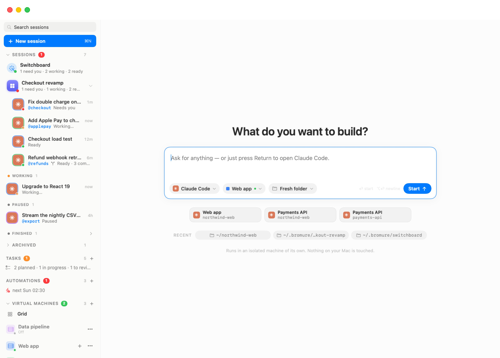
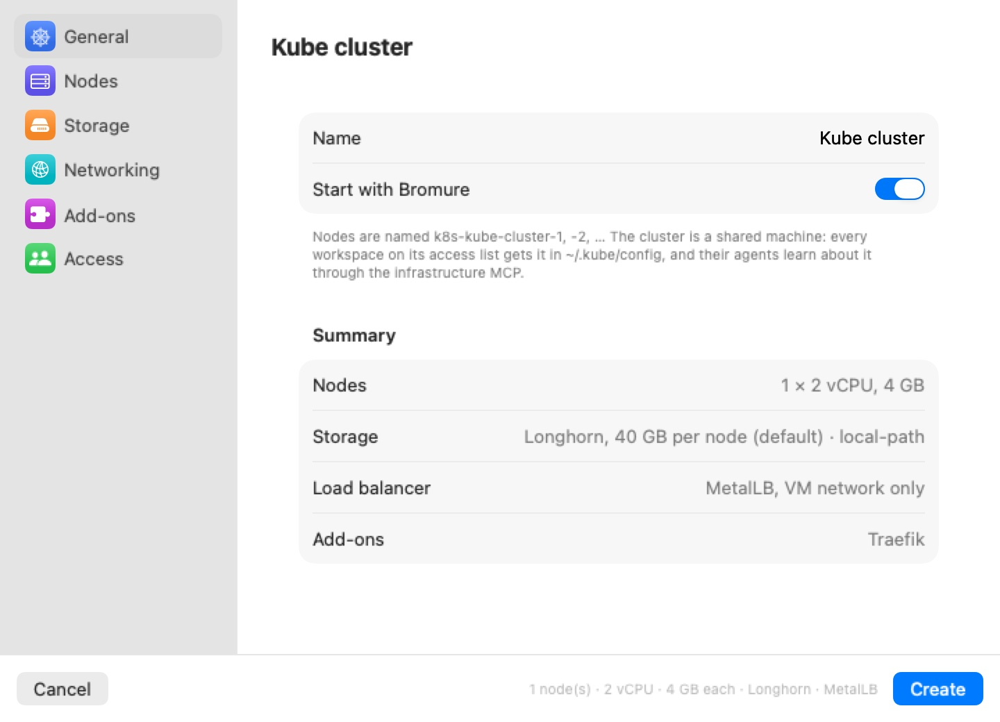
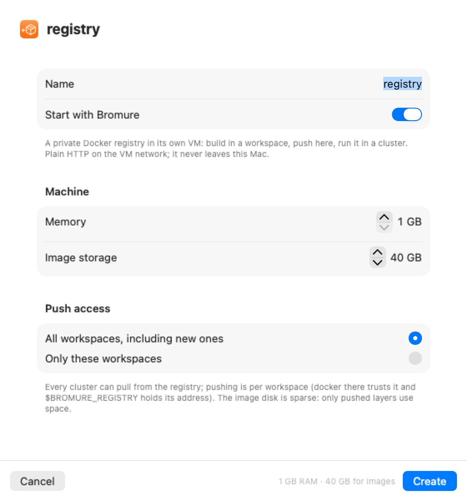

# Kubernetes Clusters & Registries

Some work needs more than one machine: a service deployed to Kubernetes, an image built in one place and run in another, a cloud API to test against. Bromure Agentic Coding can run that infrastructure for you, on this Mac, next to your machines (workspaces, in the settings editor):

- A **Kubernetes cluster** is a set of node VMs running [k3s](https://k3s.io), with optional replicated storage, a load balancer, an ingress controller and local cloud emulators. The machines you allow get it as a context in `~/.kube/config`.
- A **registry** is a private Docker registry in its own small VM. Machines you allow can push to it; every cluster can pull from it.

Both are *shared* resources: one cluster or registry serves several machines, and their agents learn about it through the infrastructure MCP server.

> **Note:** Don't confuse these clusters with **Kubernetes** credentials in a machine's [Credentials](07-settings/credentials.mdx#kubernetes) pane. Those import contexts for clusters that exist *elsewhere* (EKS, GKE, a cluster at work) and broker their credentials on the wire. The clusters in this chapter are VMs that Bromure creates and runs on this Mac.

## Where to find them

- **Workspaces › Infrastructure › Create Kubernetes Cluster…** and **Create Registry…** open the creation sheets. With a mirror window of a remote Mac in front, these items create the cluster or registry on *that* Mac (see [Remote Access](14-remote-access.mdx)).
- Once one exists, the sidebar's **Virtual Machines** section gains a **Kubernetes** list and a **Registries** list, each with a **+** to create another. A row shows a state dot, the name and a one-line status; click it to put its dashboard on the stage. Its **⋯** menu offers **Start**, or **Restart** and **Stop** while running, **Workspace access…** and **Delete…**.

<p align="center">
  
</p>

## Creating a cluster

The **New cluster** sheet has a sidebar of six panes — **General**, **Nodes**, **Storage**, **Networking**, **Add-ons**, **Access** — like a machine's settings editor. **Create** stays disabled until the sheet is valid; a short line beside it says why (for example "Give the cluster a name.").

<p align="center">
  
</p>

### General

| Field | Default | Meaning |
|---|---|---|
| **Name** | **Kube cluster** | Node host names, the kubeconfig context and the on-disk folder all derive from it: nodes are named `k8s-<name>-1`, `-2`, … |
| **Start with Bromure** | On | Boot the cluster when the app launches. |

A **Summary** lists the nodes, storage, load balancer and add-ons you have chosen.

### Nodes

| Field | Range | Default |
|---|---|---|
| **Nodes** | 1–8 | 1 |
| **vCPUs per node** | 1–16 | 2 |
| **Memory per node** | 2–64 GB | 4 GB |

With one node, it runs the control plane and your workloads together. With more, node 1 is the control plane (and still runs workloads) and the others join as workers. The pane shows the total RAM, and warns "That's *N* GB of this Mac's *M* GB — workspaces need room too." when the cluster would leave less than 4 GB for everything else.

### Storage

- **Longhorn distributed storage** (on by default) — replicated block volumes served over iSCSI from a dedicated **Data disk per node** (default 40 GB, 10–2000 GB). The disks are sparse: only written blocks use space on the Mac. Longhorn keeps up to three replicas, never more than the number of nodes. Its storage class is `bromure-longhorn`, the cluster's default. Turned off, only k3s's node-local `local-path` class remains, which pins a pod to its node.
- **Synology NAS** — persistent volumes on your NAS through Synology's CSI driver. Fill in **DSM address**, **Port**, **HTTPS**, **DSM user** and **DSM password**, optional **Volumes** (for example `/volume1, /volume3`), **Protocol** — **iSCSI (block LUNs)** or **SMB (shared folders)** — and **Filesystem**. With no volumes named, DSM picks one with free space and the class is `bromure-synology`; naming volumes gives one class each (`bromure-synology-volume1`, …). The first Synology class becomes the cluster's default; Longhorn stays available by name. The DSM account needs storage-manager rights. The password is stored encrypted on this Mac and only ever lands in the cluster's own Secrets.

### Networking

**Load balancer** chooses how Services of type `LoadBalancer` get an address:

| Choice | Behavior |
|---|---|
| **MetalLB, VM network only** (default) | Layer-2 MetalLB hands out addresses from the VM network. Twenty addresses at the top of the VM subnet are reserved for it when the cluster is set up. Reachable from the machines and this Mac; nothing is exposed on your LAN. |
| **Bromure LAN load balancer** | Each Service port is published on this Mac's LAN address, and the host relays it into the cluster. With an optional **LAN address pool** (for example `10.0.0.20-10.0.0.29`, `10.0.0.32/28` or a comma list), each Service instead gets its own spare LAN address, which the Mac answers for on the network (ARP), MetalLB-style. Reachable from your LAN, this Mac and the machines. |
| **None (NodePort only)** | `LoadBalancer` Services stay pending; use NodePort or ClusterIP. |

With the Bromure LAN load balancer, two Service annotations change the default per Service: `bromure.io/scope: vm` keeps it private (an address on the VM network, for the machines and this Mac only), and `bromure.io/loadBalancerIP` asks for a specific address.

**Traefik ingress controller** (on by default) keeps k3s's bundled ingress. With the LAN load balancer it publishes ports 80 and 443 on this Mac.

> **Warning:** The **Bromure LAN load balancer** makes cluster services reachable by anyone on your network. Choose it deliberately; the MetalLB default keeps everything on this Mac.

### Add-ons

Local cloud emulators from the open-source floci family, each one a `LoadBalancer` Service on its own port, with its data on the cluster's default storage class:

| Toggle | Port | Emulates (among others) |
|---|---|---|
| **AWS emulator (floci)** | 4566 | S3, DynamoDB, SQS, SNS, Lambda, API Gateway, Step Functions, EventBridge, Cognito |
| **Azure emulator (floci-az)** | 4577 | Blob, Queue and Table Storage, Cosmos DB, Key Vault, Service Bus, Event Hubs, Event Grid, Functions, Azure SQL, App Configuration |
| **Google Cloud emulator (floci-gcp)** | 4588 | Cloud Storage, Pub/Sub, Firestore, Datastore, Secret Manager, Cloud KMS, Cloud Run, Cloud Functions, Cloud Tasks, Cloud SQL, BigQuery |
| **Oracle Cloud emulator (floci-oci)** | 4599 | Object Storage, Queue, Streaming, Vault, KMS, Secrets, Functions, Identity, OKE |

Each enabled emulator gets a ***project* version** field. Leave it empty (**latest release**) to get the newest release on Docker Hub when the cluster is set up; type a tag (`2.1.0`) or a full image reference to pin it. If Docker Hub can't be reached, the `latest` tag is used. Services that spawn containers (Lambda, Cloud Run and the like) use the node's Docker and are best effort.

### Access

Which machines get the cluster:

- **All workspaces, including new ones** (default), or
- **Only these workspaces**, with a checkbox per machine. "At least one workspace must keep access."

Machines on the list get the cluster in their `~/.kube/config` (the context is named after the cluster) and see it through the infrastructure MCP. You can change this later from the dashboard.

Click **Create**. Provisioning takes a few minutes; the dashboard's **Log** tab shows each step.

## The cluster dashboard

The dashboard's header shows the cluster's name, a phase pill and a summary (nodes, vCPU and memory each, the k3s version, uptime), with **Start**, or **Restart** and **Stop**, and a **Cluster actions** menu: **Copy kubeconfig**, **Workspace access…**, **Start with Bromure** and **Delete cluster…**.

Six tabs, with a filter field for the lists:

| Tab | Shows |
|---|---|
| **Overview** | Cards for **Nodes**, **Pods**, **Memory**, **Storage** and **Load balancers**; a card per cloud emulator with its endpoints grouped **From this Mac and the LAN** and **From the workspaces**, a ready-to-paste line that points the cloud's CLI and SDKs at it, and the test credentials it accepts; the load balancer's published ports (and any that failed to bind, with the reason); the nodes; **Recent warnings**. |
| **Workloads** | Deployments and pods, with readiness and restarts. |
| **Services** | Services and their external addresses (**External IP: pending** until one is assigned). |
| **Storage** | Longhorn capacity and volumes, the Synology driver's state, and **Volume claims**. |
| **Access** | **Workspace access** — the same choice as in the sheet. |
| **Log** | The provisioning and lifecycle log. |

**Delete cluster…** "Stops every node and deletes their disks, including all Longhorn volumes. Workspaces lose the cluster from their kubeconfig. This can't be undone."

## Using a cluster from a machine

In an allowed machine, `kubectl` simply works: the cluster's context is in `~/.kube/config`, and kubectl talks to the control-plane node directly over the VM network. That traffic doesn't pass through the host's intercepting proxy — node addresses are excluded from the machine's proxy settings — so it doesn't appear in the machine's [trace](11-tracing.mdx).

The **Copy kubeconfig** action gives you a standalone kubeconfig for tools on the Mac itself. The node VMs are also reachable with the CLI, for example `bromure-cli vm exec k8s-dev-1 -- kubectl get nodes` (see [CLI, API & MCP](16-automation-cli.mdx)).

## Registries

### Creating a registry

**Create Registry…** opens a sheet: "A private Docker registry in its own VM: build in a workspace, push here, run it in a cluster. Plain HTTP on the VM network; it never leaves this Mac."

<p align="center">
  
</p>

| Field | Range | Default |
|---|---|---|
| **Name** | — | **registry** |
| **Start with Bromure** | — | On |
| **Memory** | 1–16 GB | 1 GB |
| **Image storage** | 10–2000 GB | 40 GB |
| **Push access** | **All workspaces, including new ones** / **Only these workspaces** | All |

The image disk is sparse: only pushed layers use space. Every cluster can pull from every registry; push access is per machine.

### The registry dashboard

The header shows the registry's address (`<ip>:5000`), its memory and disk, **Start** / **Restart** / **Stop**, and a menu with **Copy address**, **Workspace access…**, **Start with Bromure** and **Delete registry…**. Tabs: **Images** (cards for **Repositories**, **Disk** and **Address**, a **Push from a workspace** snippet, and the list of images and tags), **Access** and **Log**.

In a machine with push access, Docker already trusts the registry's address, and `$BROMURE_REGISTRY` holds it (with access to several registries, the first one's), so you can push straight away:

```
docker build -t $BROMURE_REGISTRY/myapp:dev .
docker push $BROMURE_REGISTRY/myapp:dev
kubectl run myapp --image=$BROMURE_REGISTRY/myapp:dev
```

Clusters are configured to pull from every registry automatically; when a registry is created, moves or is deleted, running clusters are updated. While a registry is stopped, pulls from it fail like any registry outage.

**Delete registry…** "Stops the registry VM and deletes every image it holds. Workspaces and clusters stop trusting its address. This can't be undone."

## Agents and the infrastructure MCP

Every machine's agents get a `bromure-infrastructure` MCP server (vsock port 5834), limited to the clusters and registries that machine may use. Its tools:

| Tool | What it does |
|---|---|
| `infrastructure_overview` | Everything available to this machine — clusters (context names, state, nodes, storage classes, load balancer, ingress) and registries (address, how to push) — with usage instructions. |
| `cluster_status` | Live detail for one cluster: phase, nodes, pods, services and their external addresses, storage, warnings, recent log lines. |
| `cluster_create` | Create a cluster, with the same options as the sheet. |
| `cluster_start` | Boot a stopped cluster. |
| `registry_status` | One registry: address, whether it answers, its images, disk usage. |
| `registry_create` | Create a registry. |
| `registry_start` | Boot a stopped registry. |

A cluster or registry an agent creates is shared with every machine (**All workspaces**) and starts with Bromure.

## Lifecycle

- **Quitting the app** suspends cluster nodes and registries (a snapshot of their memory), and the next start resumes them. A snapshot that won't restore falls back to a fresh boot.
- **Stop** shuts k3s and the containers down cleanly before powering the VMs off, allowing up to 60 seconds per machine.
- If a node or registry VM fails its filesystem check at boot, Bromure detects it, stops the VM, repairs its system and data disks, and boots it again.
- A cluster whose first setup never finished is set up again on its next start.
- Deleting a machine removes it from every access list; a list that would become empty falls back to all machines.
- Clusters and registries appear in a remote Mac's mirror window like everything else (see [Remote Access](14-remote-access.mdx)).

Cluster records live in `~/Library/Application Support/BromureAC/kube/clusters.json`; each cluster's node disks are under `~/Library/Application Support/BromureAC/kube/<cluster-id>/`.
