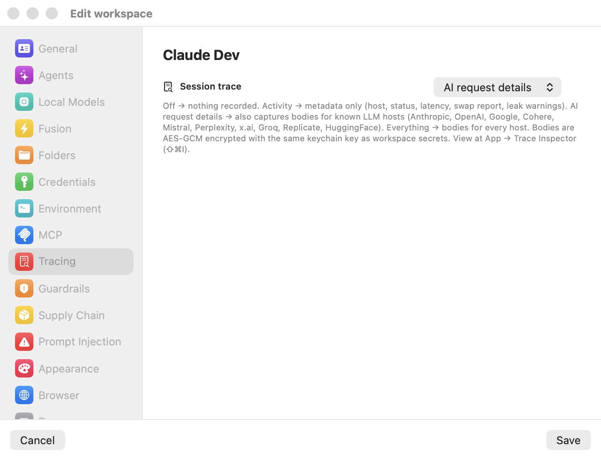

# Enterprise — Enrollment & Fleet

A single copy of Bromure Agentic Coding is a personal tool. Across a team, an administrator often needs to answer organizational questions: which Macs are running the app, what packages agents are pulling in, how many tokens are being spent, and whether any workspace tripped a prompt-injection detector. Enrollment with **Bromure Enterprise Manager** — a workspace on bromure.io — provides exactly that fleet visibility, by streaming session *metadata* (never prompts, never secrets) from each enrolled Mac.

This chapter covers enrolling a Mac, the mTLS identity that authenticates its uploads, precisely what does and does not get uploaded, per-workspace opt-out, the administrator's fleet view, remote consent handling, and off-boarding. Local tracing — the on-Mac audit trail that enrollment does not replace — is covered in [Tracing](11-tracing.mdx); the package inventory that feeds enterprise reporting is [Supply-Chain Protection](09-supply-chain.mdx).

## Two independent systems

The word "fleet" spans two features that are worth keeping distinct, because they share no trust root:

- **bromure.io enrollment** (this chapter) registers a Mac with your workspace and streams session metadata to the cloud, authenticated by a mutual-TLS certificate issued by your organization's CA.
- **The rich client** ([Remote Access](14-remote-access.mdx)) lets one Mac mirror *other* Macs' running instances over SSH, authenticated by SSH host keys and enrolled public keys.

Neither depends on the other. You can enroll without ever using the rich client, mirror hosts without enrolling any of them, or do both. Enrollment's mTLS stack is fleet telemetry only; rich-client mirroring trusts SSH — the two are deliberately not merged in this version.

## Enrolling with Bromure Enterprise Manager

Enrollment is code-based. An administrator mints a single-use, six-word enrollment code on your user's detail page in bromure.io, scoped to the app `agentic-coding`. You paste that code into the app (or the CLI), and the Mac registers itself as an *install* of the workspace.

### From the app

1. Get a six-word enrollment code from your administrator.
2. Open **Bromure Agentic Coding** (the app-name menu) → **Enroll in bromure.io…** — the item sits directly under **Check for Updates…**. A window titled **bromure.io Enrollment** opens.
3. Paste the code into the **Enrollment Code** field (placeholder: `six-word-enrollment-code`).
4. Optionally edit **Device Name** (it defaults to this Mac's name; help text: "Shown to your administrator so they can recognize this Mac.").
5. Optionally expand **Advanced** and set **Server URL (optional)** for a self-hosted or staging server.
6. Click **Enroll** (Return) or **Cancel** (Esc).

The sheet states plainly what enrolling turns on: it "sends session metadata (tools, files, commands, token usage) to your workspace so admins can review activity. Workspaces in private mode never stream." On success the install appears on the administrator's `/agentic-coding/installs` page.

> **Note:** Some in-app hint text still reads "Open Window → Enroll in bromure.io…", but the item actually lives in the application (app-name) menu — that is the authoritative location. A code minted for a different Bromure app is rejected with **Code was issued for app '…', expected 'agentic-coding'.**, and enrolling a second time fails with **Bromure Agentic Coding is already enrolled.**

### From the CLI

The GUI flows have exact CLI counterparts, grouped under **Enterprise features** in `bromure-cli --help` and sharing the same on-disk store. They are handy for scripted provisioning or enrolling over an existing SSH session.

| Command | What it does |
|---|---|
| `bromure-cli enroll --code <code> [--server-url <url>] [--device-name <name>]` | Enrolls this Mac. Prints the email, workspace, install ID, server, and device on success; exits non-zero on failure. |
| `bromure-cli enrollment-status` | Prints the current state. When un-enrolled it prints `not enrolled` and exits 0, so automation can probe safely. |
| `bromure-cli unenroll [--force]` | Signs out (see [Revocation, off-boarding, and un-enrolling](#revocation-off-boarding-and-un-enrolling)). |

The defaults match the GUI: server URL `https://bromure.io/api` (overridable via `BROMURE_MANAGED_URL` or the `managed.serverURL` UserDefaults key), device name the Mac's localized hostname.

### The mTLS install identity

Telemetry uploads do not carry a token — they authenticate with a client certificate. At enrollment (and on every renewal) the app generates a fresh RSA-2048 key, builds a certificate signing request with common name `bromure-install-<installId>`, and has your workspace's [org CA](18-glossary.mdx) sign it through the managed server. The leaf and CA certificates are stored as inspectable PEM files; the private key lives in the macOS Keychain.

At request time the certificate and key are packaged into an in-memory PKCS#12 and imported *without* touching the Keychain, so no Keychain Access entry or unlock prompt ever appears for the identity itself. The analytics endpoint's own server certificate is validated against the normal system root store.

> **Note:** The leaf-certificate request during enrollment is best-effort. If the org CA is not configured yet, enrollment still succeeds and the certificate is fetched on the first heartbeat.

## The enrollment status panel

Once enrolled, the same menu item renames itself to **bromure.io Enrollment…** and opens a status panel (title **bromure.io enrollment**) instead of the entry form. It shows **Workspace**, **User**, **Device**, **Server**, **Enrolled** (date), and **Certificate** rows — all text-selectable. The **Certificate** row reads **Valid until `<date>`** or, if it lapsed, **Expired — renewing automatically**.

Two buttons sit at the bottom: **Renew certificate** forces a new leaf certificate; **Sign out** un-enrolls (destructive — see below). Health problems appear as an orange warning banner:

| Banner | Meaning | What to do |
|---|---|---|
| **Enrollment revoked** | "Your administrator revoked this install. Sign out and enroll again with a new code to resume managed mode." | Sign out and enroll with a fresh code. |
| **Enrollment no longer accepted** | "The server rejected this install's credentials — they may have expired or been reset." | Sign out and enroll with a fresh code. |

A successful **Renew certificate** clears a stale credential-rejection state, but it never clears a **revoked** state — only re-enrollment does.

## Heartbeat and certificate renewal

While the app runs enrolled, a background task posts a heartbeat to the workspace server every 10 minutes (and once immediately at launch and at enrollment), which keeps the administrator's last-seen timestamp fresh. The server's response is authoritative for health: a revocation flips the banner; a clean response clears prior bad states. Only a `401`/`403` on the heartbeat's bearer token turns health to "token rejected" — transient errors (offline, `5xx`) never change it.

Each heartbeat tick also checks the mTLS leaf certificate and renews it whenever it is missing or within **72 hours** of expiry. Renewal is authenticated by the bearer token rather than the leaf, so even an already-expired certificate heals on the next launch.

> **Warning:** A Mac left closed past its certificate's expiry silently fails managed uploads until the next launch renews the leaf. This is transparent in normal use, but worth knowing if a machine sits shut for a long time.

## What is uploaded — and what is not

Enrolled, non-private sessions stream structured [cloud events](18-glossary.mdx) — one record each: session id, workspace id, timestamp, event type, and a small JSON payload. Sessions here are *activity windows*, not VM lifecycles: one session id per workspace per activity window, rolled over after 20 minutes of inactivity.

| Event | Payload highlights |
|---|---|
| `session.start` / `session.end` | Start and end of an activity window; `session.end` carries a reason (e.g. `idle_timeout`) and is backdated to the idle boundary. |
| `llm.request` | Provider, host, path, status code, latency, model, and input/output/cache token counts. Realtime WebSocket sessions add the transport and response id. |
| `tool.use` | Tool name and an input summary (truncated to 240 characters). |
| `file.read` / `file.write` | File path and the tool that touched it. |
| `command.run` | The command text (truncated to 500 characters) and the tool. |
| `credential.token_swap` | Host and path, and short *previews* of the fake and real tokens — never the tokens themselves. |
| `credential.ssh_sign` | Key label, SHA-256 fingerprint, and key kind (managed / imported). |
| `credential.aws_sign` | Method, host, path, service, region, and a *masked* access key. |
| `supply_chain.fetch` | Ecosystem, package, version, request kind, outcome, and reason. |
| `vm.disk_reset` | The reason and the base-image versions involved. |
| `prompt_injection.detection` | Detector, method, action, host, source, score, signals, tool-use id, and the whole flagged snippet (up to 20,000 characters). |

Streaming state is visible in every session window and mirrored in the fleet reporting an admin sees.

### What never leaves the Mac

This is the part to be precise about. The stream is metadata; the content of your work stays local. Bromure **never** uploads:

- **Raw user prompts** or **model response bodies.**
- **Secret values.** Credential events carry masked previews or fingerprints only — real key bytes never leave the Mac.
- **Anything from a private-mode workspace** (see below), and **anything at all when un-enrolled.**

Buffered events are held in memory only; a hard quit discards any not yet flushed, and there is no disk-backed retry queue. That is accepted by design — telemetry is best-effort, never at the expense of your work.

> **Warning:** There is one deliberate exception to the metadata-only rule: `prompt_injection.detection` uploads the **whole flagged snippet** (up to 20,000 characters), so an administrator can see exactly what the agent was about to read. This is content, not metadata — the trade is that a prompt-injection attempt is precisely the thing security teams need to inspect verbatim. Everything else remains previews, paths, counts, and masks. See [Prompt-Injection Protection](10-prompt-injection.mdx) for what triggers a detection.

### Batching and delivery

Events are batched in memory and posted to the analytics ingest endpoint, authenticated purely by the mTLS leaf certificate — no bearer token rides with telemetry data. The buffer flushes every 5 seconds, auto-flushes at 200 pending events, and sends at most 500 events per request. During a long outage the buffer is trimmed to the most recent events (the oldest are discarded) rather than growing without bound; a failed flush retries the same batch on the next tick.

## Private mode

Streaming is opt-out per workspace. The **Private mode** toggle (eye-slash icon) in a workspace's editor keeps that workspace's activity entirely local: no metadata is streamed, the title-bar indicator disappears for it, and the administrator's session list sees nothing from it. The local Trace Inspector is unaffected — it keeps recording per its own [trace level](11-tracing.mdx). The toggle is off (streaming enabled) for every workspace, and appears only on enrolled Macs, since it would do nothing otherwise.

Private mode lives with the [Tracing](07-settings/tracing.mdx) settings in the workspace editor. On an un-enrolled Mac the switch is simply absent, which is why the pane below shows only the trace picker:

<p align="center">
  
</p>

Events are gated at emit time — private-mode traffic never even enters the upload buffer.

> **Tip:** Private mode is the right switch when you use a personal API key in one workspace and do not want that activity visible to your organization's admins. It changes nothing about the local audit trail.

### The streaming indicator

Whenever a Mac is enrolled and a workspace is *not* in private mode, a pulsing red recording-style dot appears in that session window's toolbar (and as a dot on unified-window sidebar rows). Its tooltip reads "Session metadata is being sent to bromure.io. Toggle the workspace's Private Mode to stop streaming." and its accessibility label is **Streaming to bromure.io**. The dot is purely informational and is hidden when un-enrolled or in private mode.

## Egress IP registration

Enrolled installs also post a tiny mTLS-authenticated ping to the analytics service's `/register-ip` endpoint every 60 seconds (and once at launch and enrollment), so the workspace's records reflect the Mac's current public IP. It is silently skipped when un-enrolled. The endpoint defaults to `https://analytics.bromure.io/register-ip`, overridable via `BROMURE_AC_REGISTER_IP_URL` or the `managed.acRegisterIPURL` UserDefaults key.

## Supply-chain inventory and token-usage rollups

Two of the streamed event types are what make enterprise-tier reporting useful across a whole team.

- **Supply-chain inventory.** Every metadata and artifact fetch emits a `supply_chain.fetch` event carrying the ecosystem, package, version, request kind, outcome (`allowed`, `rewritten`, `blocked`, or `stripped`), and reason. Enrollment alone gives administrators an organization-wide inventory of every package every agent pulled in — even on workspaces with every supply-chain enforcement layer switched off, since observation is decoupled from enforcement. The enforcement side of this is documented in [Supply-Chain Protection](09-supply-chain.mdx).
- **Token-usage rollups.** Every `llm.request` event carries the model, input and output token counts, and cache-creation and cache-read counts. Aggregated across a fleet, these become per-user, per-workspace, and per-model spend reports without any prompt or response content ever being uploaded. The local counterpart — per-request token accounting you can read on your own Mac — is in [Tracing](11-tracing.mdx).

## The fleet view

On the bromure.io side, each enrolled Mac appears as a row on the workspace's `/agentic-coding/installs` page, identified by its install ID and showing the device name you set, the user, and a last-seen timestamp kept fresh by the 10-minute heartbeat. From there an administrator reviews the streamed session metadata, the supply-chain inventory, token-usage rollups, and prompt-injection detections for the whole fleet.

This is distinct from the rich client's notion of a "fleet" — mirroring several *remote hosts* at once over SSH — which is covered in [Remote Access](14-remote-access.mdx#multiple-remotes-fleet-subnet-routing). The two never share a trust root.

## Remote consent handling

When a workspace session is attached interactively over CLI or SSH — with no GUI window in front of it — the app cannot pop a dialog. Instead, the four man-in-the-middle consent brokers render their questions as numbered menus on the attached user's *terminal*:

| Prompt | Choices |
|---|---|
| Credential use — `Allow "<workspace>" to use <credential>?` | Allow for 1 hour / Allow for 5 minutes / Allow for the rest of the session / Don't allow |
| Supply-chain bypass — `Pass through <package> from workspace …?` | Allow for 15 minutes / Allow once / Allow for the rest of the session / Don't allow |
| Guardrail write — `Allow write on … from workspace …?` | (same four as above) |
| Prompt injection — `Possible <detector> in …` (shows up to 1,500 characters of the flagged text) | Block this request / Allow this request |

The crucial property is *where* the prompt is rendered: on the **host** side of the terminal pump. The guest VM only ever sees the other side of the connection, so a compromised guest can neither read the prompt nor inject an answer. If several clients attach to the same workspace, the newest interactive attach receives the prompts ("most recent attach wins").

> **Warning:** These prompts fail safe. No live attach, a timeout (default 120 seconds), a dismissal, or a detach mid-prompt all resolve to **deny** — and for prompt injection, to **block**. A registry auth-failure alert is suppressed to a log line for interactively attached sessions, since there is no GUI to show it. The GUI paths for these same decisions are covered in [Credentials](08-credentials.mdx), [Supply-Chain Protection](09-supply-chain.mdx), and [Prompt-Injection Protection](10-prompt-injection.mdx).

## Revocation, off-boarding, and un-enrolling

There are two ways an install leaves the fleet, and they do different things.

**Un-enrolling (local).** Click **Sign out** in the enrollment status panel, or run `bromure-cli unenroll`. The CLI prompts `Sign out of <org> (<email>)? [y/N]` unless you pass `--force`, and prints `not enrolled — nothing to do` (exit 0) when there is nothing to remove. Signing out deletes all local enrollment material — `install.json`, `leaf.crt`, `ca.crt`, `leaf.serial`, and the health file — removes the bearer token and every leaf private key from the Keychain, purges the cached mTLS identity, drops any buffered telemetry, and stops the heartbeat and IP-register tasks. The app returns to the **Not enrolled** state, and the status window swaps back to the enrollment form so you can immediately re-enroll with a different code.

**Revoking (server-side).** An administrator revokes the install on bromure.io. On the Mac, the next heartbeat surfaces the **Enrollment revoked** banner and managed uploads stop.

> **Warning:** Sign-out is purely local — no server call is made. An administrator retiring a device should **revoke the install server-side**; otherwise the (now-dead) install row lingers on the fleet page until it stops heartbeating. To fully off-board a Mac, revoke it in the workspace *and* sign out on the device.

## Reference

Enrollment state lives under `~/Library/Application Support/BromureAC/managed/`: `install.json` (install ID, workspace slug, user, server URL, device name, enrolled-at), `leaf.crt` and `ca.crt` (PEM), `leaf.serial` (a pointer to the Keychain entry holding the current leaf's key), and `health` (`ok` / `tokenRejected` / `revoked`). In the macOS Keychain, service `io.bromure.agentic-coding.managed-install` holds the `install-token` bearer and one `leaf-cert-key-<serialHex>` entry per issued certificate serial (this-device-only, when-unlocked).

The client contacts three managed-server routes and one ingest endpoint:

```
POST {server}/v1/enroll                              (code redemption)
POST {server}/v1/installs/{installId}/heartbeat      (Bearer)
POST {server}/v1/installs/{installId}/cert           (Bearer + CSR PEM)
POST {ingest URL}   {"events":[…]}                   (mTLS, no bearer)
```

| Interval / limit | Value |
|---|---|
| Heartbeat | every 10 minutes |
| Egress-IP register | every 60 seconds |
| Leaf renewal threshold | 72 hours before expiry |
| Event flush | every 5 seconds (or at 200 pending) |
| Max events per batch | 500 |
| Session idle rollover | 20 minutes |
| Remote-consent timeout | 120 seconds |
| Prompt-injection snippet cap | 20,000 characters |

Server and endpoint overrides (no GUI) are `BROMURE_MANAGED_URL` (or `managed.serverURL`, default `https://bromure.io/api`), `BROMURE_AC_INGEST_URL` (or `managed.acIngestURL`, default `https://analytics.bromure.io/ac-ingest`), and `BROMURE_AC_REGISTER_IP_URL` (or `managed.acRegisterIPURL`). The full command reference is in [Automation & the CLI](16-automation-cli.mdx).
