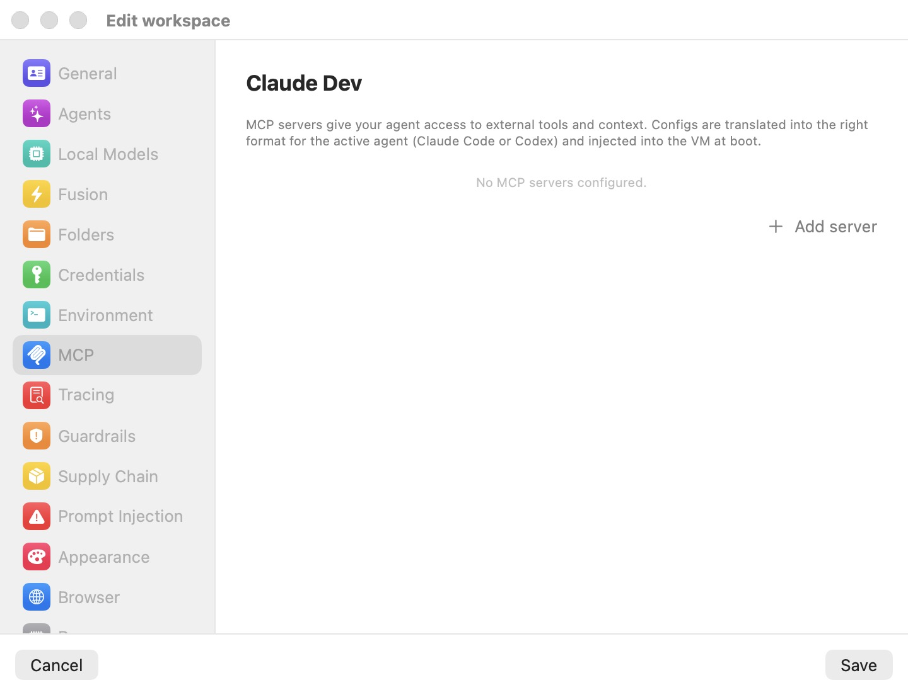

# CLI, Automation & MCP

Everything you can do in the app, you can also do without the window. The same binary that hosts the GUI — `bromure-cli`, inside `Bromure Agentic Coding.app/Contents/MacOS/` — is a full multi-command CLI, an HTTP control plane, two [MCP](18-glossary.mdx) servers, an AppleScript dictionary, and a scheduler. This chapter is the reference for all of them.

Four automation surfaces sit on top of one control plane:

- **The `bromure-cli` command line** — a Docker/kubectl-style CLI for creating workspaces, booting VMs, attaching terminals, running commands, and reading traces.
- **The automation API** — the same control plane exposed as JSON-over-HTTP on the loopback interface, for scripting from any language.
- **MCP servers** — a stdio server that lets an AI agent (Claude Code, Claude Desktop) manage the app, and a `browser` server that lets an agent drive its workspace's embedded Chromium.
- **AppleScript** — the *Bromure AC Suite* dictionary, for macOS scripting and screenshot tooling.

Scheduled automations — recurring, unattended agent runs — build on the same control plane and are covered at the end of the chapter.

## The control plane: socket and API

Every one of these surfaces ultimately speaks HTTP to the running app over one of two transports:

| Transport | Where | Access gate | On by default |
|---|---|---|---|
| **Control socket** | `~/Library/Application Support/BromureAC/control.sock` (Unix domain, HTTP/1.1) | File permissions — the socket is mode `0600`, owner-only. Reaching the file *is* the authorization, Docker-socket style. | Yes, whenever the app or a headless agent is running |
| **Automation API** | `127.0.0.1:9223` (TCP) | Loopback only by default; introspection and mutation routes additionally require the `BROMURE_DEBUG_CLAUDE` environment variable (see [Debug endpoints](#debug-endpoints-bromure_debug_claude)) | No — opt-in in **Preferences → Automation** |

The CLI never talks to a VM directly. Each subcommand is a thin HTTP client over the control socket, so the same commands work locally and — when the socket is tunneled over SSH — against a remote instance from a [rich client](18-glossary.mdx). If no agent is running when you invoke a command that needs one, the CLI autostarts a windowless background agent (`bromure-cli run --headless`) and waits up to 40 seconds for it to answer `/health`. Read-only commands (`vm ls`, `describe`, `trace …`) do not autostart; they print `No bromure-cli agent running.` instead.

> **Note:** The control socket is always available while the app runs and is independent of the **Enable automation server** switch. That switch only governs the TCP listener on port 9223. You do not need to enable the automation API to use the `bromure-cli` CLI.

## The `bromure-cli` command line

You can call the binary by its full bundle path, but the app offers a one-time install of a short alias. At launch it shows an alert — **Install the "bromure-cli" command-line tool?** — with buttons **Install** / **Not Now** / **Don't Ask Again**. Choosing **Install** symlinks `/usr/local/bin/bromure-cli` to the app binary (one admin prompt). Under the `bromure-cli` name the binary hides app-internal commands — image management, the `mcp` server, and the GUI `run` default — and exposes only the terminal-facing groups (Workspaces, Tracing, Local inference, Enterprise, `remote`); a bare `bromure-cli` prints help instead of launching the app. Invoked as `bromure-cli`, everything is available and the default subcommand is `run` (the GUI). The examples below use `bromure-cli`; substitute `bromure-cli` freely for the commands it exposes.

Commands accept a workspace **id**, a short-id prefix, or its **name** wherever a workspace argument is shown. Workspaces are the persistent VM configurations described in [Workspaces](05-workspaces.mdx); the `vm` and `workspaces` command groups are aliases for each other.

### The app and the background agent

| Synopsis | What it does |
|---|---|
| `bromure-cli run [--headless]` | Default (hidden) subcommand — launch the GUI. `--headless` runs a window-less menu-bar accessory agent; this is what the CLI autostarts to serve the control socket. |

### Image management

The base image is installed once. These commands are hidden under the `bromure-cli` alias.

| Synopsis | What it does |
|---|---|
| `bromure-cli init [--build-local]` | Install the Ubuntu base image: download the prebuilt image, falling back to a roughly 10-minute local build on download failure. `--build-local` forces the local build. |
| `bromure-cli info` | Print the base-image version, virtual size, on-disk size, and path. |
| `bromure-cli reset [--yes]` | Delete the base image (disk, EFI vars, version stamp, state) so the next `init` starts fresh; confirms unless `--yes`. |
| `bromure-cli init-foss-image --output <dir>` | Publish pipeline only — build the redistributable free-software-only base image into `<dir>`. |
| `bromure-cli verify-image --disk <path> [--timeout 300]` | Publish pipeline only — boot a disposable clone headless and require the serial login prompt within the timeout. |

> **Note:** There is no `setup` subcommand — that belongs to the sibling Bromure (browser) product. The Agentic Coding image install command is `init`. If no base image exists, launching the GUI routes you into the in-app setup flow instead.

### Workspace and VM control

This is the core group. `vm run` is deliberately Docker-shaped: it boots a workspace and hands your terminal to the guest's shared `bromure` tmux session.

| Synopsis | What it does |
|---|---|
| `bromure-cli vm ls` | List every workspace with live state (off / suspended / booting / running), uptime, window attach state, tmux tabs as a tree (`*` marks the active tab), and running Docker containers. |
| `bromure-cli vm run [<workspace>] [-v <dir>]… [--name N --tool T --auth A --api-key K] [--memory GB] [-d] [--rm]` | Start a workspace's VM, or create a throwaway one on the fly. Default: attach your terminal to the guest tmux. |
| `bromure-cli vm attach <vm> [<tab#> \| containers:<name> [-- <shell>]] [-w]` | Attach the terminal to the VM's tmux (optionally jumping to a tab), `docker exec -it` into a running container (default shell `bash`), or open/reattach the GUI window with `-w`/`--window`. |
| `bromure-cli vm exec <vm> [-i] [-t] [--timeout 600] -- <command…>` | Run a command inside the VM (kubectl-style, after `--`). `-it` opens an interactive pty; omit the command with `-it` for a shell. Guest exit codes propagate. |
| `bromure-cli vm kill <vm> [--suspend]` | Stop a VM: graceful shutdown, or suspend (RAM saved to disk) with `--suspend`. |
| `bromure-cli vm reboot <workspace> [--hard]` | Reboot a running workspace in place; graceful by default, `--hard` tears it down immediately. |
| `bromure-cli vm describe <workspace>` | Print the workspace's settings plus live runtime details when running (state, IP, vCPUs, Fusion state, disk usage from guest `df`, tabs, containers, memory in use). |
| `bromure-cli vm ports <workspace>` (or `vm <workspace> -L`) | Show a running workspace's listening ports (live `ss` as root): PORT, PROTO, ADDRESS, PROCESS, with loopback-only binds marked. |
| `bromure-cli workspaces create [--name N] [--tool T] [--auth A] [--api-key K] [--memory GB] [--color C] [-v <dir>]… [--generate-ssh] [--from-json <file\|->]` | Create a workspace headlessly. `--from-json` applies a full profile JSON document (flags override matching fields); `--generate-ssh` mints a host-side SSH key and prints the public key. |
| `bromure-cli workspaces edit <workspace> [--from-json <file\|->]` | Fetch the workspace's full config, open it in `$VISUAL`/`$EDITOR` (`vi` fallback), and save changes back. Secrets show blank — leave blank to keep, type to replace. `--from-json` applies a document non-interactively. |
| `bromure-cli workspaces rm <workspace> [-f]` | Delete a workspace and ALL its data (disk + home) after a `y/N` confirmation, skipped with `-f`. |
| `bromure-cli workspaces ssh-keygen <workspace>` | Generate a fresh host-side SSH key for the workspace and print the public key for your Git host. |

A few operational details worth knowing:

- **`vm run` flags.** `--tool` is `claude`, `codex`, or `grok`; `--auth` is `token`, `subscription`, or `bedrock`. `-v`/`--volume <hostdir>` mounts a host folder at `~/<basename>` in the guest (repeatable, up to 8). `-d`/`--detach` boots the VM and returns instead of attaching. `--rm` deletes the workspace and its disk when the VM stops. Detach from an attached tmux with `Ctrl-b d` — that leaves the VM running.
- **TTY-aware.** The Docker-style default of handing the terminal to tmux applies only on a real terminal; piped or scripted invocations silently behave as if you passed `-d`.
- **`workspaces create` auth.** For `create`, `--auth` also accepts `local`. Colors are `blue`, `red`, `green`, `orange`, `purple`, `pink`, `teal`, or `gray`.
- **Blank-keep on edit.** `workspaces edit` exports the whole config with secrets blanked; a saved-back document with a blank secret keeps the stored value, so a round-trip can never wipe your keys. An unchanged buffer saves nothing; invalid JSON aborts.
- **Exec waits.** `vm exec` waits up to 10 seconds for the guest shell agent; a `502` means the VM may not be running or the name did not match. Approval prompts that fire during an attached session are rendered on *your* terminal (see [Consent over attached terminals](#consent-over-attached-terminals)), never inside the guest.

### Models, routing, and Fusion

Local inference is covered in depth in [Local Models](13-local-models.mdx) and multi-model synthesis in [Fusion](12-fusion.mdx); the CLI toggles are:

| Synopsis | What it does |
|---|---|
| `bromure-cli model catalog\|ls\|pull\|use\|rm …` | Manage local MLX inference models — browse the curated catalog, download with live progress, select per workspace, remove. |
| `bromure-cli vm fusion enable\|disable <vm>` | Engage or disengage Fusion on a running VM. Requires the workspace to have two or more models configured. |
| `bromure-cli vm routing cloud\|local\|hybrid <vm>` | Set the LLM backend routing for a running VM. |
| `bromure-cli vm hybrid budget <tokens> <vm> \| ttft <seconds> <vm> \| split <percent> <vm>` | Tune hybrid routing: cloud-token cap per rolling 24 hours (`0` = unlimited), soft time-to-first-token fallback threshold (default 5 s), and percentage of new sessions pinned to local (0–100). |

`fusion` also accepts `on`/`engage` and `off`/`disengage` as synonyms.

### Trace inspection

These read the per-workspace MITM session traces. They return nothing unless the workspace has tracing enabled — see [Tracing settings](07-settings/tracing.mdx) — and the full story is in [Tracing](11-tracing.mdx).

| Synopsis | What it does |
|---|---|
| `bromure-cli trace ls [workspace] [--limit 50]` | List recent requests: TIME / HOST / METHOD / STATUS / REQ / RESP / LAT / FLAGS (flags include `swap×N`, `LEAK×N`, `conv`). |
| `bromure-cli trace summary [workspace]` | Aggregate totals, status classes, swap/leak/conversation counts, and top hosts. |
| `bromure-cli trace hostnames [workspace]` | List distinct hosts and their request counts. |
| `bromure-cli trace leaks [workspace]` | Show requests with suspected credential leaks (header, preview, suspicion). |
| `bromure-cli trace clear [-f]` | Wipe in-memory and on-disk trace history after a `y/N` confirmation. |

### Remote access

The optional SSH front door is disabled by default and documented fully in [Remote Access](14-remote-access.mdx). All operations go through the running app over the control socket.

| Synopsis | What it does |
|---|---|
| `bromure-cli remote [status]` | Default subcommand — print enabled/running state, bind and port, auth methods, host-key fingerprint, login user, a ready-made connect line, and authorized keys. |
| `bromure-cli remote enable [--port 2222] [--bind 0.0.0.0] [--[no-]password] [--[no-]pubkey]` | Enable the SSH server. At least one auth method must remain on. |
| `bromure-cli remote disable` | Turn the SSH server off. |
| `bromure-cli remote key add <key\|path>` / `key [ls]` / `key rm <index\|fingerprint>` | Manage authorized public keys (`ls` is the default). |

### Enterprise enrollment

CLI counterparts of the **Enroll in bromure.io…** sheet, for scripted device provisioning. See [Enterprise](15-enterprise.mdx).

| Synopsis | What it does |
|---|---|
| `bromure-cli enroll --code <6-word-code> [--server-url URL] [--device-name NAME]` | Enroll this Mac with a bromure.io workspace using an admin-minted code. Server defaults to `$BROMURE_MANAGED_URL` or `https://bromure.io/api`; device name defaults to the Mac's hostname. |
| `bromure-cli unenroll [--force]` | Sign out of the enrolled workspace (`y/N` unless `--force`). |
| `bromure-cli enrollment-status` | Print enrollment state (workspace, user, install id, device, server, enrolled date, bearer/leaf-cert presence). "not enrolled" exits `0` so automation does not treat it as a failure. |

### Integration and internal commands

| Synopsis | What it does |
|---|---|
| `bromure-cli mcp [--debug] [--api-url http://127.0.0.1:9223]` | Run the AC MCP server on stdio for AI tools. See [The AC MCP server](#the-ac-mcp-server-bromure-cli-mcp). |
| `bromure-cli __remote-menu`, `__attach-window`, `__fatclient…`, `__forward…`, `__dial`, `__tunnel-helper` | Internal entry points (the SSH ForceCommand TUI, terminal byte pump, and rich-client tunnel helpers). Not for interactive use. |

## The remote TUI (`__remote-menu`)

When SSH remote access is enabled, every remote login is forced (via `ForceCommand`) into a hand-rolled ANSI terminal UI rather than a shell — an alternate-screen, 256-color minishell driven by arrow keys and digits that works over any SSH PTY (use `ssh -t`). It mirrors the whole CLI as menus:

- **Workspaces** — create with a single-screen form (Name, Tool, Auth, API key, Memory, Color, Folders, Generate SSH, **Full settings…**, Create), per-workspace actions (Attach, New tab, Describe, Configure…, Fusion, Routing, Worktrees…, Reboot…, Suspend, Kill for running workspaces; Start, Describe, Configure…, Delete for off ones), and a raw table view. **Configure…** reproduces every GUI editor pane natively.
- **Models** — installed models and the download catalog; picking an uninstalled model offers to `model pull` it inline with live progress.
- **Trace** — Summary / Hostnames / Leaks / Recent / Clear.

While you are attached to a workspace's tmux, a magic keychord (default `Ctrl-]`, shown in the banner) pops a host-drawn **controller overlay**: a tab tree, New tab, Worktrees…, Fusion, Routing, Edit settings…, Reboot…, Suspend, Disconnect. The guest never sees the trigger key — override it with the `remote/overlay-key` file or `$BROMURE_OVERLAY_KEY`. `Ctrl-b d` disconnects from tmux back to the menu. The full remote and rich-client story, including the overlay and connection setup, is in [Remote Access](14-remote-access.mdx).

## The loopback automation API

The control plane is also exposable as JSON-over-HTTP on TCP for scripting from any language. It is **off by default**.

### Enabling it

Open **Bromure → Preferences → Automation** — the **Automation API & MCP server** pane.

1. Turn on **Enable automation server**. When it is on, the pane reads *Listening on 127.0.0.1:9223*; turning it off stops the server immediately.
2. Optionally set **Port** (the field is captioned *(default: 9223)*) and **Bind address** (default `127.0.0.1`). Port and bind address take effect the next time the server starts — toggle the switch off and on to apply them now.

You can also flip the switch without the GUI:

```bash
defaults write io.bromure.agentic-coding automation.enabled -bool true
```

> **Warning:** Setting **Bind address** to anything other than `127.0.0.1` exposes the API — and the MCP server it backs — to the network, and the pane warns *Non-loopback bind exposes the API to the network. The MCP server has no auth.* There is no authentication on the TCP listener beyond the loopback boundary and the `BROMURE_DEBUG_CLAUDE` gate below. Leave the bind address on loopback unless you have a specific, trusted reason not to.

### Authentication model

The TCP listener and the control socket serve the *same* routes, but with different access:

| Route group | Control socket | Automation API (TCP loopback) |
|---|---|---|
| Profile and session **listing**, session **open/close** | Allowed | Allowed |
| VM control, `exec`, `/app/state`, `/debug/*` | Allowed | Requires `BROMURE_DEBUG_CLAUDE` on the app |
| `remote`, `/state`, `automations`, `grid-layout`, `prompts` | Allowed | Control-socket only |

In other words: the control socket is the full-access, owner-only path; the TCP API opens the safe subset on loopback and gates the powerful routes behind the debug flag. Path segments are single percent-encoded (so workspace names with spaces work), and request bodies up to 8 MB are accepted.

### Endpoints for scripting

The most useful routes:

| Endpoint | Transport | Purpose |
|---|---|---|
| `GET /health` | Both | Liveness plus `debugEnabled`. |
| `GET /state` | Socket | One-shot mirror snapshot: workspaces, VMs, grid layout, automations, `pendingPrompts`, vmnet subnet. |
| `GET /vms` | Both | List running VMs. |
| `POST /vms` | Both (debug-gated on TCP) | Boot a VM from a profile reference or an inline spec plus mounts. |
| `GET /sessions` / `POST /sessions` | Both | List sessions; open a session for a workspace. |
| `GET /profiles` / `POST /profiles` | Both | List workspaces; create one from a JSON document (`?full=1` returns the whole secrets-blanked document). |
| `POST /vms/<id>/exec` | Both (debug-gated on TCP) | Run a command in a VM; `interactive` hijacks the connection into a raw framed pty stream. |
| `GET /automations` / `POST /automations/<id>/run` | Socket | Read and drive scheduled automations (see [Scheduled automations](#scheduled-automations)). |
| `POST /prompts/<id>/answer` | Socket | Answer a queued lifecycle prompt (see [Answering pending prompts](#answering-pending-prompts)). |

Because the control socket path contains spaces, capture it in a variable first:

```bash
SOCK="$HOME/Library/Application Support/BromureAC/control.sock"

# Full mirror snapshot (control socket only)
curl --unix-socket "$SOCK" http://localhost/state

# List running VMs (control socket — no debug flag needed here)
curl --unix-socket "$SOCK" http://localhost/vms

# Boot a workspace by name
curl --unix-socket "$SOCK" -X POST http://localhost/vms \
  -d '{"profile":"Claude Dev"}'

# Answer a queued lifecycle prompt with one of its offered button labels
curl --unix-socket "$SOCK" -X POST http://localhost/prompts/PROMPT_ID/answer \
  -d '{"choice":"Not Now"}'
```

The safe subset works over the TCP API once you have enabled it — for example, listing and opening sessions needs no debug flag:

```bash
# List sessions
curl http://127.0.0.1:9223/sessions

# Open a session for a workspace
curl -X POST http://127.0.0.1:9223/sessions -d '{"profile":"Claude Dev"}'
```

> **Note:** `GET /vms` (listing running VMs) is available over the TCP automation API without any debug flag. Mutating VM routes — `POST /vms` (boot a VM) and `POST /vms/<id>/exec` — require `BROMURE_DEBUG_CLAUDE` over TCP; drive them over the control socket (as above) when you do not want to run the app in debug mode. The full endpoint surface — including worktree and tab actions, `/trace`, `/remote`, and the rich-client mirror routes — is summarized in the [Appendix](19-appendix.mdx).

## The AC MCP server (`bromure-cli mcp`)

`bromure-cli mcp` runs a stdio JSON-RPC MCP server (server name `bromure-cli`) that lets an AI tool manage the app. It wraps the automation HTTP API and AppleScript, so **enable the automation server first** — the session and profile-listing tools call the HTTP API at `--api-url` (default `http://127.0.0.1:9223`).

The tools it exposes:

- `bromure_ac_list_profiles`, `bromure_ac_list_sessions`
- `bromure_ac_open_session` (waits up to 30 seconds for the window), `bromure_ac_close_session`
- `bromure_ac_get_profile`, `bromure_ac_set_profile` (atomic JSON replace, id preserved)
- `bromure_ac_get_profile_setting`, `bromure_ac_set_profile_setting` (keys include `name`, `color`, `comments`, `tool`, `authMode`, `apiKey`, `closeAction`, `memoryGB`, `folderPathsCount`, `mcpServerCount`, `keyboardLayoutOverride`, `keyRepeatDelayMs`, `keyRepeatRateHz`)

With `--debug` (and `BROMURE_DEBUG_CLAUDE` set on the app) it adds `bromure_ac_app_state`, `bromure_ac_vm_exec`, `bromure_ac_vm_read_file`, and `bromure_ac_vm_write_file`.

To wire it into Claude Code, add the following to `~/.config/claude-code/.mcp.json` (or your client's equivalent). This is the exact snippet the **MCP client configuration** section of the Preferences pane offers to copy:

```json
{
  "mcpServers": {
    "bromure-cli": {
      "command": "/Applications/Bromure Agentic Coding.app/Contents/MacOS/bromure-cli",
      "args": ["mcp"]
    }
  }
}
```

> **Note:** The `get`/`set` profile tools shell out to `osascript` (AppleScript against the running app), so the GUI app must be running and macOS may prompt once for Automation permission. Profile JSON travels with secrets blanked unless `BROMURE_DEBUG_CLAUDE` is set.

## The in-workspace browser MCP server

Separately from the AC MCP server, every workspace agent is given a `browser` MCP server automatically — no configuration. It drives the workspace's embedded Chromium, which runs in its own disposable VM. The workspace editor's **MCP** pane describes the workspace's own MCP servers; the built-in browser server is always present on top of whatever you add there.

<p align="center">
  
</p>

The server exposes 23 tools for navigation and inspection — `browser_navigate`, `browser_new_tab`, `browser_list_tabs`, `browser_activate_tab`, `browser_close_tab`, `browser_back`, `browser_forward`, `browser_reload`, `browser_screenshot` (with a full-page option), `browser_evaluate`, `browser_get_text`, `browser_get_html`, `browser_get_links`, `browser_click`, `browser_fill`, `browser_type`, `browser_press_key`, `browser_wait_for`, `browser_network`, `browser_network_summary`, `browser_clear_network`, `browser_console`, and `browser_pick_element` (an interactive 60-second element picker).

Transport is a generated Python stdio shim, `bromure-browser-mcp.py`, staged read-only into the guest at `/mnt/bromure-meta/`. It dials the host over [vsock](18-glossary.mdx) port 5830 and reconnects forever on drops, so the MCP client never withdraws the tools. A tool call against a closed browser opens it and waits for the cold boot. Because the browser is a *separate* VM, the server instructions warn agents to reach a workspace dev server by the workspace's LAN IP (`hostname -I`), never `localhost`.

> **Note:** On a rich client, the agent's browser-MCP stream can be spliced over an SSH channel so a remote agent drives the browser pane you see locally. One relay is active at a time. See [Remote Access](14-remote-access.mdx).

HTTP MCP servers you add in the editor can authenticate through the host-side OAuth broker: it performs RFC 8414 discovery and RFC 7591 dynamic client registration (as *Bromure AC*), runs a PKCE authorization-code flow in your system browser, and serves the callback on a loopback listener (ports 28500–28599). The success page reads *Authorized — You can close this tab and return to Bromure AC.* The whole flow runs on the host, so the VM never sees real OAuth credentials.

## AppleScript (Bromure AC Suite)

A scripting dictionary, the *Bromure AC Suite*, is a third automation surface — useful for orchestration and for screenshot tooling that needs window IDs. Target `application "Bromure Agentic Coding"` from Script Editor or `osascript`. It covers:

- **Profiles** — `list profiles`, `create ac profile <name> [color <c>]` (returns a UUID), `delete ac profile <name|uuid>`, and full-document round-trip via `get profile json` / `set profile json` (the whole Codable profile; id preserved; stored secrets merged under blank fields).
- **Per-field settings** — `get profile setting … key …` / `set profile setting … key … to value …`.
- **Editor windows** — `open profile manager`, `open ac profile editor`, `close ac profile editor`, `select editor category <key>`, and `get editor window id` / `get main window id` (a `CGWindowID` for `screencapture -l`).
- **Sessions** — `open ac session`, `close ac session`, `list ac sessions`.
- **App state and settings** — `get app state` (JSON), plus `get ac app setting` / `set ac app setting` for keys `automation.enabled`, `automation.port`, `automation.bindAddress`, `remoteAccess.enabled`, `remoteAccess.port`, `remoteAccess.bindAddress`, `managed.serverURL`, and `managed.acIngestURL`. Setting `automation.enabled` toggles the HTTP server live.

For example, to open a session:

```bash
osascript -e 'tell application "Bromure Agentic Coding" to open ac session "Claude Dev"'
```

> **Note:** Profile JSON travels with secrets scrubbed unless `BROMURE_DEBUG_CLAUDE` is set. Setting `apiKey` to an empty string via `set profile setting` *clears* the key rather than keeping it — unlike the blank-keep behavior of the JSON round-trip bridges. Locale switching is deliberately not scriptable; relaunch the app with, for example, `-AppleLanguages "(fr)"` instead.

## Scheduled automations

A scheduled automation is a recurring, unattended agent run bound to one workspace: when it fires, it creates a fresh git worktree and launches the chosen agent there with your prompt, and the run appears as an ordinary worktree tab. Automations are created and managed from the **AUTOMATIONS** section of the main window's sidebar, and the whole feature — triggers, schedule syntax, chaining, the mandatory injection screen, run history, and where automations persist — is documented in [Automations](06b-automations.mdx). This section covers only the control-plane surface the feature exposes: driving automations over the API, answering the decision prompts an unattended run can raise, and how consent works over an attached terminal.

### Controlling automations over the API

The whole feature is mirrored on the control socket for the rich client:

| Endpoint | Purpose |
|---|---|
| `GET /automations` | List automations and their run history. |
| `POST /automations` | Create or update (upsert) an automation. |
| `DELETE /automations/<id>` | Delete an automation. |
| `POST /automations/<id>/run` | Fire it now (does not change the schedule). |
| `POST /automations/<id>/toggle` | Pause or resume it. |

### Answering pending prompts

Some lifecycle decisions — a storage upgrade, a drift reset, a compromise wipe — normally appear as a local alert. When they are triggered by a remote rich client instead, they are queued rather than shown on the host: they surface in `GET /state` under `pendingPrompts` (each with an `id`, `profileID`, `title`, `message`, and button labels) and are answered with `POST /prompts/<id>/answer`:

```bash
SOCK="$HOME/Library/Application Support/BromureAC/control.sock"
curl --unix-socket "$SOCK" -X POST http://localhost/prompts/PROMPT_ID/answer \
  -d '{"choice":"Upgrade"}'
```

Pass one of the prompt's own button labels as `choice`. If no client answers within 180 seconds, the prompt resolves to its safe fallback (cancel / not-now — never the destructive option); if no client has polled `/state` within 10 seconds, it falls back immediately. These routes are control-socket only. A rich client renders these prompts as ordinary local alerts.

### Consent over attached terminals

While a terminal is interactively attached to a session — through `vm exec -it`, `vm attach`, or an SSH attach — host-side approval prompts (credential use, and similar) are rendered on *your* terminal, not inside the guest. The prompt reads **🔒 Bromure — approval required** with numbered choices and *Choice [1-N] (Enter or timeout = deny)*. Enter, timeout, EOF, or detaching all mean deny, so a compromised guest can never forge an approval. The guest tmux is repainted afterward.

## Debug endpoints (`BROMURE_DEBUG_CLAUDE`)

Launching the app with `BROMURE_DEBUG_CLAUDE` set unlocks additional routes on the TCP automation API and lifts the debug gate on VM control:

- `POST /sessions/<id>/exec` and the `/vms/…` control routes without the control socket.
- `GET /app/state`.
- `GET /debug/ui-shot?path=…&which=unified|picker|editor` — the app renders its own window to a PNG (no Screen Recording permission needed) and returns a subview-frame dump; the default output is `/tmp/bromure-ui-shot.png`.
- `POST /debug/editor` — drives the settings editor for the screenshot tool.
- `POST /detect/prompt-injection` — runs the real detectors and returns their verdict (this route requires the debug flag *even on the control socket*).

The flag also lets secrets travel verbatim through the AppleScript and MCP profile-JSON bridges and is required by `bromure-cli mcp --debug`'s VM tools. `GET /health` reports `debugEnabled` so you can tell which mode the app is in.

> **Warning:** `BROMURE_DEBUG_CLAUDE` removes the safety gate that normally keeps `exec`, VM control, and raw profile secrets off the loopback TCP API. Run the app with it only on a machine you control, and never combine it with a non-loopback bind address — doing so would expose full VM shell access, unredacted secrets, and window captures to anyone who can reach the port. It is distinct from `BROMURE_AC_DEBUG` (stderr event logging) and `BROMURE_CLI_DEBUG` (CLI socket diagnostics), which are harmless logging switches. The debug endpoints, all environment variables, and every file location touched in this chapter are catalogued in the [Appendix](19-appendix.mdx).
