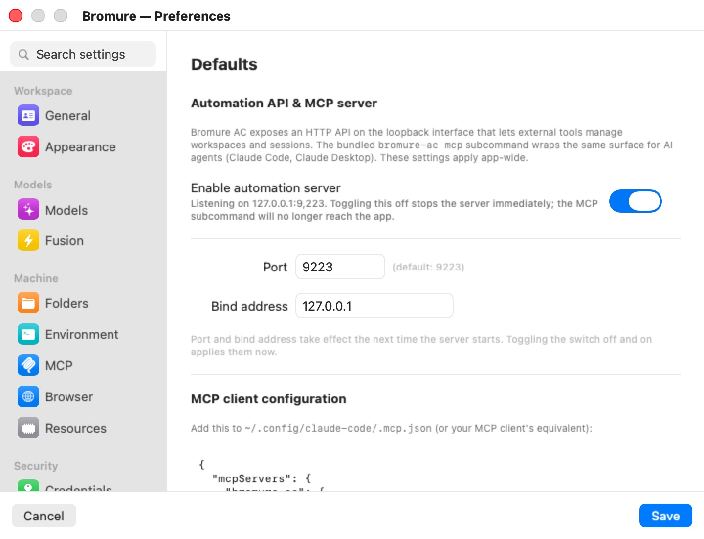

# CLI, API & MCP

Everything the app does can also be driven without its window. The app binary — `bromure-ac`, inside `Bromure Agentic Coding.app/Contents/MacOS/` — is also a multi-command CLI, an HTTP control plane, an [MCP](18-glossary.mdx) server for outside AI tools, and an AppleScript target. Inside every VM, a set of built-in MCP servers gives the agents their own view of Bromure. This chapter is the reference for all of them.

The surfaces, from the outside in:

- **The `bromure-cli` command line** — a Docker/kubectl-style CLI for machines, VMs, terminals, commands, traces, models, remote access, and enrollment.
- **The control plane** — the same operations as JSON over HTTP, on an owner-only Unix socket and, optionally, on a loopback TCP port.
- **The AC MCP server** (`bromure-ac mcp`) — lets an AI tool on your Mac (Claude Code, Claude Desktop) manage the app.
- **The in-guest MCP servers** — built into every VM: the browser, automations, infrastructure, delegation, and, for specific sessions, the task board and the Switchboard.
- **AppleScript** — the *Bromure AC Suite* dictionary.

Throughout this chapter, and in the CLI, a machine is called a **workspace** (its name in the settings editor and in the command line). Sessions in the sense of [agent conversations](05-sessions-home.mdx) are reached through the `/agent-sessions` routes; the older `/sessions` routes and the `session` wording in the CLI and AppleScript refer to a machine's window.

## The control plane: socket and API

Every surface speaks HTTP to the running app over one of two transports:

| Transport | Where | Access gate | On by default |
|---|---|---|---|
| **Control socket** | `~/Library/Application Support/BromureAC/control.sock` (Unix domain, HTTP/1.1) | File permissions — the socket is mode `0600`, owner-only. Reaching the file *is* the authorization, Docker-socket style. | Yes, whenever the app or a headless agent is running |
| **Automation API** | `127.0.0.1:9223` (TCP) | Loopback only by default; most control routes additionally require the `BROMURE_DEBUG_CLAUDE` environment variable, and some are never served over TCP (see [Authentication model](#authentication-model)) | No — opt-in in **Preferences › Automation** |

The CLI never talks to a VM directly. Each subcommand is a thin HTTP client over the control socket, so the same commands work locally and — when the socket is tunneled over SSH — against a remote instance from a [rich client](14-remote-access.mdx). If no agent is running when you invoke a command that needs one, the CLI autostarts a windowless background agent (`bromure-ac run --headless`) and waits up to 40 seconds for it to answer `/health`. Read-only commands (`vm ls`, `describe`, `trace …`) do not autostart; they print `No bromure-ac agent running.` instead.

> **Note:** The control socket is always available while the app runs and is independent of the **Enable automation server** switch. That switch only governs the TCP listener on port 9223. You do not need to enable the automation API to use the CLI.

## The `bromure-cli` command line

You can call the binary by its full bundle path, but the short name is more convenient. Choose **Bromure Agentic Coding › Install Command-Line Tool…** in the app menu. The alert **Install the “bromure-cli” command-line tool?** explains that it creates a symlink at `/usr/local/bin/bromure-cli` and needs your admin password once; click **Install** (or **Cancel**). On success, **Command-line tool installed** tells you to run `bromure-cli --help`. The app never offers this at launch any more — the menu item is the only way in, and you can run it again at any time (for example after moving the app).

The same binary behaves differently depending on the name it is called by:

- **As `bromure-cli`** it hides the app-internal commands — image management (`init`, `info`, `reset`, and the publish-pipeline tools), the `mcp` server, and the GUI `run` default — and exposes only the terminal-facing groups (Workspaces, Tracing, Local inference, Enterprise features, `remote`). A bare `bromure-cli` prints help instead of launching the app.
- **As `bromure-ac`** (the binary inside the app bundle) everything is available and the default subcommand is `run`, which launches the GUI.

The examples below use `bromure-cli`; use the full `…/MacOS/bromure-ac` path for the commands only it exposes.

Commands accept a workspace **id**, a short-id prefix, or its **name** wherever a workspace argument is shown. The `vm` and `workspaces` command groups are aliases for each other. What a machine is, and how it relates to sessions, is covered in [Machines](06f-machines.mdx).

### The app and the background agent

| Synopsis | What it does |
|---|---|
| `bromure-ac run [--headless]` | Default (hidden) subcommand — launch the GUI. `--headless` runs a window-less menu-bar accessory agent; this is what the CLI autostarts to serve the control socket. |

### Image management

The base image is installed once. These commands exist only under the `bromure-ac` name.

| Synopsis | What it does |
|---|---|
| `bromure-ac init [--build-local]` | Install the Ubuntu base image: download the prebuilt image, falling back to a local build on download failure. `--build-local` forces the local build. |
| `bromure-ac info` | Print the base-image version, virtual size, on-disk size, and path. |
| `bromure-ac reset [--yes]` | Delete the base image (disk, EFI vars, version stamp, state) so the next `init` starts fresh; confirms unless `--yes`. |
| `bromure-ac init-foss-image --output <dir>` | Publish pipeline only — build the redistributable free-software-only base image into `<dir>`. |
| `bromure-ac verify-image --disk <path> [--timeout 300]` | Publish pipeline only — boot a disposable clone headless and require the serial login prompt within the timeout. |

> **Note:** If no base image exists, launching the GUI routes you into the onboarding wizard, which installs the image in place — see [Installation](02-installation.mdx).

### Workspace and VM control

This is the core group. `vm run` is deliberately Docker-shaped: it boots a workspace and hands your terminal to the guest's shared `bromure` tmux session.

| Synopsis | What it does |
|---|---|
| `bromure-cli vm ls` | List every workspace with live state (off / suspended / booting / running), uptime, window attach state, tmux tabs as a tree (`*` marks the active tab), and running Docker containers. |
| `bromure-cli vm run [<workspace>] [-v <dir>]… [--name N --tool T --auth A --api-key K] [--memory GB] [-d] [--rm]` | Start a workspace's VM, or create a throwaway one on the fly. Default: attach your terminal to the guest tmux. |
| `bromure-cli vm attach <vm> [<tab#> \| containers:<name> [-- <shell>]] [-w]` | Attach the terminal to the VM's tmux (optionally jumping to a tab), `docker exec -it` into a running container (default shell `bash`), or open/reattach the GUI window with `-w`/`--window`. |
| `bromure-cli vm exec <vm> [-i] [-t] [--timeout 600] -- <command…>` | Run a command inside the VM (kubectl-style, after `--`). `-it` opens an interactive pty; omit the command with `-it` for a shell. Guest exit codes propagate. |
| `bromure-cli vm kill <vm> [--suspend]` | Stop a VM: graceful shutdown, or suspend (RAM saved to disk) with `--suspend`. |
| `bromure-cli vm reboot <workspace> [--hard]` | Reboot a running workspace in place; graceful by default, `--hard` tears it down immediately. |
| `bromure-cli vm describe <workspace>` | Print the workspace's settings plus live runtime details when running (state, IP, vCPUs, Fusion state, disk usage from guest `df`, tabs, containers, memory in use). |
| `bromure-cli vm ports <workspace>` (or `vm <workspace> -L`) | Show a running workspace's listening ports (live `ss` as root): PORT, PROTO, ADDRESS, PROCESS, with loopback-only binds marked. |
| `bromure-cli vm fsck <workspace> [--repair] [--home]` | Check a stopped workspace's system disk — or its home image with `--home` — from the Mac, with no VM and no extra tools. `--repair` replays the filesystem journal and clears a stale error flag. See [Checking a disk from the command line](#checking-a-disk-from-the-command-line). |
| `bromure-cli workspaces create [--name N] [--tool T] [--auth A] [--api-key K] [--memory GB] [--color C] [-v <dir>]… [--generate-ssh] [--from-json <file\|->]` | Create a workspace headlessly. `--from-json` applies a full profile JSON document (flags override matching fields); `--generate-ssh` mints a host-side SSH key and prints the public key. |
| `bromure-cli workspaces edit <workspace> [--from-json <file\|->]` | Fetch the workspace's full config, open it in `$VISUAL`/`$EDITOR` (`vi` fallback), and save changes back. Secrets show blank — leave blank to keep, type to replace. Deleting a key in the editor clears that field. `--from-json` applies a document non-interactively; it may be partial — an absent key keeps its value, an explicit `null` clears it. |
| `bromure-cli workspaces rm <workspace> [-f]` | Delete a workspace and ALL its data (disk + home) after a `y/N` confirmation, skipped with `-f`. |
| `bromure-cli workspaces ssh-keygen <workspace>` | Generate a fresh host-side SSH key for the workspace and print the public key for your Git host. |

A few operational details worth knowing:

- **`vm run` flags.** `--tool` takes an agent id: `claude`, `codex`, `grok`, `kimi`, or `omp`. `--auth` is `token`, `subscription`, `bedrock`, or `local`. An unrecognized value is an error that lists the valid values, for example `Invalid --tool “gpt” — expected one of: claude | codex | grok | kimi | omp.`; `workspaces create` checks `--tool` and `--auth` the same way. `-v`/`--volume <hostdir>` mounts a host folder at `~/<basename>` in the guest (repeatable, up to 8). `-d`/`--detach` boots the VM and returns instead of attaching. `--rm` deletes the workspace and its disk when the VM stops. Detach from an attached tmux with `Ctrl-b d` — that leaves the VM running.
- **Agents come from Models.** The tool and auth flags only seed a new workspace. Which model and provider each agent actually uses comes from **Preferences › Models** and the workspace's own **Models** pane — see [Models & Providers](13-models.mdx).
- **TTY-aware.** The Docker-style default of handing the terminal to tmux applies only on a real terminal; piped or scripted invocations behave as if you passed `-d`.
- **`workspaces create` values.** Colors are `blue`, `red`, `green`, `orange`, `purple`, `pink`, `teal`, or `gray`.
- **Blank-keep on edit.** `workspaces edit` exports the whole config with secrets blanked; a saved-back document with a blank secret keeps the stored value, so a round-trip can never wipe your keys. An unchanged buffer saves nothing; invalid JSON aborts.
- **Exec waits.** `vm exec` waits up to 10 seconds for the guest shell agent; a `502` means the VM may not be running or the name did not match. Approval prompts that fire during an attached session are rendered on *your* terminal (see [Consent over attached terminals](#consent-over-attached-terminals)), never inside the guest.

### Checking a disk from the command line

`vm fsck` is the scriptable twin of the ext4 browser's **Run fsck…** and of the **Repair Disk** button the app shows when a boot stops on filesystem errors. It uses Bromure's own ext4 checker, so nothing needs to be installed.

```bash
bromure-cli vm kill "Web app"            # the workspace must be stopped
bromure-cli vm fsck "Web app"            # check the system disk, report only
bromure-cli vm fsck "Web app" --repair   # replay the journal, clear the error flag
bromure-cli vm fsck "Web app" --home     # check the home image instead
```

It refuses to run while the workspace is running. The output ends with one of these summaries: "Filesystem is clean.", "Filesystem repaired; it is now consistent.", or "Filesystem has errors this checker cannot repair." A check without `--repair` that finds problems suggests re-running with `--repair`. The command exits with status `4` while errors remain. The checker's scope and limits are described in [Advanced](16a-advanced.mdx#checking-and-repairing-a-disk).

### Models, routing, and Fusion

Model and provider settings are covered in [Models & Providers](13-models.mdx) and multi-model synthesis in [Fusion](12-fusion.mdx); the CLI toggles are:

| Synopsis | What it does |
|---|---|
| `bromure-cli model catalog\|ls\|pull\|use\|rm …` | Manage on-device MLX models — browse the curated catalog (with RAM-fit and tool-calling badges), download with live progress, set the active model for a running VM's workspace, remove. |
| `bromure-cli vm fusion enable\|disable <vm>` | Engage or disengage Fusion on a running VM. Requires the workspace to have two or more models configured. `on`/`engage` and `off`/`disengage` are accepted as synonyms. |
| `bromure-cli vm routing cloud\|local <vm>` | Set the LLM backend routing for a running VM: the agents' cloud providers, or the local model. |

### Trace inspection

These read the per-workspace proxy traces. They return nothing unless the workspace has tracing enabled — see [Tracing settings](07-settings/tracing.mdx) — and the full story is in [Tracing & Audit](11-tracing.mdx).

| Synopsis | What it does |
|---|---|
| `bromure-cli trace ls [workspace] [--limit 50]` | List recent requests: TIME / HOST / METHOD / STATUS / REQ / RESP / LAT / FLAGS (flags include `swap×N`, `LEAK×N`, `conv`). |
| `bromure-cli trace summary [workspace]` | Aggregate totals, status classes, swap/leak/conversation counts, and top hosts. |
| `bromure-cli trace hostnames [workspace]` | List distinct hosts and their request counts. |
| `bromure-cli trace leaks [workspace]` | Show requests with suspected credential leaks (header, preview, suspicion). |
| `bromure-cli trace clear [-f]` | Wipe in-memory and on-disk trace history after a `y/N` confirmation. |

### Remote access

The optional SSH front door is disabled by default and documented fully in [Remote Access & Clients](14-remote-access.mdx). All operations go through the running app over the control socket.

| Synopsis | What it does |
|---|---|
| `bromure-cli remote [status]` | Default subcommand — print enabled/running state, bind and port, auth methods, host-key fingerprint, login user, a ready-made connect line, and authorized keys. |
| `bromure-cli remote enable [--port 2222] [--bind 0.0.0.0] [--[no-]password] [--[no-]pubkey]` | Enable the SSH server. At least one auth method must remain on. |
| `bromure-cli remote disable` | Turn the SSH server off. |
| `bromure-cli remote key add <key\|path>` / `key [ls]` / `key rm <index\|fingerprint>` | Manage authorized public keys (`ls` is the default). |

### Enterprise enrollment

CLI counterparts of the **Log in to bromure.io…** sheet, for scripted device provisioning. See [Enterprise](15-enterprise.mdx).

| Synopsis | What it does |
|---|---|
| `bromure-cli enroll --code <6-word-code> [--server-url URL] [--device-name NAME]` | Enroll this Mac with a bromure.io workspace using an admin-minted code. Server defaults to `$BROMURE_MANAGED_URL` or `https://bromure.io/api`; device name defaults to the Mac's hostname. |
| `bromure-cli unenroll [--force]` | Sign out of the enrolled workspace (`y/N` unless `--force`). |
| `bromure-cli enrollment-status` | Print enrollment state (workspace, user, install id, device, server, enrolled date, bearer/leaf-cert presence). "not enrolled" exits `0` so automation does not treat it as a failure. |

### Integration and internal commands

| Synopsis | What it does |
|---|---|
| `bromure-ac mcp [--debug] [--api-url http://127.0.0.1:9223]` | Run the AC MCP server on stdio for AI tools. See [The AC MCP server](#the-ac-mcp-server-bromure-ac-mcp). |
| `__remote-menu`, `__attach-window`, `__fatclient…`, `__forward…`, `__dial`, `__tunnel-helper` | Internal entry points (the SSH ForceCommand TUI, terminal byte pump, and rich-client tunnel helpers). Not for interactive use. |

## The remote TUI (`__remote-menu`)

When SSH remote access is enabled, every remote login is forced (via `ForceCommand`) into a hand-rolled ANSI terminal UI rather than a shell — an alternate-screen, 256-color menu driven by arrow keys and digits that works over any SSH PTY (use `ssh -t`). It mirrors the CLI as menus:

- **Workspaces** — create with a single-screen form (Name, Tool, Auth, API key, Memory, Color, Folders, Generate SSH, **Full settings…**, Create), per-workspace actions (Attach, New tab, Describe, Configure…, Fusion, Routing, Worktrees…, Reboot…, Suspend, Kill for running workspaces; Start, Describe, Configure…, Delete for off ones), and a raw table view. **Configure…** offers the settings editor's panes as text forms; its **Models** form is read-only (the server's providers, and whether the workspace overrides them), since models are chosen in the app.
- **Models** — installed models and the download catalog; picking an uninstalled model offers to `model pull` it inline with live progress.
- **Trace** — Summary / Hostnames / Leaks / Recent / Clear.

While you are attached to a workspace's tmux, a magic keychord (default `Ctrl-]`, shown in the banner) pops a host-drawn **controller overlay**: a tab tree, New tab, Worktrees…, Fusion, Routing, Edit settings…, Reboot…, Suspend, Disconnect. The guest never sees the trigger key — override it with the `remote/overlay-key` file or `$BROMURE_OVERLAY_KEY`. `Ctrl-b d` disconnects from tmux back to the menu. The remote TUI works on machines and their terminals; agent sessions, rooms and the Switchboard are reached from the rich client instead. The full remote story is in [Remote Access & Clients](14-remote-access.mdx).

## The loopback automation API

The control plane can also be exposed as JSON over HTTP on TCP, for scripting from any language. It is **off by default**.

### Enabling it

Open **Preferences… › Automation** (⌘,) — the **Automation API & MCP server** pane.

<p align="center">
  
</p>

1. Turn on **Enable automation server**. When it is on, the pane reads *Listening on 127.0.0.1:9223*; turning it off stops the server immediately.
2. Optionally set **Port** (captioned *(default: 9223)*) and **Bind address** (default `127.0.0.1`). Port and bind address take effect the next time the server starts — toggle the switch off and on to apply them now.

You can also flip the switch without the GUI:

```bash
defaults write io.bromure.agentic-coding automation.enabled -bool true
```

> **Warning:** Setting **Bind address** to anything other than `127.0.0.1` exposes the API — and the MCP server it backs — to the network, and the pane warns *Non-loopback bind exposes the API to the network. The MCP server has no auth.* There is no authentication on the TCP listener beyond the loopback boundary and the `BROMURE_DEBUG_CLAUDE` gate below. Leave the bind address on loopback unless you have a specific, trusted reason not to.

### Authentication model

The TCP listener and the control socket serve the *same* routes, but with different access:

| Route group | Control socket | Automation API (TCP loopback) |
|---|---|---|
| `GET /health`, `GET /profiles`, `GET /vms`, `GET`/`POST /sessions` | Allowed | Allowed |
| Workspace creation and editing (`POST /profiles`, `/profiles/<id>…`), VM control and `exec` (`POST /vms`, `/vms/<id>/…`), `/trace`, `/app/state`, `/preferences`, `/models/settings`, agent sessions, rooms, delegations, tasks, automations, clusters and registries | Allowed | Requires `BROMURE_DEBUG_CLAUDE` on the app |
| `/state`, `/state/subscribe`, `/remote…`, `/grid-layout`, `/workspaces`, `/subscriptions/…`, `/models/<action>`, `/connector` | Allowed | Never — control-socket only |

In other words: the control socket is the full-access, owner-only path; the TCP API opens the safe read subset on loopback and gates everything else behind the debug flag. Path segments are single percent-encoded (so workspace names with spaces work).

### Endpoints for scripting

The most useful routes:

| Endpoint | Purpose |
|---|---|
| `GET /health` | Liveness plus `debugEnabled`. |
| `GET /state` | One-shot mirror snapshot: workspaces, VMs, grid layout, automations, `pendingPrompts`, and more. |
| `GET /state/subscribe` | The push form of `/state`: the connection stays open and a fresh snapshot is streamed whenever the state changes. Rich clients use it instead of polling. |
| `GET /vms` / `POST /vms` | List running VMs; boot a VM from a workspace reference or an inline spec plus mounts (what `vm run` calls). |
| `POST /vms/<id>/exec` | Run a command in a VM; `interactive` hijacks the connection into a raw framed pty stream. |
| `GET /profiles` / `POST /profiles` | List workspaces; create one from a JSON document. |
| `GET` / `PUT /preferences` | Read or replace the Preferences **Defaults** template (secrets blanked on read, kept when left blank on write). This is what a rich client's Preferences window edits on a remote host. |
| `GET` / `PUT /models/settings` | Read or replace the global model settings (**Preferences › Models**), with keys redacted. |
| `POST /subscriptions/register` / `POST /subscriptions/forget` | Start a provider sign-in on this host for a client (`{"provider": …, "profileId": …}`; the sign-in URL comes back through `/state`), or forget a stored sign-in. |
| `POST /agent-sessions/start` | Start an agent session (`profile`, `tool`, optional folder, repository or opening message). |
| `POST /agent-sessions/<id>/<action>` | Act on a session: `send`, `keys`, `resume`, `close`, `rename`, `nickname`, `archive`, `unarchive`, `delete`, `review`, and the branch actions (`worktree`, `branch-merge`, `branch-pr`, `branch-discard`, `branch-keep`, `branch-decline`). |
| `GET /agent-sessions/<id>/transcript`, `GET /agent-sessions/<id>/pending` | A session's conversation (base64 JSONL), and what it is waiting on (a question and its options). |
| `POST /agent-sessions/switchboard` | Start or show the Switchboard. |
| `POST /agent-rooms/create\|move\|group`, `POST /agent-rooms/<id>/rename\|color\|layout\|archive\|unarchive\|ungroup\|delete\|switchboard` | Create and edit [rooms](06b-rooms.mdx). |
| `POST /delegations/request`, `POST /delegations/<id>/<action>`, `GET /delegations/<id>/file` | Cross-host [delegation](06d-delegation.mdx): one host's session asks a session on another, then sends, answers, steers, closes or cancels, and fetches attached files. |
| `GET` / `POST /tasks`, `/tasks/<id>/…` | Read and drive the [Coding Tasks](06i-coding-tasks.mdx) board. |
| `GET` / `POST /k8s`, `/k8s/<id>/<action>`, `POST /registries`, `/registries/<id>/<action>` | Create and drive [Kubernetes clusters and registries](13a-kubernetes.mdx). |
| `GET /automations` / `POST /automations/<id>/run` | Read and drive scheduled automations (see [Controlling automations over the API](#controlling-automations-over-the-api)). |
| `POST /prompts/<id>/answer` | Answer a queued lifecycle prompt (see [Answering pending prompts](#answering-pending-prompts)). |

Because the control socket path contains spaces, capture it in a variable first:

```bash
SOCK="$HOME/Library/Application Support/BromureAC/control.sock"

# Full mirror snapshot (control socket only)
curl --unix-socket "$SOCK" http://localhost/state

# List running VMs
curl --unix-socket "$SOCK" http://localhost/vms

# Boot a workspace by name
curl --unix-socket "$SOCK" -X POST http://localhost/vms \
  -d '{"profile":"Web app"}'

# Answer a queued lifecycle prompt with one of its offered button labels
curl --unix-socket "$SOCK" -X POST http://localhost/prompts/PROMPT_ID/answer \
  -d '{"choice":"Not Now"}'
```

The safe subset works over the TCP API once you have enabled it — for example, listing workspaces and opening a machine's window needs no debug flag:

```bash
curl http://127.0.0.1:9223/profiles
curl -X POST http://127.0.0.1:9223/sessions -d '{"profile":"Web app"}'
```

> **Note:** The control-plane routes are an integration surface shared with the rich client, not a versioned public API; their request and response shapes can change between releases. The CLI commands above are the stable way to script Bromure. Debug-only routes, environment variables, and file locations are catalogued in the [Appendix](19-appendix.mdx).

## The AC MCP server (`bromure-ac mcp`)

`bromure-ac mcp` runs a stdio JSON-RPC MCP server (server name `bromure-ac`) that lets an AI tool on your Mac manage the app. It wraps the automation HTTP API and AppleScript, so **enable the automation server first** — the listing and window tools call the HTTP API at `--api-url` (default `http://127.0.0.1:9223`). It is not available under the `bromure-cli` name.

The tools it exposes:

- `bromure_ac_list_profiles`, `bromure_ac_list_sessions`
- `bromure_ac_open_session` (opens a workspace's window; waits up to 30 seconds), `bromure_ac_close_session`
- `bromure_ac_get_profile`, `bromure_ac_set_profile` (atomic JSON replace, id preserved)
- `bromure_ac_get_profile_setting`, `bromure_ac_set_profile_setting`

With `--debug` (and `BROMURE_DEBUG_CLAUDE` set on the app) it adds `bromure_ac_app_state`, `bromure_ac_vm_exec`, `bromure_ac_vm_read_file`, and `bromure_ac_vm_write_file`.

To wire it into Claude Code, add the following to `~/.config/claude-code/.mcp.json` (or your client's equivalent). This is the exact snippet the **MCP client configuration** section of the Automation pane shows:

```json
{
  "mcpServers": {
    "bromure-ac": {
      "command": "/Applications/Bromure Agentic Coding.app/Contents/MacOS/bromure-ac",
      "args": ["mcp"]
    }
  }
}
```

> **Note:** The `get`/`set` profile tools shell out to `osascript` (AppleScript against the running app), so the GUI app must be running and macOS may prompt once for Automation permission. Profile JSON travels with secrets blanked unless `BROMURE_DEBUG_CLAUDE` is set.

## MCP servers inside the VMs

Separately from the AC MCP server, Bromure gives the agents inside every VM a set of built-in MCP servers — no configuration needed. Each is a small Python stdio shim staged read-only into the guest under `/mnt/bromure-meta/`; the shim dials the host over [vsock](18-glossary.mdx) and reconnects forever on drops, so the agent never loses its tools. The host serves the tools, and every call is checked there: an agent can only see and act on what its own machine and session are entitled to.

| vsock port | Server | Who gets it | Tools |
|---|---|---|---|
| 5830 | **browser** | Every agent | The 23 `browser_*` tools that drive the machine's embedded Chromium (see [below](#the-browser-server)). |
| 5831 | **task board** | Only agents running a [coding task](06i-coding-tasks.mdx) | `board_get_task`, `board_set_plan`, `board_create_subtasks`, `board_set_dependencies`, `board_ready_for_review`, `board_report_landing`. |
| 5832 | **plan stream** | Coding-task planning runs | Not an MCP server: the channel over which a task's planning run streams its plan to the board. |
| 5833 | **automations** | Every agent | `automation_list`, `automation_get`, `automation_create`, `automation_update`, `automation_delete`, `automation_run` — limited to the automations of the agent's own machine. See [Automations](06h-automations.mdx). |
| 5834 | **infrastructure** | Every agent | `infrastructure_overview`, `cluster_status`, `cluster_create`, `cluster_start`, `registry_status`, `registry_create`, `registry_start` — limited to the clusters and registries the machine has access to. See [Kubernetes Clusters & Registries](13a-kubernetes.mdx). |
| 5835 | **delegation** | Every agent session | `delegate`, `request`, `list_peers`, `list_delegations`, `read_inbox`, `wait`, `ask`, `report`, `deliver`, `answer`, `steer`, `close_delegation`, `cancel`, `worktree_create`, `worktree_status`, `worktree_merge`. The shim tells the host which tmux window it runs in, so an agent can't claim to be another session. See [Agents Working Together](06d-delegation.mdx). |
| 5836 | **switchboard** | Only the [Switchboard](06e-switchboard.mdx) session | `list_sessions`, `read_session`, `pending_question`, `list_workspaces`, `next_events`, `send_to_session`, `answer_question`, `press_keys`, `start_session`, `resume_session`, `message_user`, `archive_session`. |

The browser, automations, infrastructure and delegation servers are written into each agent's own MCP configuration alongside the servers you add in the machine's **MCP** pane ([MCP settings](07-settings/mcp.mdx)). The task-board and Switchboard servers are passed only to the runs that need them.

### The browser server

The browser server drives the machine's embedded Chromium, which runs in its own disposable VM. Its 23 tools cover navigation and inspection — `browser_navigate`, `browser_new_tab`, `browser_list_tabs`, `browser_activate_tab`, `browser_close_tab`, `browser_back`, `browser_forward`, `browser_reload`, `browser_screenshot` (with a full-page option), `browser_evaluate`, `browser_get_text`, `browser_get_html`, `browser_get_links`, `browser_click`, `browser_fill`, `browser_type`, `browser_press_key`, `browser_wait_for`, `browser_network`, `browser_network_summary`, `browser_clear_network`, `browser_console`, and `browser_pick_element` (an interactive 60-second element picker).

A tool call against a closed browser opens it and waits for the cold boot. Because the browser is a *separate* VM, the server's instructions tell agents to reach a dev server on their machine by the machine's LAN IP (`hostname -I`), never `localhost`. The full story is in [The Embedded Browser](06g-browser.mdx).

> **Note:** On a rich client, the agents' browser-MCP stream can be carried over the SSH connection so a remote agent drives the browser pane you see locally. See [Remote Access & Clients](14-remote-access.mdx).

### OAuth for MCP servers you add

HTTP MCP servers you add in the editor can authenticate through the host-side OAuth broker: it performs RFC 8414 discovery and RFC 7591 dynamic client registration (as *Bromure AC*), runs a PKCE authorization-code flow in your system browser, and serves the callback on a loopback listener (ports 28500–28599). The success page reads *Authorized — You can close this tab and return to Bromure AC.* The whole flow runs on the host, so the VM never sees real OAuth credentials.

## AppleScript (Bromure AC Suite)

A scripting dictionary, the *Bromure AC Suite*, is another automation surface — useful for orchestration and for screenshot tooling that needs window IDs. Target `application "Bromure Agentic Coding"` from Script Editor or `osascript`. It covers:

- **Profiles** — `list profiles`, `create ac profile <name> [color <c>]` (returns a UUID), `delete ac profile <name|uuid>`, and full-document round-trip via `get profile json` / `set profile json` (the whole profile; id preserved; stored secrets merged under blank fields).
- **Per-field settings** — `get profile setting … key …` / `set profile setting … key … to value …`.
- **Editor windows** — `open profile manager`, `open ac profile editor`, `close ac profile editor`, `select editor category <key>`, and `get editor window id` / `get main window id` (a `CGWindowID` for `screencapture -l`).
- **Machine windows** — `open ac session`, `close ac session`, `list ac sessions`.
- **App state and settings** — `get app state` (JSON), plus `get ac app setting` / `set ac app setting` for keys `automation.enabled`, `automation.port`, `automation.bindAddress`, `remoteAccess.enabled`, `remoteAccess.port`, `remoteAccess.bindAddress`, `managed.serverURL`, and `managed.acIngestURL`. Setting `automation.enabled` toggles the HTTP server live.

For example, to open a machine's window:

```bash
osascript -e 'tell application "Bromure Agentic Coding" to open ac session "Web app"'
```

> **Note:** Profile JSON travels with secrets scrubbed unless `BROMURE_DEBUG_CLAUDE` is set. Setting `apiKey` to an empty string via `set profile setting` *clears* the key rather than keeping it — unlike the blank-keep behavior of the JSON round-trip bridges. Locale switching is deliberately not scriptable; relaunch the app with, for example, `-AppleLanguages "(fr)"` instead.

## Scheduled automations

A scheduled automation is a recurring, unattended agent run bound to one machine. Automations are created and managed from the automation board (**⇧⌘A**, or the sidebar's **Automations** section), and agents can manage their own machine's automations through the automations MCP server above. The whole feature — triggers, schedules, chaining, the mandatory injection screen, run history — is documented in [Automations](06h-automations.mdx). This section covers the control-plane surface: driving automations over the API, answering the decision prompts an unattended start can raise, and how consent works over an attached terminal.

### Controlling automations over the API

| Endpoint | Purpose |
|---|---|
| `GET /automations` | List automations and their run history. |
| `POST /automations` | Create or update (upsert) an automation. |
| `DELETE /automations/<id>` | Delete an automation. |
| `POST /automations/<id>/run` | Fire it now (does not change the schedule). |
| `POST /automations/<id>/toggle` | Pause or resume it. |
| `POST /automation-runs/<run-id>/acknowledge` | Dismiss a failed or blocked run from the board's **Needs attention** column. |
| `GET /automation-runs/<run-id>/transcript` | A finished run's archived transcript (base64). |

### Answering pending prompts

Some lifecycle decisions — the base-image upgrade offer, a disk that fails its boot-time check, a compromise alert, a compromise wipe — normally appear as a local alert. When there is nobody at the Mac to answer (a headless agent, or a launch requested by a remote rich client), they are queued instead: they surface in `GET /state` under `pendingPrompts` (each with an `id`, `profileID`, `title`, `message`, and button labels) and are answered with `POST /prompts/<id>/answer`:

```bash
SOCK="$HOME/Library/Application Support/BromureAC/control.sock"
curl --unix-socket "$SOCK" -X POST http://localhost/prompts/PROMPT_ID/answer \
  -d '{"choice":"Remind me later"}'
```

Pass one of the prompt's own button labels as `choice`. If no client answers before the prompt's timeout, it resolves to its safe fallback — never the destructive option (a compromise alert, for instance, falls back to shutting the VM down). If no client is connected at all, it falls back immediately. A rich client renders these prompts as ordinary alerts.

> **Note:** Automations, delegations and other unattended starts never wait on a prompt. A start that would need an answer from you — a machine marked compromised, or a local model still downloading — is refused with a clear reason in the run's history instead ("The workspace is marked compromised — start it yourself to confirm the wipe."). A suspended machine whose saved state can't be restored boots fresh.

### Consent over attached terminals

While a terminal is interactively attached to a machine — through `vm exec -it`, `vm attach`, or an SSH attach — host-side approval prompts (credential use, and similar) are rendered on *your* terminal, not inside the guest. The prompt reads **🔒 Bromure — approval required** with numbered choices and *Choice [1-N] (Enter or timeout = deny)*. Enter, timeout, EOF, or detaching all mean deny, so a compromised guest can never forge an approval. The guest tmux is repainted afterward.

## Debug endpoints (`BROMURE_DEBUG_CLAUDE`)

Launching the app with `BROMURE_DEBUG_CLAUDE` set lifts the debug gate on the TCP automation API, so the routes in the middle row of the [authentication table](#authentication-model) work over TCP too, including these debug routes (always available on the control socket, except where noted):

- `GET /debug/ui-shot?path=…&which=…` — the app renders its own window to a PNG (no Screen Recording permission needed) and returns a subview-frame dump; the default output is `/tmp/bromure-ui-shot.png`.
- `POST /debug/editor` — drives the settings editor for the screenshot tool.
- `POST /detect/prompt-injection` — runs the real detectors and returns their verdict (this route requires the debug flag *even on the control socket*).

The flag also lets secrets travel verbatim through the AppleScript and MCP profile-JSON bridges and is required by `bromure-ac mcp --debug`'s VM tools. `GET /health` reports `debugEnabled` so you can tell which mode the app is in.

> **Warning:** `BROMURE_DEBUG_CLAUDE` removes the safety gate that normally keeps `exec`, VM control, and raw profile secrets off the loopback TCP API. Run the app with it only on a machine you control, and never combine it with a non-loopback bind address — doing so would expose full VM shell access, unredacted secrets, and window captures to anyone who can reach the port. It is distinct from `BROMURE_AC_DEBUG` (stderr event logging) and `BROMURE_CLI_DEBUG` (CLI socket diagnostics), which are harmless logging switches.
